# Android TV Client

The [Android TV client](https://github.com/4eh5xitv6787h645ebv/jellyfin-androidtv)
is the first-party native adopter of the Canopy Extension Platform. Developers
should also read the [Android TV Client Guide](androidtv-client.md).

What the Canopy integration looks like on a TV. Every capture below is from a
release build on an NVIDIA Shield against a live Jellyfin 12 + Canopy + Seerr
server. Short screen recordings of the same surfaces in motion live with
the client, on its
[features page](https://github.com/4eh5xitv6787h645ebv/jellyfin-androidtv/blob/master/docs/features.md).

Nothing here appears when the server has no Canopy plugin, has Seerr disabled,
or your account is not linked to Seerr — the surfaces are omitted entirely
rather than showing empty states or dead buttons.

---

## Discover

A **Discover** entry appears in the toolbar beside Home and Search, but only
once the server confirms Seerr is reachable and linked for you.

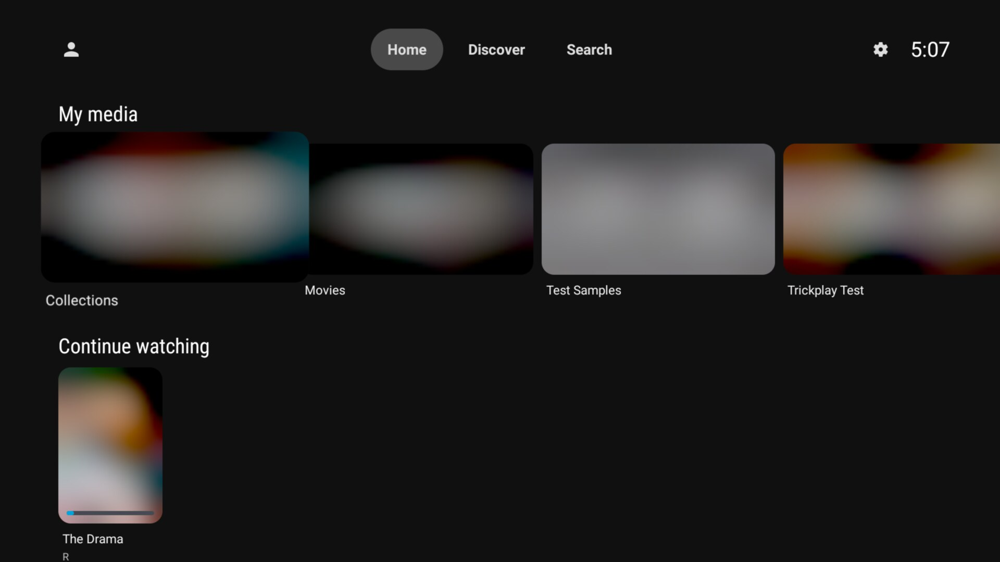

It opens rows of your watchlist, what's trending, and popular and upcoming
movies and series.

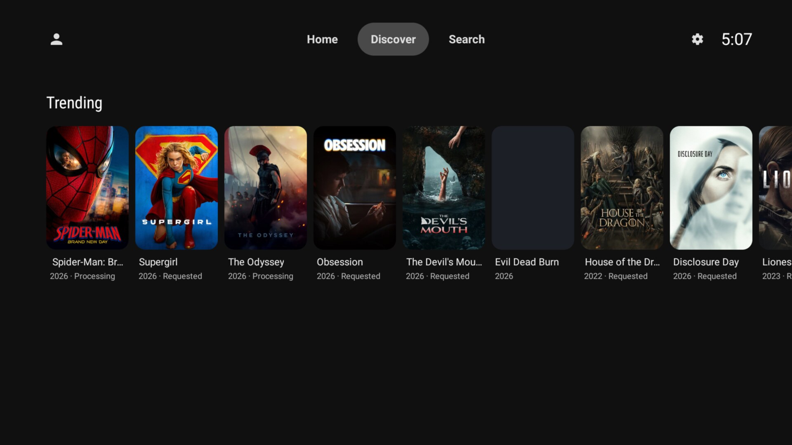

Further down are genre tiles, each opening a paged grid for that genre.

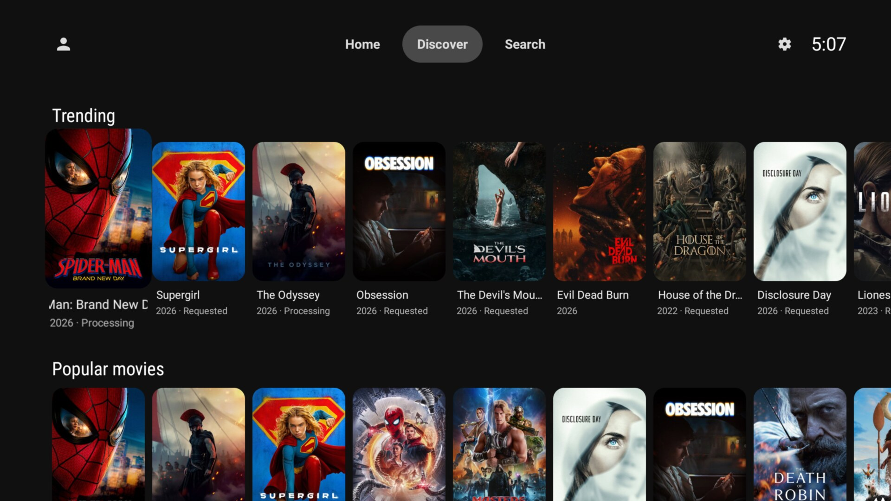

## Requesting something you don't have

Selecting anything that is not in your library opens a details screen built
from the same components as the native one — poster, rating, genres, overview
— with the request actions inline.

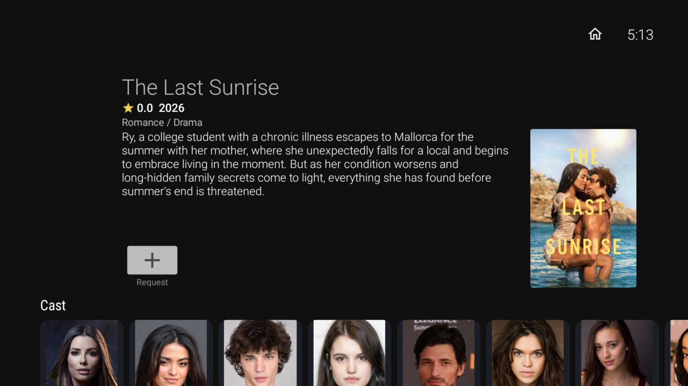

Series show a season picker offering exactly the seasons you are missing, and
4K requests consider the 4K state separately. If your Seerr account has a
request quota, the button shows how many you have left.

## Cast and filmographies

Every title carries its cast, and each person opens their filmography split
into movies and series, ordered by popularity.

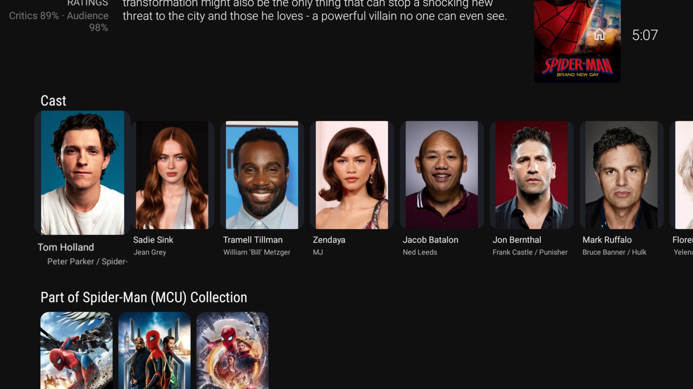

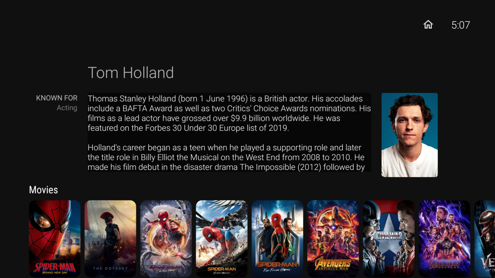

The **native** Jellyfin person screen gains the same rows, so an actor's full
filmography is browsable even when your library only holds a few of their
titles.

## Search

Search results gain a "Discover · Seerr" row underneath your library results —
movies, series and people — ending in a tile that opens the full Discover
screen.

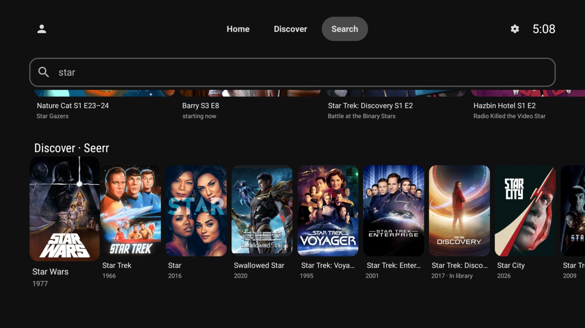

## Canopy actions on your own library

Spoiler Guard, Hidden Content and Seerr actions appear on item details as
ordinary buttons beside Play and Watched. They participate in the same
overflow rules as the built-in actions, so the row never outgrows its width
and a label is never clipped — an action whose label does not fit is moved
into *Other options* instead.

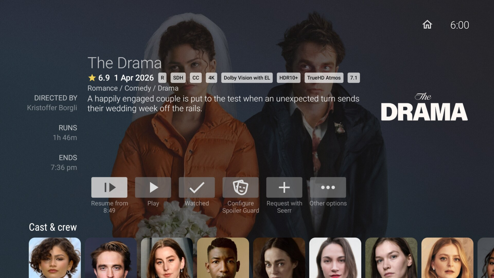

Selecting one opens the form the *server* described, rendered with native
controls. The client does not know what Spoiler Guard is — it renders whatever
the catalog offers, so new server features appear without a client update.

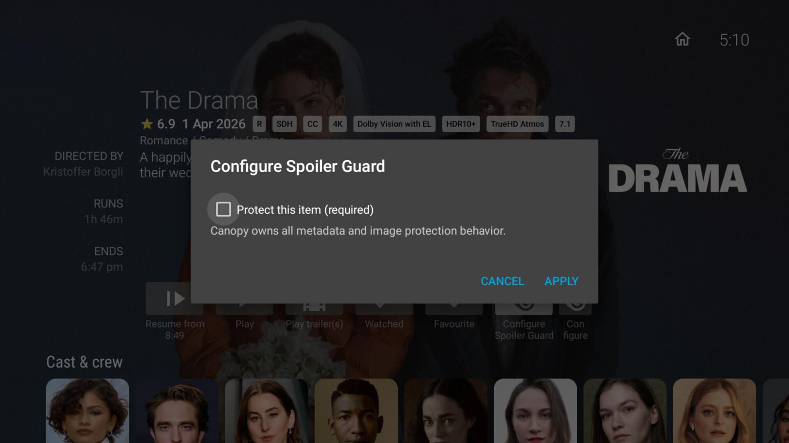

Long-pressing a Seerr card for a title already in your library opens the same
actions without leaving the row.

## Settings

Everything is switchable under **Settings → Canopy**.

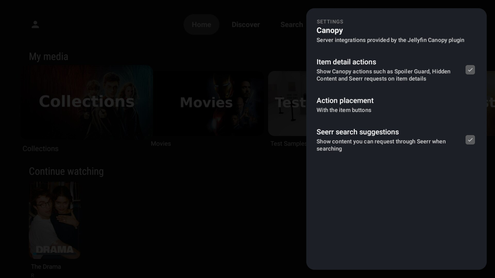

*Action placement* decides where the actions live: with the item buttons, in
the *Other options* menu, or in a dedicated Actions row below the details.

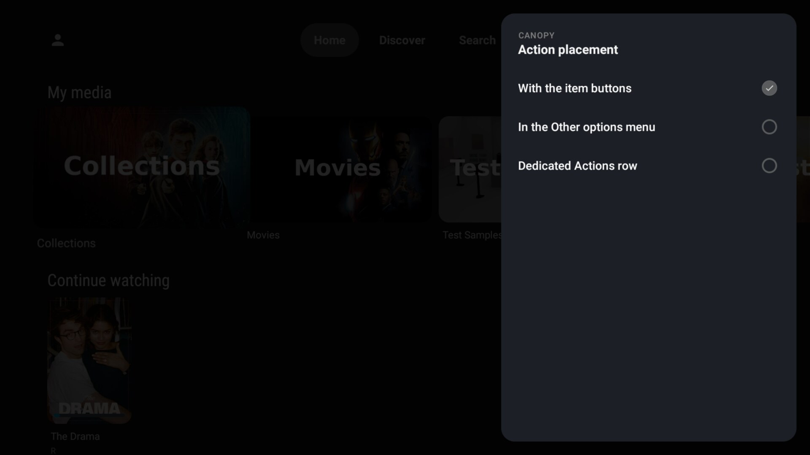
