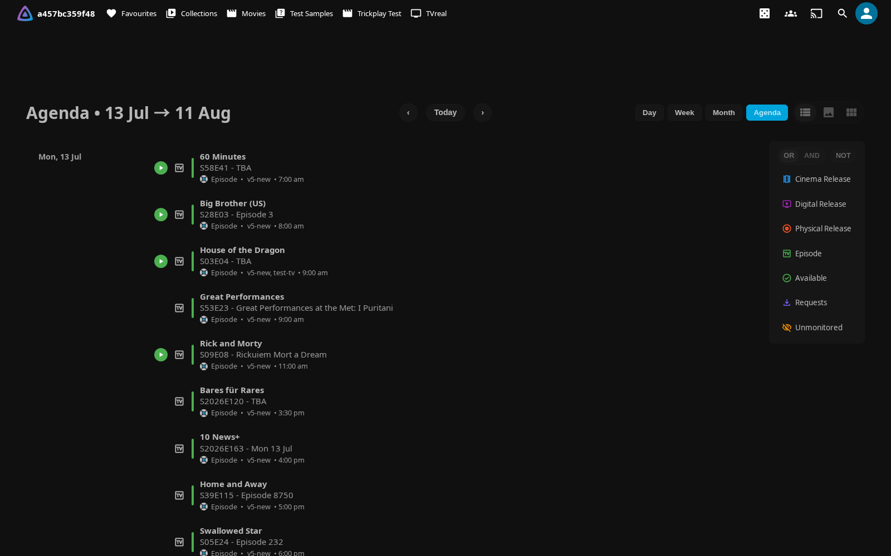
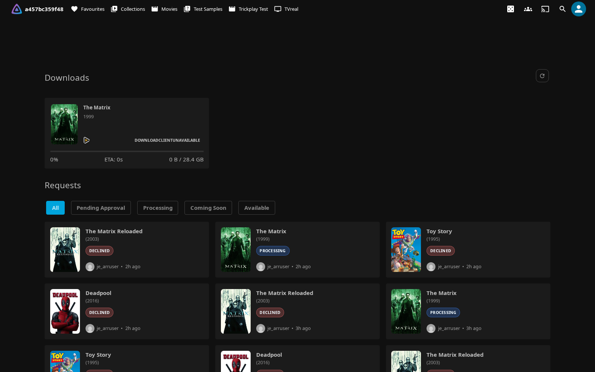

# *arr Integration

Quick access to Sonarr, Radarr, and Bazarr from Jellyfin, plus calendar and download monitoring.

!!! note

    ***arr links, Search, Interactive Search, and Manage are only visible to admin users.**

    **The Calendar page, Requests page, and synced tag links are available to all users.**


!!! warning


    **Security Considerations:**

    - **API Keys** are stored securely on server
    - **Network Access** - Ensure *arr instances are secure
    - **HTTPS** - Use HTTPS for remote access

## Features

The *arr integration provides convenient links to your Sonarr, Radarr, and Bazarr instances directly from Jellyfin item pages. Additionally, it can display *arr tags as clickable links and provide calendar and download monitoring pages.

- **Quick Links** - Jump to Sonarr, Radarr, Bazarr pages for any item
- **Search & Interactive Search** - Trigger an automatic search, or pick a release by hand, from the item menu — without opening the arr UI
- **Monitor & Add** - Toggle monitoring or add a movie/series to Sonarr/Radarr from Jellyfin
- **Tag Links** - Display *arr tags as clickable links with filtering
- **Calendar View** - Upcoming releases from Sonarr/Radarr
- **Requests Page** - Monitor download queue and status
- **Admin Only** - Links only visible to administrators

## *arr Links

### Setup

1. Go to **Dashboard** → **Plugins** → **Jellyfin Elevate**
2. Navigate to the ***arr** tab
3. Check **"Enable *arr Links on Detail Pages"**
4. Add one or more Sonarr and/or Radarr instances (see [Multi-Instance Support](#multi-instance-support) below)
5. Optionally add a **Bazarr URL** for subtitle management links
6. Optional: Check **"Show links as text"** for text links instead of icons
7. Click **Save**

### Multi-Instance Support

You can configure multiple Sonarr instances and multiple Radarr instances — useful for separate libraries (e.g., TV vs Anime, HD vs 4K).

**Each instance has:**

| Field | Description |
|---|---|
| **Name** | Display name shown in dropdowns (e.g., "TV Shows", "Anime", "4K Movies") |
| **URL** | Internal base URL the Jellyfin server uses to reach the instance (e.g., `http://192.168.1.100:8989`) |
| **External URL** | Optional public URL a user's browser opens for links to this instance (e.g., `https://sonarr.example.com`); leave empty to reuse the internal URL |
| **API Key** | API key for authenticating with the instance |
| **URL Mappings** | Optional per-instance URL remapping (see below) |
| **Enabled** | Toggle to disable an instance without deleting it |

**Adding instances:**

1. Open plugin settings → the ***arr** tab
2. Click **"+ Add Sonarr instance"** or **"+ Add Radarr instance"**
3. Fill in Name, URL, and API Key
4. Click **Save**

**Disabling an instance:**

Toggle the **Enabled** switch off to temporarily disable an instance (e.g., during maintenance). The instance remains in config with its URL and API key intact — re-enable it at any time without re-entering credentials.

**How links behave with multiple instances:**

- **Single matching instance** — renders as a plain icon link (no badge clutter). Enable **"Show status badge for single-instance"** to always show the status border and episode/file count.
- **Multiple matching instances** — the link becomes a dropdown button. Click it to see each instance with:
    - A colour-coded status dot (green = complete, amber = partial, grey = missing)
    - Episode count or download status
    - File size on disk

**Calendar and Requests pages** fan out across all enabled instances automatically.

### URL Mappings

Map each **Jellyfin access URL** to the *arr URL a browser should open from it — useful when the same Jellyfin server is reached at different addresses (e.g. local network vs remote). Mappings can be set globally (legacy fields) or per-instance.

**Format:**
```text
jellyfin_access_url|arr_url
```

The left side is matched against the Jellyfin server URL the browser is currently using; the right side is the *arr link base returned for that context.

**Example:**
```text
https://jellyfin.example.com|https://sonarr.example.com
http://192.168.1.50:8096|http://192.168.1.100:8989
```

**Use Case:** Serve different *arr link targets depending on how the user reached Jellyfin (remote HTTPS vs local network).

### Legacy Single-Instance Fields

The original `SonarrUrl`, `SonarrApiKey`, `RadarrUrl`, and `RadarrApiKey` fields are preserved for downgrade safety. If no instances are configured in the new multi-instance list, the plugin automatically falls back to these legacy fields so existing setups continue working without any migration step.

!!! note
    After adding instances via the new UI, the legacy fields are no longer used for arr links. They remain in config and are not deleted, so downgrading to an older plugin version restores the previous single-instance behaviour.

### Usage

**On Item Detail Pages:**

1. Open any movie or TV show
2. Look for *arr link icons in the external links section
3. Click to open the item in the respective *arr application, or click the dropdown to choose an instance

**Visibility:**

- Only visible to administrators
- Automatically detects item type (movie/TV)
- Shows relevant links only (Sonarr for TV, Radarr for movies)

## *arr Tags

Display synced *arr tags as clickable links on item detail pages.

### Setup

**Prerequisites:**

- At least one Sonarr **and/or** Radarr instance configured (URL + API key)

Neither service is mandatory — tags sync from whichever you set up. A movie-only server with just Radarr, or a TV-only server with just Sonarr, works fine; the sync task processes each service independently and simply skips the one you haven't configured.

!!! note "How series are matched"

    Sonarr series tags are matched to your Jellyfin library by **TVDB id**
    (Sonarr's canonical, always-present id), falling back to **IMDb id**. This
    means TVDB-scraped libraries — series that have no IMDb id — now sync their
    tags reliably. Radarr movies are matched by **TMDB id** as before.

**Configuration:**

1. Go to **Dashboard** → **Plugins** → **Jellyfin Elevate**
2. Navigate to the ***arr** tab
3. Check **"Enable Tags Sync"**
4. Ensure the Sonarr/Radarr instances you configured above have valid API keys — tag sync uses those instance keys (there is no separate key field in the Tags Sync section)
5. Configure tag settings (see below)
6. Click **Save**

!!! important "Tags only populate when the sync task runs"

    Tag syncing is performed by the scheduled task **"Sync Tags from *arr to Jellyfin"** (Dashboard → Scheduled Tasks). Tags appear on items only after this task runs — trigger it manually the first time, then add a schedule trigger so it runs periodically and picks up new items automatically.

### Tag Settings

**Tag Prefix:**

- Default: `JE Arr Tag: `
- Prefix added to synced tags
- Helps identify plugin-managed tags
- Leaving the field blank falls back to the same `JE Arr Tag: ` default on both
  the write and read sides, so cleared prefixes no longer leave orphaned tags

**Clear old tags before sync:**

- Remove old plugin-managed tags before syncing
- Keeps tags clean and up-to-date
- Recommended: Enabled

**Show synced tags as links:**

- Display tags as clickable links on item pages
- Click to view all items with that tag
- Recommended: Enabled

### Tag Filtering

**Show as Links Filter:**

- Newline-separated list — one tag name per line
- Only matching tags displayed as links
- Leave empty to show all tags

**Example:**

```text
in-netflix
in-disney
4k-upgrade
```

**Hide Specific Links Filter:**

- Newline-separated list — one tag name per line
- Matching tags not displayed as links
- Overrides show filter

**Example:**
```text
internal-tag
do-not-show
```

**Sync to Jellyfin Filter:**

- Newline-separated list — one tag name per line
- Only matching tags synced from *arr
- Leave empty to sync all tags

### Custom Styling

Customize tag link appearance with CSS.

**Example - Rename Tag:**
```css
/* Hide original label */
.itemExternalLinks a.arr-tag-link[data-tag-name="1 - n00bcodr"] .arr-tag-link-text {
  display: none !important;
}

/* Add custom label */
.itemExternalLinks a.arr-tag-link[data-tag-name="1 - n00bcodr"]::after {
  content: " N00bCodr";
}
```

**Example - Hide Specific Tag:**
```css
.itemExternalLinks a.arr-tag-link[data-id="in-netflix"] {
  display: none !important;
}
```

**Example - Service Colors:**
```css
.itemExternalLinks a.arr-tag-link[data-id="in-netflix"] {
  background: #d81f26;
  color: #fff;
}
```

See README for more CSS examples.

## Calendar Page



View upcoming releases from Sonarr and Radarr in a calendar interface.

### Setup

1. Go to **Dashboard** → **Plugins** → **Jellyfin Elevate**
2. Navigate to the **Pages** tab
3. Check **"Enable Calendar Page"**
4. Choose integration method:
   - **Add Calendar as a native Home tab** - Adds Calendar as its own tab on the Home page, no external plugin needed (recommended on Jellyfin 12's experimental layout — the default)
   - **Use Plugin Pages** - Adds sidebar link (requires [Plugin Pages](https://github.com/IAmParadox27/jellyfin-plugin-pages) plugin)
   - **Use Custom Tabs** - Adds custom tab (requires [Custom Tabs](https://github.com/IAmParadox27/jellyfin-plugin-custom-tabs) plugin)
5. Configure calendar settings (see below)
6. Click **Save**
7. Restart Jellyfin if using Plugin Pages

### Calendar Settings

**First Day of Week:**

- Any weekday, Sunday through Saturday (default Monday)

**Time Format:**

- `5pm/5:30pm` - 12-hour format
- `17:00/17:30` - 24-hour format

**Highlight Favorites/Watchlist:**

- Highlight favorite shows/movies in calendar
- Requires favorites set in Jellyfin

**Highlight Watched Series:**

- Highlight series you're currently watching
- Based on watch history

**Filter by Library Access:**

- On by default
- Restricts calendar items to libraries the user can access
- Upcoming items not yet in Jellyfin are matched by their Sonarr/Radarr root folder

**Show Requested Only (Default):**

- Default the calendar to showing only requested items
- Users can still toggle other items back on from within the calendar

**Force Only Requested Items:**

- Lock the calendar to requested items only
- Removes the ability to show non-requested items, enforcing the filter

### Usage

**Access Calendar:**

- Click "Calendar" in sidebar (Plugin Pages)
- Navigate to custom tab (Custom Tabs)
- Direct URL: `/web/index.html#/calendar`

**Features:**

- Day, week, month, and agenda views
- Color-coded by series/movie
- Click event to view details
- Filter by Sonarr/Radarr
- Search functionality

!!! note "Accuracy with multiple instances and date-only releases"

    - **Multiple instances** — when the same show or movie exists in more than
      one Sonarr/Radarr instance, its calendar events are disambiguated **per
      instance**, so each event keeps the correct instance icon and click-through
      even when two instances number their items identically.
    - **Date-only releases** — a release with no exact air time (Radarr cinema/
      digital/physical dates, and the Sonarr air-date fallback) is placed on its
      intended **local calendar day** with no spurious clock time, instead of
      drifting a day earlier for viewers west of UTC. Genuine air-time releases
      (Sonarr `airDateUtc`) are still shown in your local time.
    - **Duplicate collapsing** is deterministic — the same release always
      collapses to the same single event regardless of which instance or date
      order it was fetched in.

---

## Requests Page



Monitor active downloads from Sonarr and Radarr in a dedicated page (route `#/downloads`).

### Features

- Active download queue with progress bars and ETA
- Quality and file size information
- Auto-refresh with configurable poll interval
- Filter and search

### Setup

1. Go to **Dashboard** → **Plugins** → **Jellyfin Elevate**
2. Navigate to the **Pages** tab
3. Check **"Enable Requests Page"** (under the "Requests Page" section)
4. Choose integration method (Native Home Tab, Plugin Pages, or Custom Tabs) — the Native Home Tab adds Requests as its own tab on the Home page and needs no external plugin (recommended on Jellyfin 12's experimental layout)
5. Click **Save** and restart Jellyfin if using Plugin Pages

Direct URL: `/web/index.html#/downloads`

!!! note
    This is the same unified Requests page that also surfaces Seerr media requests and issues when a Seerr server is connected. Toggle the *arr download queue with **"Show Downloads in Requests Page"** and the Seerr issues with **"Show Seerr Issues Section"**, both under the **Requests Page** section of the **Pages** tab.

## Search & Interactive Search

Drive your configured Sonarr and Radarr instances straight from Jellyfin's own item menu — the three-dot menu on a card, the more button on a detail page, and long-press on touch — so you rarely need to open the arr web UI after setup. **Admin only.**

The menu items appear on **movies, series, seasons and episodes** whenever the matching service (Radarr for movies, Sonarr for the TV kinds) has at least one enabled instance configured, and the item has a TVDB/TMDB id.

### Search (automatic)

Fires the correct arr search command for the item and hands off to the arr's own grab logic:

| Item | Command |
|------|---------|
| Movie | Movie search |
| Series | Whole-series search |
| Season | Season search |
| Episode | Episode search |

If more than one configured instance tracks the item, the search runs on all of them. A toast reports how many instances started, and (when the Requests page is enabled) points you there to watch progress.

### Interactive Search (manual release picker)

Opens a themed release picker listing the candidate releases the arr found — title, quality, size, age, indexer, seeders/health, custom-format score and any rejection reasons — with a **Grab** button per row. Filter by text, sort (best match / size / age / seeders / format score), hide rejected releases, and switch between instances that track the item. Grabbing sends the release to the arr's download client exactly as the arr UI would.

Interactive Search is offered for **movies, seasons and episodes** (Sonarr has no whole-series manual search — open a season or episode).

### Manage (Monitor & Add)

The **Manage in Sonarr/Radarr…** item opens a compact panel that:

- toggles **Monitor / Unmonitor** per tracking instance,
- shows **live download progress** for the item (reusing the same queue as the [Requests page](#requests-page), with a jump link there — no second downloads view),
- and, for a movie or series **not yet tracked** by an instance, offers **Add to Sonarr/Radarr** with a quality-profile + root-folder picker, a monitor toggle and an optional search-on-add.

The Manage actions are gated by a separate setting so you can keep search-only if you don't want changes to the arr library made from Jellyfin.

### Setup

1. Configure at least one Sonarr and/or Radarr instance under **Dashboard → Plugins → Jellyfin Elevate → *arr** (URL + API key — the same instances the *arr Links use).
2. On the same tab, under **Search & Interactive Search**, make sure **"Enable Search in the item menu"** is on (default), and optionally **"Enable management actions (Monitor / Add)"**.
3. Open any movie/series/season/episode menu as an administrator — the **Search**, **Interactive Search** and **Manage** items appear.

!!! note
    Search finds the item in the arr by its TVDB (Sonarr) or TMDB (Radarr) id, so the item must already be tracked there. Use **Manage → Add to Sonarr/Radarr** to start tracking a movie or series that isn't yet in the arr.