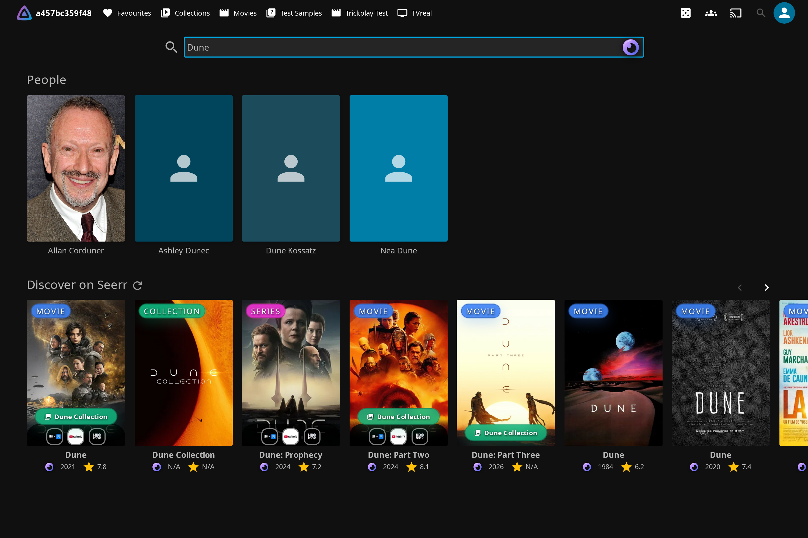
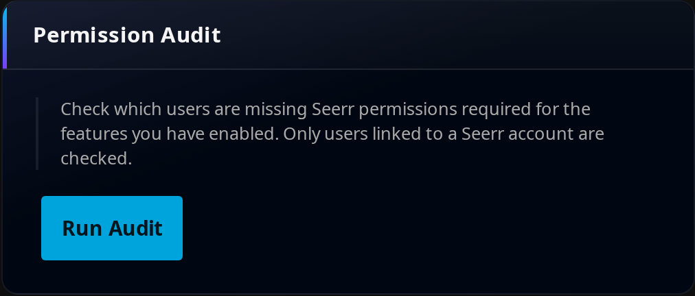
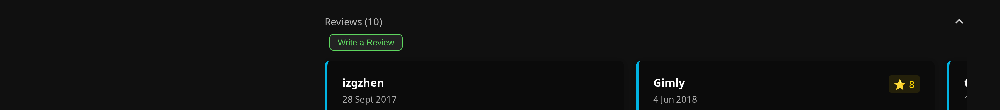

# Discover & Request

Jellyfin is great at playing what you already own. Jellyfin Canopy turns it into a place to *find* something to watch and *get* the things you don't have yet — without leaving the app. This guide covers the four features that make that happen:

- **[Elsewhere](#elsewhere-where-else-a-title-is-streaming)** shows where a movie or show streams across services and regions, right on its detail page.
- **[Discovery](#discovery-a-feed-to-find-something-to-watch)** adds a customizable feed of Trending, Popular, Upcoming and genre rows inside your libraries.
- **[Requesting with Seerr](#requesting-with-seerr)** wires your Jellyfin search, detail pages and a dedicated Requests page into your [Seerr](https://docs.seerr.dev/) instance so people can ask for new media in a couple of clicks.
- **[Reviews](#reviews)** brings both TMDB reviews and reviews your own users write onto detail pages.

Three of these lean on **The Movie Database (TMDB)** or **Seerr**, so a short setup pays off across all of them. If you haven't installed the plugin yet, start with [Getting Started](getting-started.md).

---

## Elsewhere — where else a title is streaming

Elsewhere answers a question every viewer eventually asks: *"Where else can I watch this?"* It adds a where-to-watch panel to movie and TV detail pages, listing the streaming services that carry the title in your region — or announcing, with your own branding, that it's only on your server. The data comes from TMDB, so coverage is broad and kept current by the TMDB community.


What it gives you:

- **Multi-region availability** — check where a title streams across different countries, not just your own.
- **Provider icons and names** — the logo and name of each streaming service that carries it.
- **Exclusive branding** — when a title isn't on any streaming service, show a custom message like "Only available on My Server" to highlight what your library offers that others don't.
- **Customizable filters** — show only the providers you care about, and hide the ones you don't (with regex support on the hide list).

### What Elsewhere needs

Elsewhere requires a **TMDB API key**. Everything else ships ready to go — **Enable Elsewhere** is **on by default** (`ElsewhereEnabled = true`) — but the panel does not appear on detail pages until a valid key is set.

!!! info "Prerequisites"
    - A **TMDB API key** ([free from TMDB](https://www.themoviedb.org/settings/api))
    - The **Jellyfin Canopy** plugin installed (see [Getting Started](getting-started.md))

#### Getting a TMDB API key

1. Create a free account at [TMDB](https://www.themoviedb.org/).
2. Go to [Settings → API](https://www.themoviedb.org/settings/api).
3. Request an API key (choose the "Developer" option).
4. Copy the **API Key (v3 auth)**.
5. Paste it into the plugin settings.

!!! tip "One key powers every TMDB feature"
    A single TMDB API key drives every TMDB-backed feature in the plugin. The same key is used whether you enter it on the **Elsewhere** tab or the **Seerr** tab — setting it in one place is enough. It unlocks:

    - **Elsewhere streaming availability** — the where-to-watch panel on detail pages
    - **TMDB Reviews** — TMDB and user-written reviews on detail pages
    - **Release / Air Dates** — TMDB release-date and air-date lookups
    - **Seerr streaming-provider posters** — streaming-service icons on Seerr result cards, plus person ("More from Actor") and keyword/tag discovery
    - **People Tags** — birthplace and age enrichment for cast members on detail pages

### Turn it on

1. Go to **Dashboard → Plugins → Jellyfin Canopy**.
2. Open the **Elsewhere** tab.
3. Confirm **Enable Elsewhere** is checked (it is on by default).
4. Enter your **TMDB API Key**.
5. Select your **Default Region** (for example US, GB, DE).
6. Optionally configure default and ignored providers (see below).
7. Click **Save**.

!!! note "On by default, but needs a key"
    Because **Enable Elsewhere** ships on, the only required step is entering a valid **TMDB API Key** — the panel stays hidden until a key is present. Untick **Enable Elsewhere** if you want to turn the detail-page panel off entirely.

### On the detail page

Open any movie or TV detail page and scroll to the streaming-availability panel. Its heading tells you what was found:

- `Also available in <region> on:` — followed by provider icons and names for that region.
- `Not available on any streaming services in <region>` — or your [custom branding message](#custom-branding), if you've set one.

The panel shows provider logos, provider names, and availability across each region you've selected.

### Region & provider defaults (admin)

The server-wide defaults live on the **Elsewhere** tab. Each is also used by features that don't depend on the Elsewhere panel, so these fields stay editable even when **Enable Elsewhere** is off — only the detail-page panel and its custom-branding fields are gated behind the toggle.

| Setting | Default | What it does |
| --- | --- | --- |
| **Default Region** | `US` (when blank) | The primary region for availability checks. Also used by **TMDB Release Dates** and the **Seerr streaming icons**. Examples: `US`, `GB`, `DE`, `FR`, `ES`, `IT`. [Full list of regions](https://cdn.jsdelivr.net/gh/n00bcodr/Jellyfin-Elsewhere/resources/regions.txt). |
| **Default Providers** | Blank (show all) | Comma-separated list of providers to show by default — e.g. `Netflix,Hulu,Disney Plus`. Leave blank to show every provider. Also used by the Seerr streaming icons. [Full list of providers](https://cdn.jsdelivr.net/gh/n00bcodr/Jellyfin-Elsewhere/resources/providers.txt). |
| **Ignore Providers** | Blank | Comma-separated list of providers to hide from results. **Supports regex patterns.** Also used by the Seerr streaming icons. |

Common provider names include Netflix, Amazon Prime Video, Disney Plus, HBO Max, Hulu and Crunchyroll.

!!! example "Ignore Providers — exact names and regex"
    Basic (exact names):
    ```text
    Apple TV,Google Play Movies
    ```
    Regex (hide every "with Ads" tier):
    ```text
    .*with Ads
    ```
    Multiple patterns at once:
    ```text
    .*with Ads,.*Free,Vudu
    ```
    Use it to hide services you (or your users) can't access, filter out ad-supported tiers, drop free options, or exclude rental/purchase-only services. Regex is supported on the **ignore** list only.

#### Custom branding

Two optional fields let you turn a "nothing found" result into a statement about your library.

| Setting | Default | What it does |
| --- | --- | --- |
| **Custom Branding Message** | Blank | Text shown in the panel when the title is **not** on any streaming provider in the region — e.g. "Only available on My Server". Replaces the default "Not available on any streaming services in [region]" message. Leave blank to fall back to the default. |
| **Custom Branding Icon URL** | Blank | An optional icon shown next to the message. Appears only when a message **is** set **and** the title has no available providers. Accepts a full `https://` URL or a local path such as `/web/assets/img/icon.png`. Leave empty to show the message with no icon. |

### Per-user panel controls

Everything above is the server-wide admin default. Any user can override the region and provider filters just for themselves, straight from the panel — click the **gear (settings) icon** in the panel header to open the per-user dialog.

| Control | What it does |
| --- | --- |
| **Region** | A primary region select that overrides the admin **Default Region** for this user. |
| **Add other countries** | An autocomplete for adding extra regions. When set, the panel's **Search** button looks the title up across every selected region at once. |
| **Providers** | A provider-filter autocomplete that overrides the admin **Default Providers** for this user. Leave it empty to show every provider. |
| **Search** | Runs the multi-region lookup for the chosen region(s) and shows availability for each. |

Each user's choices are saved server-side to their own `elsewhere.json`, so they persist across devices and never change the admin defaults or anyone else's view. A user who never opens the dialog keeps the admin Default Region and Default Providers.

### Streaming posters on Seerr cards

Elsewhere's provider data can also appear on Seerr discovery and result cards, so people can see where a title already streams while deciding what to request. Turn it on from the **Seerr** tab:

1. Go to **Dashboard → Plugins → Jellyfin Canopy → Seerr** tab.
2. Check **Show Streaming Providers on Posters**.
3. Click **Save**.

The cards then carry the same provider information shown on item pages. This uses the shared TMDB key and the same Default Region / provider settings.

### Privacy, limitations & troubleshooting

Elsewhere sends only what's needed to look a title up — the item's TMDB ID, the selected region code, and your API key (securely transmitted). It does **not** send your library contents, personal information, or viewing history. All provider data comes from TMDB and is only as accurate and current as TMDB's community data.

Its limits follow from that: availability data depends on TMDB accuracy, some regions have sparse provider data, availability changes frequently, and an internet connection is required.

!!! warning "Panel not showing?"
    - Verify the TMDB API key is correct.
    - Ensure **Enable Elsewhere** is checked.
    - Confirm the item actually has TMDB metadata (a TMDB ID).
    - Check the browser console for errors.

    If nothing shows even for popular titles, TMDB's API may be blocked in your region — try a VPN, and see the [Seerr TMDB troubleshooting notes](https://docs.seerr.dev/troubleshooting#tmdb-failed-to-retrievefetch-xxx).

If a title shows **no providers**, it may not be available in the selected region, every matching provider may be on your ignore list, TMDB may lack data for the item, or you may have hit a rate limit. Try a different region, review your ignore list, confirm the item has a TMDB ID, or wait and retry. For anything else, check the [FAQ](help.md).

---

## Discovery — a feed to find something to watch

Discovery adds a customizable **rows-of-cards feed** — Trending, Popular, Upcoming, Top Rated, genre rows and more — right inside your Movies and TV Shows libraries. Instead of scrolling the same grid of what you own, you get a browsing surface for finding your next watch, with anything you don't have yet one tap away from a request.

Every card behaves like the rest of Jellyfin Canopy's Seerr surfaces: real poster art, an availability badge, a one-tap **Request** button for titles you don't have, streaming-service icons, and a direct link into your library for titles you already own.

### Where it shows up

A **Discovery** button appears in the toolbar of your **Movies** and **TV Shows** library pages. Tapping it swaps the library grid for your Discovery feed; tapping it again returns to the grid. Movie pages show movie rows; TV pages show TV rows.

!!! tip "More placements are on the way"
    A Home-screen tab, a dedicated Discovery page, and trending suggestions on the search screen are planned follow-ups.

### The rows

| Row | What it shows |
| --- | --- |
| **Trending This Week** | What's trending globally right now |
| **Popular** | The most popular movies / shows |
| **Upcoming** | Releasing soon |
| **Top Rated** | Highest rated |
| **My Watchlist** | Your Seerr watchlist (optional) |
| **Genre rows** | A few rows for real genres (Action, Comedy, …) |

### Where the data comes from

Discovery is **Seerr-backed and requires a Seerr connection** — there is no raw TMDB fallback, by design. Rows come from Seerr, so every card already knows whether a title is **available**, **requested**, or **requestable**, and requests happen inline. "Already in your library" is resolved through the plugin's own provider lookup.

Discovery also respects each user's **parental rating limit** — the same server-side filter used across the Seerr features (see [Parental-rating & tag filtering](#parental-rating-tag-filtering)) — so restricted users never see blocked titles in a feed. That filter is always enforced server-side and is not something a user can turn off.

### Make it yours

Every user can tap **Customize** on their Discovery feed to choose which rows appear and in what order — include or exclude any row (genre rows included), reorder them, or reset to the defaults your admin set. Your choices are saved for you and don't affect anyone else.

!!! note "Customizations are saved per device, not on your account"
    Row choices are stored in your **browser** on the device you're using — they don't sync across your devices or browsers. Customize your feed on your laptop and another device (or a different browser) still shows the admin defaults until you customize it there too. Clearing your browser's site data resets your choices back to the defaults.

### Admin defaults

Admin settings live on the **Discovery** tab of the config page (**Dashboard → Plugins → Jellyfin Canopy**). They set the **defaults** that a user sees until they customize their own feed.

!!! info "Requires a Seerr connection"
    Configure a Seerr connection on the **Seerr** tab first (see [Requesting with Seerr](#requesting-with-seerr)). Rows come from Seerr, so cards carry availability, request state and inline Request buttons, and every feed is parental-rating filtered server-side.

| Setting | Default | What it does |
| --- | --- | --- |
| **Enable Discovery & Trending** | On | Master switch for the whole feature. |
| **Show in the Movies & TV library menu** | On | Adds the Discovery button to the Movies and TV Shows library pages. |

**Default rows** — the starting point for every user's feed:

| Row | Default |
| --- | --- |
| **Trending This Week** | On |
| **Popular** | On |
| **Upcoming** | On |
| **Top Rated** | On |
| **My Watchlist** | Off |
| **Add a few genre rows automatically** | On |

Discovery resolves a user's feed as **their customization → your admin defaults → built-in defaults**. A user who never opens *Customize* always sees your defaults; once they customize, their choice wins for them only. **Reset to defaults** in the Customize modal clears their override and returns them to your admin defaults.

---

## Requesting with Seerr

Connect a [Seerr](https://docs.seerr.dev/) instance and your users can search for, request and track new media without leaving Jellyfin. Seerr results appear alongside Jellyfin search results, detail pages gain request and issue-reporting actions, and a dedicated Requests page shows everything in flight.



!!! warning "Not affiliated with Seerr"
    This plugin is **not** affiliated with Seerr. Seerr is an independent project that the plugin integrates with. Please report any issues with this integration to the **Jellyfin Canopy** repository, not to the Seerr team.

!!! tip "How it works"
    To keep things secure and avoid CORS errors, the plugin routes every Seerr call through the **Jellyfin server as a proxy**. This keeps your Seerr API key on the server, out of the browser, and sidesteps cross-origin restrictions.

### Connect Seerr

#### Step 1 — Enable Jellyfin Sign-In in Seerr

1. In Seerr, go to **Settings → Users**.
2. Enable **Enable Jellyfin Sign-In**.
3. Save.


#### Step 2 — Import Jellyfin users (optional)

This step is optional if you turn on plugin-side auto import (Step 4).

1. In Seerr, open the **Users** page.
2. Click **Import Jellyfin Users**.
3. Select the users to import and save.

Users with access and users without access appear differently in Seerr:


#### Step 3 — Configure the plugin

1. Go to **Dashboard → Plugins → Jellyfin Canopy → Seerr** tab.
2. Check **Enable Seerr integration** — the master toggle; nothing Seerr-related works until this is on.
3. Check **Show Seerr Results in Search**.
4. Enter your **Seerr URL(s)**, one per line — the **internal** address the Jellyfin *server* uses (LAN or docker-network). Use the internal URL for best performance. Each distinct URL represents a separate Seerr identity domain: user-scoped work stays pinned to the instance where that user was resolved, while safe public reads can try the configured order. Do not list multiple aliases for the same instance.
5. Optionally enter a **Seerr External URL** — the **public** address a user's *browser* opens for "Open in Seerr" links (see [Internal vs external URL](#internal-vs-external-url)). Leave blank to reuse the internal URL.
6. Enter your **Seerr API Key** — found in Seerr under **Settings → General → API Key**.
7. Click the **Test** button next to the API Key field to verify the connection.
8. Enable the [optional features](#request-options) you want.
9. Click **Save**.

!!! note "TMDB API key on the Seerr tab"
    The **Seerr** tab also has a **TMDB API Key** field. This shared key enables person/keyword discovery (**More from Actor** and tag discovery) and the streaming-provider posters on Seerr cards. It's the **same** key used by Elsewhere — enter it in either place and both features use it. See [Getting a TMDB API key](#getting-a-tmdb-api-key).

#### Internal vs external URL

Seerr is reached from two very different places, which is why there are two URL fields:

| Field | Used by | Example |
| --- | --- | --- |
| **Seerr URL(s)** | The Jellyfin server, for all API calls | `http://seerr:5055` |
| **Seerr External URL** | User browsers, for deep links only | `https://requests.example.com` |

The **Jellyfin server** handles search, requests, issues and user import — it should use the **internal** URL, which may be unreachable from a browser. A **user's browser** opens Seerr only when someone clicks an "Open in Seerr" link, so it needs a **public** URL.

!!! tip
    Leave **Seerr External URL** blank if the internal URL is already reachable from browsers — links then reuse the internal URL exactly as before. Set it when Seerr sits behind a reverse proxy or auth gateway that the server bypasses on the LAN but users reach over the internet. When set, the internal Seerr URL is no longer sent to non-admin clients as the link base.

For setups where users reach Jellyfin through several different URLs, **URL Mappings** (under *Advanced URL Mappings*) map each Jellyfin access URL to a specific Seerr URL; a matching mapping takes priority over the External URL. The External URL is the simpler option and covers most deployments. Format is one mapping per line:

```text title="Formatting"
jellyfin_url|seerr_url
```

!!! example "URL mapping examples"
    === "Remote access"
        ```text
        https://jellyfin.mydomain.com|https://seerr.mydomain.com
        ```
    === "Local access"
        ```text
        http://192.168.1.10:8096|http://192.168.1.10:5055
        ```
    === "Remote + local"
        ```text
        https://jellyfin.mydomain.com|https://seerr.mydomain.com
        http://192.168.1.10:8096|http://192.168.1.10:5055
        ```
    === "Base URLs + paths"
        ```text
        https://example.com/jellyfin|https://example.com/seerr
        ```

!!! note
    URL Mappings are delivered to every signed-in client so each browser can pick the right link — both sides of every mapping are user-visible by design. Only put URLs in mappings that users are meant to see and open. A malformed value (missing `http://`/`https://`, embedded credentials, or a query string/fragment) is rejected with a clear warning on save and never used.

#### Step 4 — Auto-import users (optional)

Skip manual imports in Seerr by letting the plugin import users just in time. When enabled, the lookup searches every configured identity domain for an existing mapping. If none exists, the new Jellyfin user is imported once into the first canonical configured domain when they first use Seerr Search.

1. Go to **Dashboard → Plugins → Jellyfin Canopy → Seerr** tab.
2. In the **Users** section, check **Auto import Jellyfin users to Seerr**.
3. Optionally expand **Blocked Users** and select users to exclude from lookup/import.
4. Optionally click **Import Users Now** to run an immediate bulk import.
5. Click **Save**.

!!! tip "Scheduled import"
    The scheduled task **Import Jellyfin Users to Seerr** runs every 6 hours by default when auto import is enabled. Manual and scheduled bulk imports first read complete, stable user maps from every configured identity domain and exclude every user already mapped anywhere. A user linked on multiple domains is valid and remains excluded. Only the truly unbound batch is sent once to the first canonical configured domain; the POST is never fanned out or replayed elsewhere after a timeout, malformed response, or error. If any domain's map is incomplete, malformed, or internally ambiguous, no import is sent. Change the trigger under **Dashboard → Scheduled Tasks**.

### Search & request

Type a query in the Jellyfin search bar and results from both Jellyfin **and** Seerr appear. Seerr results carry a request-status indicator; click one to request the title or view its details.

A **Seerr icon** on the search page shows the connection status:

| State | Meaning |
| --- | --- |
| **Active** | Seerr is connected and your Jellyfin user is linked. Seerr results load alongside Jellyfin's, and requests can be made. |
| **User Not Found** | Seerr is connected, but your Jellyfin user isn't linked to a Seerr account. If auto import is on, linking is attempted automatically; otherwise import the user in Seerr. Results won't load until linked. |
| **Offline** | The plugin couldn't connect to any configured Seerr URL. Check your settings and that Seerr is running and reachable. Results won't load. |

#### Request status indicators

| Indicator | Meaning |
| --- | --- |
| **Available** | Already in your library |
| **Pending Approval** | Request submitted, awaiting admin approval |
| **Requested** | Request approved, waiting to download |
| **Processing** | Actively downloading |
| **Declined** | An admin declined the request |
| **Not Requested** | Click to request |

#### The Seerr-only filter

By default the search page shows both Jellyfin and Seerr results. To focus on Seerr alone, **double-click** the Seerr search icon (**double-tap** on touch devices, or focus it and press ++enter++ / ++space++). This toggles a "show only Seerr results" mode that hides the Jellyfin result sections and moves the Seerr section to the top; a *Showing results only from Seerr* toast confirms the change. Toggle it again to restore all sections (a *Showing all search results* toast confirms).

!!! note
    The filter is only available while the Seerr icon is **Active** — that is, Seerr is connected and your Jellyfin user is linked. The icon's tooltip reflects the current mode ("Double-click to show only Seerr results" / "Double-click to show all results").

#### 4K requests

Requesting in 4K is a two-part gate: an admin master switch, and per-user permission on the Seerr side.

1. Enable **Enable 4K Requests** and/or **Enable 4K TV Requests** in the plugin settings (each is a master switch).
2. For a movie or TV result, use the request split-button dropdown and choose **Request in 4K**.
3. For TV, the season selection modal opens in 4K mode — the header reads **Request Series - 4K** and the primary button reads **Request in 4K**.

!!! note "When the 4K option actually appears"
    Beyond the admin master switch, the 4K option is offered only when the Seerr server actually has 4K enabled for that media type (a default 4K Radarr / Sonarr — Seerr's `movie4kEnabled` / `series4kEnabled`) **and** the signed-in user holds the Seerr **REQUEST_4K** (or the media-specific **REQUEST_4K_MOVIE** / **REQUEST_4K_TV**) permission. Otherwise the affordance is hidden. The server enforces the same rule on the request itself, so a 4K request can never be made without permission.

In the **More Info** modal, TV actions use **Request More** as the primary action, with **Request in 4K** in the dropdown when 4K is requestable.

#### Requesting collections

With **Show Collections in Seerr Results** on (the default), TMDB collections — Harry Potter, the Marvel Cinematic Universe and the like — appear in Seerr search results with an option to request the whole collection at once. The collection request modal lists every movie with its current status; titles that are already available, already requested, or blocklisted are pre-disabled, and only the still-requestable movies you select are submitted (one request per movie, matching Seerr's own behavior). When 4K movie requests are available to you, the modal shows a **Request in 4K** toggle that submits the selected movies in 4K and re-evaluates each against its own 4K status.

#### Request options

These toggles on the **Seerr** tab shape the request experience:

| Setting | Default | What it does |
| --- | --- | --- |
| **Enable 4K Requests** | Off | Master switch for 4K movie requests. Requires a Seerr instance with a 4K Radarr and users with 4K permission. See [4K requests](#4k-requests). |
| **Enable 4K TV Requests** | Off | Master switch for 4K TV requests. Requires a 4K Sonarr and users with 4K permission. When enabled and available, TV request buttons gain a 4K dropdown, the season modal opens in 4K mode with the title **Request Series - 4K** and primary button **Request in 4K**. |
| **Show Advanced Request Options** | — | Shows advanced options (season selection, quality options, etc.) in the request modal. |
| **Show Request Quota Info** | On | Request modals display a chip with the user's current request usage and, when a complete request history makes it safe to derive, when the next slot frees up. A temporary history failure omits only that reset estimate rather than hiding Seerr's authoritative quota numbers — a maxed-out user then sees "Reset time is currently unavailable" instead of a silent gap, so an unavailable estimate is never mistaken for "no reset exists". A blocked request shows a detailed quota-error dialog instead of a vanishing toast. |
| **Show Collections in Seerr Results** | On | Shows TMDB collections in results with an option to request the whole collection. See [Requesting collections](#requesting-collections). |
| **Open Results in "More Info" Modal** | Off | Controls what happens when a user clicks a Seerr result's title or poster. **Off** opens the item in Seerr; **On** opens an in-app **More Info** modal, keeping the user inside Jellyfin. |
| **Show "Request More" Button on Series** | On | Adds a **Request More** button beside the Seasons heading on Series detail pages whenever the show has unrequested seasons in Seerr, so users can request more seasons without using the search bar. |
| **Show Streaming Providers on Posters** | — | Shows Elsewhere provider icons on Seerr result cards (needs a TMDB key). See [Streaming posters on Seerr cards](#streaming-posters-on-seerr-cards). |

### Recommendations, similar & discovery on detail pages

Seerr detail pages surface **Recommended items** and **Similar items** sections, each with real-time request status and a Request button, so people can branch off into related titles.

Enable them on the **Seerr** tab:

1. Check **Show similar items** and/or **Show recommended items**.
2. Optionally enable **Exclude items already in library** to hide titles you already own.
3. Optionally enable **Exclude blocklisted items**.

Beyond a single item's recommendations, Seerr powers several **discovery** surfaces you can browse and request from directly:

- **Genre Discovery** — browse by genre (Action, Comedy, …)
- **Network Discovery** — browse by network (Netflix, HBO, …)
- **Person Discovery** — browse by actor, director or crew
- **Tag Discovery** — browse by custom tags
- **Collection Discovery** — on a collection/BoxSet page, surface the collection's movies not yet in your library, each with a request button (on by default)

Each supports filtering by TV / Movies / All, infinite scroll with pagination, requesting directly from the results, and library awareness so titles you own are hidden. Enable the discovery types you want in settings; reach them via custom navigation or direct URLs. For the packaged, customizable version of all this, see [Discovery](#discovery-a-feed-to-find-something-to-watch).

### Auto-Requests

Auto-Requests place a request on your users' behalf based on what they watch — the next season as a show winds down, or the next movie in a collection. They're configured on the **Seerr** tab and require the **Enable Seerr integration** master toggle.

#### Auto Season Request

- Triggers when a set number of episodes remain in the season.
- Optionally requires all episodes watched first.
- Configurable threshold, **default 2 episodes remaining**.
- Does **not** require a TMDB key.

#### Auto Movie Request

!!! note "Requires a TMDB API key"
    Auto Movie Requests use TMDB to resolve a movie's collection and pick the next title, so they need a **TMDB API Key** (entered on the Elsewhere or Seerr tab). With no key configured, the feature does nothing.

- Triggers on **playback start**.
- Triggers after a set number of minutes watched, **default 20 minutes**.
- Optionally checks the release date and only requests titles that have released.
- **Next in collection** — when a movie belongs to a TMDB collection, the next title is chosen by **release order**, not the collection's raw list order, so a prequel or spin-off is never requested ahead of the actual next film (titles with no release date sort last). This is a Movie behavior.
- **Quality Profile Mode** — how the auto request picks its Radarr target:
    - *Default* — Seerr uses its default Radarr server and quality profile.
    - *Original* — uses the same quality profile as the movie being watched, falling back to default if not found.
    - *Custom* — uses the specific Radarr server, quality profile and root folder you select. These IDs are local to a Seerr instance, so Custom mode requires exactly one distinct configured Seerr identity domain. With multiple domains, the automatic request fails closed instead of applying source-less IDs to whichever instance owns the user.
- **Use default instead of 4K fallback** (default on) — applies only when Quality Profile Mode is *Original*. If the watched movie was requested with a 4K profile, the auto-request uses Seerr's default profile instead, preventing failures or manual approvals for users who lack 4K request permission. Disable it to preserve the original 4K profile when all your users have 4K request access.

!!! note "Automatic requests stay on one Seerr instance"
    When more than one Seerr instance is configured, the plugin first resolves the Jellyfin user to one source instance. Collection/status/profile reads and the final automatic request all stay on that exact instance. The POST is never replayed to another backend after a failure, because the first backend may already have committed it. An "already requested" response from the pinned instance is treated as success.

### The Requests page

The Requests page brings active downloads from Sonarr/Radarr together with Seerr requests and issues in one place, so people can watch a request move from *pending* to *available* without hopping between apps.


!!! note "You only need one data source"
    The page draws from two **independent** sources and is useful with either:

    - **Downloads** come from your **\*arr** services — a single **Sonarr *or* Radarr** is enough. A movie-only Radarr (or TV-only Sonarr) setup works fine; the other service isn't required. See [Sonarr & Radarr](sonarr-radarr.md).
    - **Requests and issues** come from **Seerr**.

    Configure whichever you use — you don't need all three at once.

#### Set it up

1. Go to **Dashboard → Plugins → Jellyfin Canopy → Pages** tab (look for the "Requests Page" section).
2. Check **Enable Requests Page**.
3. Optionally check **Show Downloads in Requests Page** to display active \*arr downloads (enabled by default).
4. Optionally check **Show Seerr Issues Section** to display Seerr issues.
5. Optionally check **Enable In-App Request Approvals** to show Approve / Decline buttons on pending requests (enabled by default — see [In-app approvals](#in-app-request-approvals)).
6. Configure the polling settings (below).
7. Click **Save**.

The Requests page is a routed destination with automatic entry points — a link in the **Jellyfin Canopy** sidebar-drawer section, plus a header-tray icon button and a user-preferences-menu link on the modern layout, ordered by the admin **Pages order** setting. Reach it directly at `/web/index.html#/downloads`; browser back/forward, refresh, and deep links all work. See [Sonarr & Radarr](sonarr-radarr.md) for the full Requests page details.

#### What's on it

The page shows active downloads with progress bars, ETA, quality and size; Seerr requests with status chips (Pending Approval, Requested, Processing, Declined); and reported issues. You can filter by status and search.

!!! note "Complete lists and per-user filtering"
    - The request list is filtered by **each caller's own Jellyfin parental-rating limit** (see [Parental-rating & tag filtering](#parental-rating-tag-filtering)), and a user who can only see their own requests never receives another user's rows.
    - The **Coming Soon** view reads *all* pages of Seerr's non-terminal processing collection before filtering future dates and paging locally, so it doesn't stop at the first page and its totals reflect the full future-dated set.

#### Polling

| Setting | Default | What it does |
| --- | --- | --- |
| **Enable Auto-Refresh** | On (recommended) | Automatically refreshes download and request status. |
| **Poll Interval (seconds)** | 30 | How often to refresh, range **30–300 seconds**. Lower = more frequent updates and higher server load; higher = the reverse. |

#### In-app request approvals

Approve or decline pending Seerr requests without leaving Jellyfin. Pending request cards show a green **Approve** and a red **Decline** button; clicking one proxies the action to Seerr and refreshes the row so its status chip updates immediately.

- **Who sees the buttons** — only callers Seerr would let approve: **Jellyfin admins**, and Seerr users holding the **Manage Requests** (or **Admin**) permission. Everyone else sees the request list without approval controls. The server enforces this on every action, so the buttons are a convenience, not the security boundary.
- **How it works** — the action is proxied server-side to Seerr's `POST /api/v1/request/{id}/approve` (or `/decline`) using the plugin's configured Seerr API key; the acting user is passed through so Seerr records the correct approver and applies that user's permissions. The Seerr API key is never exposed to the browser.
- **Feedback** — a toast confirms the approval or decline, and the card's status chip moves from *Pending Approval* to *Requested* (or *Declined*).
- **Enable / disable** — the **Enable In-App Request Approvals** toggle (**Pages** tab) turns the whole affordance on or off. It's on by default. When off, the buttons never render and the approve/decline endpoint refuses the action.

!!! note "Pending detection"
    The buttons appear whenever the **request** itself is pending, even when the media is already partially available — for example a pending request for a new season of a show you already have. That's why the control keys off request status, not media availability.

#### Issues on the page

With **Show Seerr Issues Section** on, reported Seerr issues appear in their own section on the page — view all issues, filter by status, page through them, and open the Seerr reporter modal to manage each one. TMDB detail lookups are cached. Enable it on the **Pages** tab alongside **Enable Requests Page**.

### Reporting issues

A corrupt file or out-of-sync subtitles shouldn't need a message to the admin. Users can report problems with media directly to Seerr from a detail page.

Issue types cover **Video** (quality, corruption, wrong file), **Audio** (sync, missing tracks, quality), **Subtitles** (sync, missing, incorrect) and **Other** (metadata, artwork, etc.).

To report one: open a movie or TV detail page, click the report icon in the action buttons, select the issue type, choose a season and episode for TV (optional), enter a description, and submit.

Two related settings on the **Seerr** tab:

| Setting | Default | What it does |
| --- | --- | --- |
| **Show 'Report Issue' Button** | — | Displays the issue-reporting button on item detail pages. |
| **Show Open Issue Indicator** | Off | Turns the **Report Issue** button orange with a count badge when the item already has open issues in Seerr, so users see at a glance that a problem's been reported. Requires **Show 'Report Issue' Button**. |

!!! note
    The issue-reporting button is hidden when Seerr is not reachable, or when the user is not linked to a Seerr account.

### Watchlist sync

Keep watchlists in step between Seerr and Jellyfin, in either direction. Configure these on the **Seerr** tab.

**Seerr → Jellyfin** *(requires the [KefinTweaks plugin](https://github.com/ranaldsgift/KefinTweaks) to provide watchlist functionality)*

- Adds requested items to the Jellyfin watchlist when they become available in the library.
- Syncs Seerr watchlist items to Jellyfin.
- Remembers previously removed items so they aren't re-added.
- Runs via the **Sync Watchlist from Seerr to Jellyfin** scheduled task.

**Jellyfin → Seerr**

- Syncs each user's Jellyfin watchlist to their linked Seerr watchlist.
- Only syncs items that have a TMDB ID and a linked Seerr account.
- Skips items already in the Seerr watchlist.
- Runs via the **Sync Watchlist from Jellyfin to Seerr** scheduled task (**default: daily at 03:30**).

| Setting | Default | What it does |
| --- | --- | --- |
| **Add requested media to Watchlist** | — | Auto-adds requested items when they become available (needs KefinTweaks). |
| **Sync Seerr Watchlist → Jellyfin** | — | Syncs Seerr watchlist items to Jellyfin. |
| **Sync Jellyfin Watchlist → Seerr** | — | Syncs each user's Jellyfin watchlist to their linked Seerr account. |
| **Prevent re-adding removed items** | — | Remembers removed items so they aren't re-added. |
| **Memory retention (days)** | 365 | How long removed items are remembered. |

### Recently-added sync to Seerr

Close the gap between new items landing in Jellyfin and Seerr noticing them. **Trigger Seerr recently-added scan when new Jellyfin items are added** (default **off**) — when on, the plugin asks Seerr to run its recently-added scan whenever new items are imported into your Jellyfin library, so Seerr marks matching requests as available sooner.

- **Debounce (seconds)** (default **60**, range **5–3600**) — coalesces bursts of item-added events into one scan after activity settles. Continuous imports cannot postpone the scan forever: the first pending event starts a hard deadline of four debounce windows, capped at one hour.
- Automatic and manual triggers share one worker. Requests never overlap; events received during a scan become at most one coalesced follow-up, and **Trigger scan now** drains a pending timer or joins the equivalent active scan instead of causing a duplicate.
- Each batch sends at most one trigger to every normalized distinct Seerr URL. The admin button submits all form domains as one owned batch, so draining an automatic timer cannot make its later per-domain calls duplicate work. Comma/newline duplicates and trailing-slash aliases collapse to one identity domain; distinct URLs are independent intended domains, so one domain failing does not prevent the others from being attempted. The manual result reports all-success, partial-success, and all-failed outcomes separately.

### Parental-rating & tag filtering

Seerr surfaces respect each user's Jellyfin content-rating restriction, so a child account on a PG limit never *sees* — let alone requests — an R-rated title. Filtering happens **server-side**: restricted titles are stripped from the response before it reaches the browser, so they can't be recovered by inspecting network traffic. A client-side hide would only conceal the cards.

**How it decides:**

- It uses each user's own **Maximum Parental Rating** and **Block unrated items** settings from their Jellyfin account (**Dashboard → Users → *user* → Access**). Nothing is duplicated in the plugin — Jellyfin stays the single source of truth for what each user may watch.
- It applies to search results, discovery rows (genre / network / keyword / studio), similar and recommended sections, collections, watchlists, person filmographies (including the films listed under a person), the **Requests page**, and the requested-items feed the **Calendar** draws from. Each list is filtered against the caller's own limit before it reaches the browser.
- A restricted user also can't **open** a blocked title's detail/season or **request** it by id — both are rejected server-side, not merely hidden.
- The raw TMDB passthrough is **denied by default** for a rating-limited user. Only rating-free lookups pass through untouched (genre lists, and keyword or company *search*); a movie/TV detail or one of its own parts is served only when the parent title is within the user's limit; everything else — discover, trending, title search, similar and recommendations, person and collection browsing — is blocked. Any new or unknown passthrough shape is blocked until it's explicitly reviewed as safe, so a future endpoint can't leak restricted results by accident.
- A title's certification is read the same way the More Info modal shows it (region → US → first available), using your **Default Region** (an Elsewhere setting) to choose the certification system.
- **Administrators are never filtered**, and **users with no rating limit set see everything** — matching how Jellyfin treats parental controls in the library. `adult` titles are always hidden from restricted users.

**Tag-based controls** are enforced too. A user whose Jellyfin policy **blocks items with tags** (say `zombie` or `horror`) won't be sent matching titles in Seerr search/discovery, gets a 403 on their detail pages, and can't request them; **Allow only items with tags** works as the same strict allow-list it is in the library. The two directions deliberately match different metadata:

- **Blocked** tags match a title's TMDB **keywords and genre names** — keywords are the very strings Jellyfin's TMDB provider imports as library Tags, and genre names are included so blocking "horror" also covers the genre. Over-hiding is the safe direction.
- **Allowed** tags match **keywords only**, mirroring the library exactly (genres never become item Tags, so a genre match must not satisfy an allow-list the library itself would enforce more strictly).

Matching uses Jellyfin's own normalization ("Sci-Fi" = "sci fi"), and a blocked tag always wins over an allowed one, exactly like the native rules.

**Configure:**

1. Enable **Respect parental ratings** in the Seerr search settings (on by default); **Respect blocked / allowed tags** (also on by default) controls the tag rules specifically.
2. Set each restricted user's **Maximum Parental Rating**, **Block items with tags** / **Allow only items with tags**, and optionally **Block unrated items** in their Jellyfin account. Users with no limit and no tag rules are unaffected.

!!! note "Limitations"
    - **Tag matching relies on TMDB metadata.** Keywords are community-sourced and uneven — an obscure title may simply lack the keyword you blocked (blocking the *genre* name gives broader coverage). Titles whose keywords/genres can't be fetched are hidden for tag-restricted users (fail closed), like unverifiable certifications.
    - **Unrated titles** (no certification on TMDB) follow the user's **Block unrated items** setting, exactly as in the library.
    - Certifications and tag signatures are fetched per title and cached (see [Caching & performance](#caching-performance)); the first search that surfaces a new title for a restricted user is slightly slower.

This filter is closely related to [Spoiler Guard](spoiler-guard.md), which protects unwatched-content metadata by a different mechanism — the two are independent and can be used together.

### Permission Audit (admin)

The Permission Audit is an administrator-only tool that checks every Jellyfin user's Seerr account and reports which Seerr permissions each user holds. It's the fastest way to find users who aren't linked to Seerr or who are missing a permission a plugin feature needs (requests, 4K requests, advanced options, issue reporting, and so on).



**Where to find it:** open the plugin configuration, go to the **Seerr** section, and click **Run Audit** in the "Permission Audit" area.

**How it works:** the audit iterates every Jellyfin user and tries to resolve a linked Seerr user for each, returning a per-user report with three outcomes:

- **Not linked** — the Jellyfin user has no corresponding Seerr account (or Seerr was unreachable). Use the Import Users feature or check Seerr manually.
- **Permissions Missing** — a linked user lacks one or more permissions an enabled feature needs. The audit lists the specific missing permissions, drawn from: `REQUEST`, `REQUEST_MOVIE`, `REQUEST_TV`, `REQUEST_4K`, `REQUEST_4K_MOVIE`, `REQUEST_4K_TV`, `REQUEST_ADVANCED`, `REQUEST_VIEW`, `MANAGE_REQUESTS`, `CREATE_ISSUES`, `VIEW_ISSUES`, `MANAGE_ISSUES`.
- **OK** — the user is linked and has the required permissions. OK users are collapsed into an expandable section.

!!! note "REQUEST_VIEW & MANAGE_REQUESTS"
    If these two are flagged, it may mean nothing more than that those users will only see *their own* requests on the Requests page rather than everyone's. If that's what you intend, the missing permission can be safely ignored.

**Quick steps:**

1. Ensure Seerr integration is configured and reachable (Seerr URLs + API key).
2. Open the plugin configuration → **Seerr** → **Permission Audit**.
3. Click **Run Audit** and wait for results (large user lists can take a while).
4. Review anyone flagged **Permissions Missing** or **Not linked**, and fix them in Seerr.

**Notes:**

- The audit bypasses the cache to guarantee fresh permission checks, so it can be slow with many users.
- If Seerr is unreachable the audit may report users as **Not linked** — verify Seerr availability via the plugin's Seerr status check.
- If users *should* be linked but appear as not linked, try the **Import Users Now** action first.

Remember that these permissions govern what a user may *do* in Seerr; the separate, server-side [parental-rating filter](#parental-rating-tag-filtering) governs what they may *see*, resolving each caller's own Jellyfin limit regardless of their Seerr permissions.

### Caching & performance

Seerr responses and derived data are cached to keep the integration fast. All of these live on the **Seerr** config tab, and **every Seerr cache is flushed automatically whenever plugin settings are saved.**

| Setting | Default | What it does |
| --- | --- | --- |
| **Response Cache TTL** | 10 minutes | How long Seerr search/discovery responses are cached. |
| **Parental Rating Cache TTL** | 1440 minutes (24 hours) | How long a title's resolved content rating is cached for the [parental-rating filter](#parental-rating-tag-filtering). Ratings rarely change, so this is long by default and shared across all users, keeping the filter cheap after a title's first lookup. |
| **User ID Cache TTL** | 30 minutes | How long the resolved Jellyfin-user → Seerr-user id mapping is cached before it's looked up again. |
| **Disable server-side response cache** *(Debug section)* | Off | When on, every Seerr proxy request bypasses the response cache and is fetched fresh. Useful for testing; increases load on Seerr and isn't recommended for normal use. |

### Troubleshooting Seerr

!!! warning "Icon shows Offline"
    1. Verify the Seerr URL is correct and reachable.
    2. Check Seerr is running.
    3. Use the **Test** button in plugin settings.
    4. Check server logs for errors.

!!! warning "Icon shows User Not Found"
    1. Verify **Enable Jellyfin Sign-In** is on in Seerr.
    2. If auto import is enabled, run **Import Users Now** from the plugin settings.
    3. If auto import is disabled, import the Jellyfin user manually in Seerr.
    4. Make sure the user isn't in the **Blocked users** list.
    5. Use the same username in both systems.

**Search returns nothing:** confirm the icon is Active, the API key is correct, and check the browser console for errors. **Results load slowly:** prefer the internal Seerr URL, check network latency, and verify Seerr's own performance and resources.

**Requests won't submit:** confirm the user has request permission in Seerr (the [Permission Audit](#permission-audit-admin) is the quickest check), that request limits aren't exceeded, and that the item isn't already requested. **Requests don't appear:** refresh Seerr, confirm the request succeeded without errors, and check the Seerr request queue.

**Reviews, Elsewhere or Seerr icons not working at all?** TMDB may be blocked in your region — see the [Seerr TMDB troubleshooting notes](https://docs.seerr.dev/troubleshooting#tmdb-failed-to-retrievefetch-xxx), and try a VPN or proxy. For anything else, see [Help & Community](help.md).

---

## Reviews

Jellyfin Canopy puts two kinds of reviews on your detail pages: reviews pulled from **TMDB**, and reviews your **own users** write and share on your server. Both appear in a dedicated Reviews section; the two are configured together on the **Elsewhere** tab.

### TMDB reviews

Show the reviews TMDB users have written for a title, right on its detail page.


Each review shows the full text with author information, a rating score and the review date, and can be expanded or collapsed. To enable:

1. Go to **Dashboard → Plugins → Jellyfin Canopy → Elsewhere** tab.
2. Enable **Show TMDB Reviews**.
3. Click **Save**.

| Setting | Default | What it does |
| --- | --- | --- |
| **Show TMDB Reviews** | — | Displays TMDB reviews on item detail pages. |
| **Expand reviews by default** (`ReviewsExpandedByDefault`) | Off | When on, the reviews section opens already expanded instead of collapsed. This is a server-wide admin default; each user can still collapse or expand it in their own session. |

!!! note "TMDB key required — but not the Elsewhere panel"
    TMDB Reviews need a valid **TMDB API key**. If Elsewhere is already configured, no additional key is needed. TMDB Reviews are **independent of the Enable Elsewhere toggle** — you can show reviews without enabling the Elsewhere streaming-providers panel. All they need is the TMDB key (entered under Elsewhere settings and shared across features).

### User reviews

Let your own users write reviews for any movie, series, season, or episode. Reviews are stored on your server and visible to all users, giving your community its own voice alongside TMDB's.



What users get:

- Write a review with a **star rating (1–5)** and optional text, or just a rating with no text.
- Reviews appear in a dedicated **Reviews** section on detail pages, listed **before** TMDB reviews.
- Edit or delete their own review at any time.
- The **average user rating** shows as a chip next to the TMDB/RT ratings in the item's media-info bar.
- The average also appears as a poster tag (a `person_heart` icon) on library cards when rating tags are enabled.

Review text is limited to 2,000 characters. A server can hold 15,000 reviews in
total, with up to 1,000 per user; editing or deleting an existing review remains
available at the limit. Lists are loaded in bounded pages automatically, so normal
detail-page behaviour is unchanged for large community libraries.

**How to write one:** open a movie, series, season or episode detail page, scroll to the **Reviews** section, click **Add Review**, choose a star rating (optional) and write text (optional — a rating alone is valid), then click the save icon.

**Enable it (admin):**

1. Go to **Dashboard → Plugins → Jellyfin Canopy → Elsewhere** tab.
2. Enable **Enable User Written Reviews**.
3. Optionally enable **Show average user rating on poster cards** to display the average as a poster tag.
4. Optionally disable **Show "—" on posters for unrated items** to hide the `—` placeholder on posters when no ratings exist yet.
5. Click **Save**.

!!! note
    The poster tag also requires each user to have **Rating Tags** enabled in the [Enhanced Panel](enhanced.md) (Settings tab).

#### Moderation

Admins can moderate every review, not just their own — a delete button appears on all reviews, a confirmation dialog is shown before deletion, the action is logged, and the section refreshes automatically.

Two admin defaults in the **User Reviews** section of the config page (**Elsewhere** tab) control whose reviews *non-admins* can see. Both are **on** by default, and admins always see every review regardless.

| Setting | Default | What it does |
| --- | --- | --- |
| **Hide reviews from hidden users** (`HideReviewsFromHiddenUsers`) | On | Hides reviews written by Jellyfin users marked *"Hide this user from login screens"* from non-admin viewers. |
| **Hide reviews from disabled users** (`HideReviewsFromDisabledUsers`) | On | Hides reviews written by Jellyfin users marked *"Disable this user"* from non-admin viewers. |

!!! info "Reviews and Spoiler Guard"
    Both TMDB and user reviews are suppressed on titles a user hasn't watched when [Spoiler Guard](spoiler-guard.md) is protecting that title, so a plot-revealing review can't spoil something you're saving for later.

---

For where each of these settings lives in the config page, see the "Where settings live" map in the [Reference](reference.md). For installing the plugin and first-run setup, see [Getting Started](getting-started.md).
