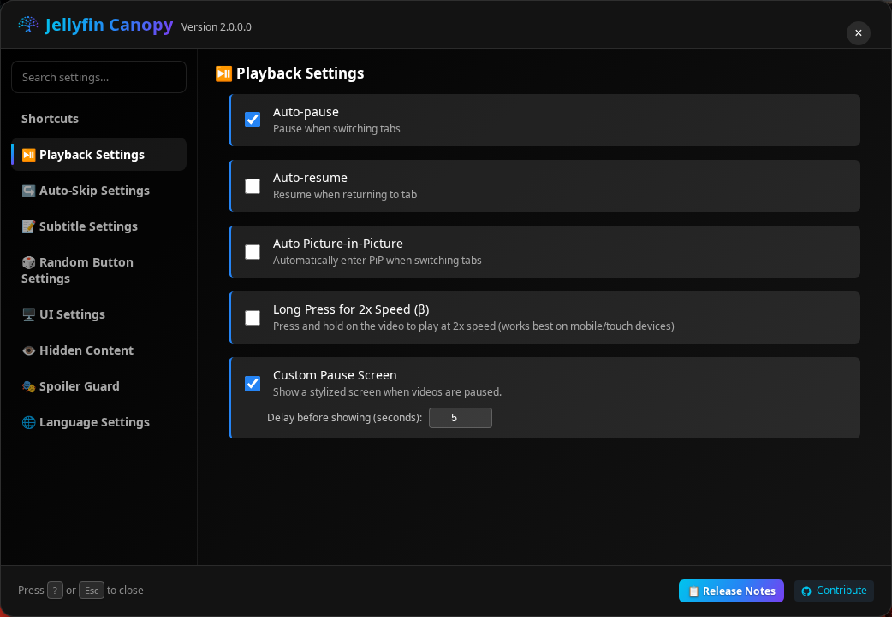
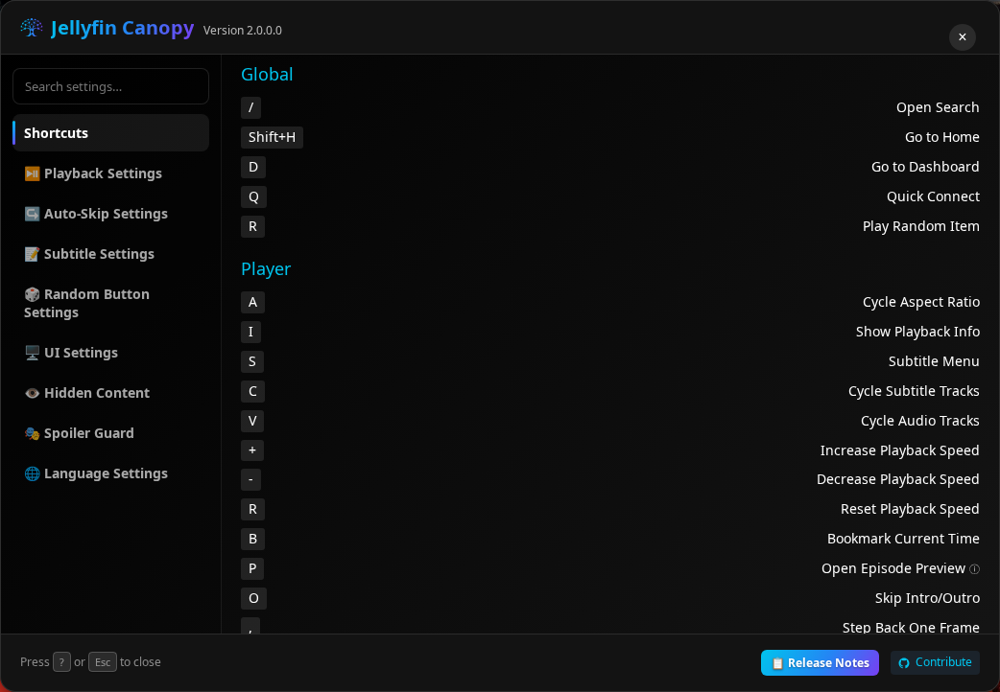
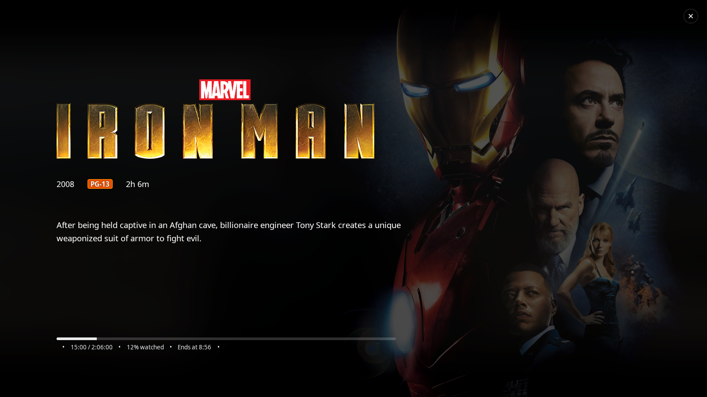
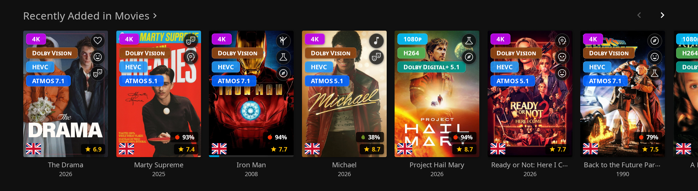
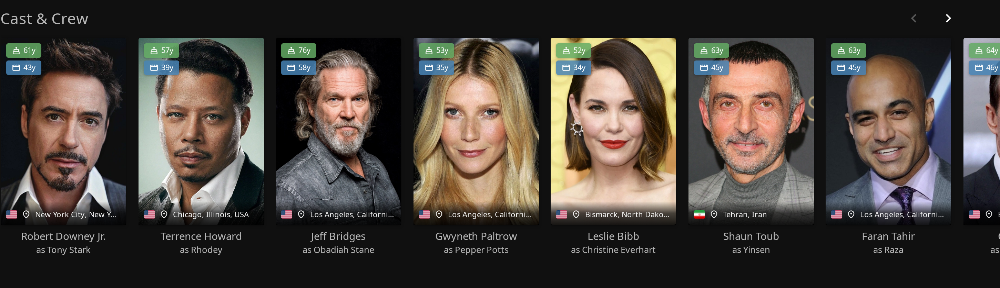
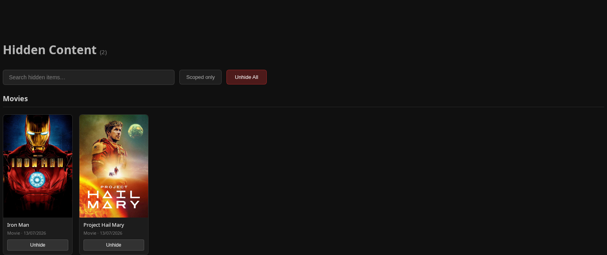
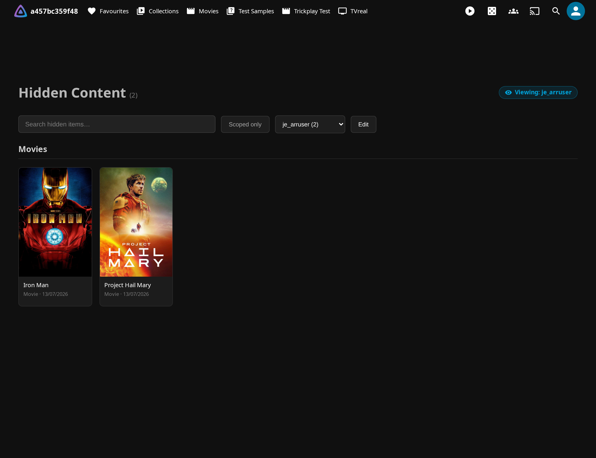
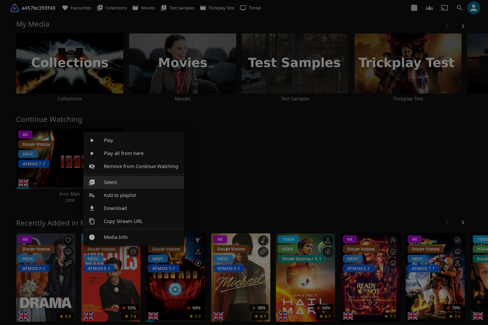
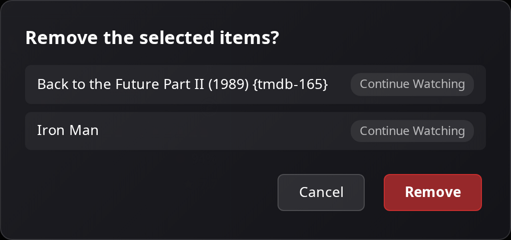

# The Enhanced Experience

The Enhanced area is the part of Jellyfin Canopy you touch every day: sharper playback controls, subtitles you can actually read, poster tags that tell you at a glance what a title is, bookmarks that stick, and a tidy home screen with nothing you don't want to see. Almost everything here is a **per-user** preference you set in the **Enhanced Panel** — and almost every one of those has a matching **admin default** so a server owner can pick sensible starting values for everyone.

This guide walks through the whole Enhanced experience: the panel itself, the playback and control features, and everything that shapes how you browse your library. If you haven't installed the plugin yet, start with [Getting Started](getting-started.md); for a map of which config tab every admin setting lives on, see the [Reference](reference.md).

---

## The Enhanced Panel

The Enhanced Panel is your control center. It's where you turn features on and off, customize keyboard shortcuts, and tune things like subtitle styling and tag positions — all without leaving the page you're on.

**Open it two ways:**

- Press `?` anywhere in the web client.
- Click **Jellyfin Canopy** in the sidebar.

The panel is a settings view with a section list on the left (full-screen with tap-through sections on phones) and a search box that filters the sections:

- **Shortcuts** — customize the keyboard shortcuts (see [Advanced keyboard shortcuts](#advanced-keyboard-shortcuts)).
- **Playback, Auto-Skip, Subtitles, Random Button, UI, Hidden Content, Spoiler Guard, Language** — enable or disable features and adjust positions, sizes, colors, and modes, one section at a time.

Toggling a feature applies **immediately** — no restart, no page reload. The toggles you'll find here include Quality Tags, Genre Tags, Language Tags, Rating Tags, People Tags, Pause Screen, Auto-skip Intros, Auto-skip Outros, Auto Picture-in-Picture, Show Watch Progress, Show File Sizes, Show Audio Languages, and more.

### Settings persistence

Your preferences follow you. Everything you set in the Enhanced Panel is saved **server-side, per Jellyfin user** — stored in the plugin's per-user `settings.json` (via the `/JellyfinCanopy/user-settings/{userId}/settings.json` endpoint). Because the settings live on the server keyed to your account, they sync automatically across every device and browser where you log in as the same user.

### Admin defaults vs. per-user settings

Nearly every per-user toggle in the panel also exists as an **admin default** on the plugin config page (**Dashboard** → **Plugins** → **Jellyfin Canopy**). The admin default is the value a user starts with; the moment a user changes that setting in their own panel, their choice takes over for them. A handful of settings are **admin-only** (server-wide), and a few are noted below as such. The [Reference](reference.md) guide maps every admin setting to the config tab it lives on.

### Default Language

You can run the plugin's interface in your own language. Jellyfin Canopy auto-detects your Jellyfin profile language, but you can override it per user from the language selector in the Enhanced Panel's **Settings** tab. The list of available languages is served by the plugin's own `/JellyfinCanopy/locales` endpoint, so language discovery works on isolated networks and doesn't depend on GitHub.

| Setting | Scope | Default | What it does |
| --- | --- | --- | --- |
| **Default UI Language** (`DefaultLanguage`) | Admin default | *empty (system default)* | Sets the starting UI language for all users. Each user can override it in their own settings; leave empty to follow each user's Jellyfin profile language. |

!!! tip "Full translation details live elsewhere"

    Bundled locales, the translation cache, and how to contribute a translation are covered in [Customization](customization.md).

---

## Playback and controls

These features make the player itself better — faster to drive from the keyboard, easier on the eyes, and smarter about intros, tabs, and where you left off.

### Advanced keyboard shortcuts

Drive Jellyfin without reaching for the mouse: a comprehensive set of hotkeys covers navigation and playback, and every shortcut is remappable per user.

**Global shortcuts** (available anywhere):

| Key | Action |
| --- | --- |
| `/` | Open Search |
| `Shift+H` | Go to Home |
| `D` | Go to Dashboard |
| `Q` | Quick Connect |
| `R` | Play Random Item |

**Player shortcuts** (available during playback):

| Key | Action |
| --- | --- |
| `A` | Cycle Aspect Ratio |
| `I` | Show Playback Info |
| `S` | Subtitle Menu |
| `C` | Cycle Subtitle Tracks |
| `V` | Cycle Audio Tracks |
| `+` | Increase Playback Speed |
| `-` | Decrease Playback Speed |
| `R` | Reset Playback Speed |
| `B` | Bookmark Current Time |
| `P` | Open Episode Preview *(requires the [InPlayerEpisodePreview](https://github.com/Namo2/InPlayerEpisodePreview/) plugin)* |
| `O` | Skip Intro/Outro |
| `,` | Step Back One Frame |
| `.` | Step Forward One Frame |
| `Z` | Jump to Last Position |
| `0`–`9` | Jump to that percentage of the video (`1` = 10%, `5` = 50%, …) |

**To customize a shortcut:**

1. Press `?` to open the Enhanced Panel.
2. Go to the **Shortcuts** tab.
3. Click any key to set a custom binding.
4. Changes save automatically, per user.

Modifier combinations work in any pressed order and are displayed consistently
as `Meta+Ctrl+Alt+Shift+Key` (only the modifiers you use are shown). On macOS,
the Command key is stored as `Meta`; existing `Cmd`, `Command`, and differently
ordered legacy bindings are normalized automatically without changing what the
physical shortcut does. The editor rejects another binding with the same
semantic key combination, even when its stored spelling or order differs.

!!! note "Admin: disabling shortcuts server-wide"

    An administrator can turn off **all** keyboard shortcuts for every user with
    the **Disable Keyboard Shortcuts** toggle in **Dashboard** → **Plugins** →
    **Jellyfin Canopy** → **Keyboard** tab. When enabled, the shortcuts stop
    working and the **Shortcuts** tab is removed from the Enhanced Panel.

### Customizable subtitles

Fine-tune how subtitles look with presets, custom colors, and a draggable position — so captions sit where you want them and read cleanly against any scene.

**Styling options:**

- Multiple font families.
- Six size presets: **Tiny**, **Small**, **Normal**, **Large**, **Extra Large**, **Gigantic**.
- Background opacity.
- Text shadow options.
- User-configurable **text color** with alpha support.
- User-configurable **background color** with alpha support.
- A live preview in settings, plus a computed text shadow for transparent or black backgrounds.

**Positioning:** the **Settings** tab has a draggable subtitle **position grid** — click or drag anywhere on it to place the subtitles, and use the **reset** button to return to the defaults of vertical **85%** and horizontal **50%**. Position is a per-user setting and takes effect only when Jellyfin's own subtitle style is set to **Custom**.

**To customize:**

1. Open the Enhanced Panel → **Settings**.
2. Find the subtitle presets section and pick your style, size, and font.
3. Or open custom colors: choose a text color, adjust its alpha, choose a background color, adjust its alpha, and watch the live preview.
4. Drag on the position grid to place the captions (reset returns to the defaults).

Changes apply immediately.

| Setting | Scope | Default | What it does |
| --- | --- | --- | --- |
| Subtitle **Style** (e.g. Clean White, Classic Black Box, Netflix Style) | Per-user + admin default | *set by admin* | The subtitle appearance preset. Admin sets the default on the config page (**Playback → Subtitles**); each user can override. |
| Subtitle **Size** | Per-user + admin default | *set by admin* | Tiny · Small · Normal · Large · Extra Large · Gigantic. |
| Subtitle **Font** | Per-user + admin default | *set by admin* | The subtitle typeface. |
| **Vertical position** (`SubtitleVerticalPosition`) | Per-user | `85` (%) | Vertical placement on the position grid; applies only with Jellyfin's subtitle style set to **Custom**. |
| **Horizontal position** (`SubtitleHorizontalPosition`) | Per-user | `50` (%) | Horizontal placement on the position grid; applies only with Jellyfin's subtitle style set to **Custom**. |
| **Disable Custom Subtitle Styles by default** | Per-user + admin default | — | Globally disables Jellyfin's custom subtitle style overrides so source subtitle styling shows unmodified. |

### Custom pause screen

Pause a video and, after a short delay, a full overlay fades in with the title's artwork and details — so a paused screen looks intentional instead of frozen.

**It shows:** the media title and logo; year, rating, and runtime; the plot/description; your current progress with time remaining; a spinning-disc animation; and a blurred backdrop.

**The delay** controls how many seconds of pause pass before the overlay appears. Each user can set their own delay in the Enhanced Panel (it persists across reloads), while the admin sets the default for everyone.

| Setting | Scope | Default | What it does |
| --- | --- | --- | --- |
| **Pause Screen Delay (seconds)** | Per-user + admin default | `5` (range `1`–`60`) | Seconds of pause before the overlay fades in. Admin sets it on the config page (**Playback → Pause Screen Delay**); a user's own value overrides the default. |

!!! tip

    The pause screen (and every tag family) is styleable with your own CSS — see the [Reference](reference.md) guide.

### Auto-skip intros and outros

Skip past the parts you don't watch. Intro and outro skipping are **two independent toggles**, so you can auto-skip recaps but sit through end-credit scenes, or vice versa.

Both are per-user settings in the Enhanced Panel's **Settings** tab, each with a matching admin default on the config page (**Playback**). Auto-skip reads Jellyfin 12's native **Media Segments** and jumps to the segment's exact end boundary.

| Setting | Scope | Default | What it does |
| --- | --- | --- | --- |
| **Auto-skip Intros** (`AutoSkipIntro`) | Per-user + admin default | **off** | Automatically skips detected intro segments. |
| **Auto-skip Outros** (`AutoSkipOutro`) | Per-user + admin default | **off** | Automatically skips detected outro / end-credit segments. |

!!! note "What auto-skip needs, and how it behaves"

    Both toggles rely on **media segments** existing for the item — from the
    [Intro Skipper plugin](https://github.com/intro-skipper/intro-skipper) or any
    other segment provider. Seeking back into a segment after an auto-skip will
    **not** re-skip it (rewind to before the segment and play through again and it
    skips again, matching the native behavior), and the plugin defers to the
    native per-type segment actions where they apply. Jellyfin stores media
    segments **per item, not per version** — an item with multiple versions whose
    timings differ may see boundaries taken from the primary version.

### Smart playback

Smart playback is a handful of small conveniences that make the player feel aware of what you're doing — pausing when you look away, resuming when you come back, and letting you nudge the speed.

- **Auto-pause** — pauses playback when you switch browser tabs.
- **Auto-resume** — resumes when you return to the tab.
- **Auto Picture-in-Picture** — enters PiP mode when you switch tabs, so the video keeps playing in a floating window.
- **Playback speed control** — adjust speed with the keyboard shortcuts (`+`, `-`, and `R` to reset).
- **Long press / hold for 2× speed** (beta, touch devices only) — long-press anywhere on the player to temporarily play at 2× speed; release to return to normal. A per-user toggle in the Enhanced Panel with a matching admin default.

Enable or disable these in the Enhanced Panel → **Settings** tab. Auto-skip intros and outros are part of the same smart-playback family — see [Auto-skip intros and outros](#auto-skip-intros-and-outros).

### Watch progress

See how far you are through a title right on its detail page, in whatever form is most useful to you.

- **Show Watch Progress** is a per-user toggle in the **Settings** tab.
- **Display mode** — show progress as a **Percentage**, **Time Watched**, or **Time Remaining**.
- **Time format** — for the time-based modes, choose **h:m** or **y:mo:d:h:m**.

| Setting | Scope | Default | What it does |
| --- | --- | --- | --- |
| **Show Watch Progress** | Per-user | — | Displays your progress through each title on its detail page. |
| **Watch Progress Default** (`WatchProgressDefaultMode`) | Admin default | `Percentage` | The default display mode: Percentage · Time Watched · Time Remaining. |
| **Watch Progress Time Format** (`WatchProgressTimeFormat`) | Admin default | `h:m` | The format used by the time-based modes: `h:m` or `y:mo:d:h:m`. |

---

## Your library and browsing

Everything in this section shapes what you see while browsing: the tags layered onto posters, the bookmarks you drop in videos, the content you choose to hide, and the tools that keep your home screen tidy.

### Media tags and overlays

Media tags layer at-a-glance information straight onto your poster art — resolution and codec, genre, audio language, ratings — plus richer detail for cast members. Each family is an independent, positionable per-user overlay with an admin default, and all of them are served instantly by the [server-side tag cache](#the-tag-cache).

Enable and position tags from the Enhanced Panel → **Settings**: turn on the families you want and set each one's position (top-left, top-right, and so on).

#### Quality Tags

Show quality information right on the poster: `4K`, `HDR`, `ATMOS`, and more.

- **Resolution:** 8K, 4K, 1440p, 1080p, 720p, 480p, LOW-RES
- **Video format:** AV1, HEVC, H265, VP9, H264
- **Video features:** HDR, Dolby Vision, HDR10+, HDR10, IMAX, 3D
- **Audio:** ATMOS, DTS-X, TRUEHD, DTS, Dolby Digital+, 7.1, 5.1
- **Media stubs:** BluRay, HD DVD, DVD, VHS, HDTV, Physical (for physical-media files)

Quality Tags break down into **six independently toggleable categories** — **Resolution** (4K/1080p…), **Source** (BluRay/DVD/HDTV…), **HDR** (HDR10+/Dolby Vision), **Special format** (IMAX/3D), **Video format** (HEVC/H264/AV1…), and **Sound** (Atmos/DTS/5.1/7.1…). Each category can be enabled, disabled, and reordered on its own. The config-page values are admin defaults; each user can override which categories show and in what order.

#### Genre Tags

Identify genres at a glance with themed icons. Genre Tags use Material Design icons in circular badges that expand on hover, show up to **3** genres per item, and sit at a customizable position.

#### Language Tags

Show which audio languages a title has as country flags. Language Tags display up to **3** unique languages, sit bottom-left by default, and also appear on item detail pages. The flag icons are served from the plugin's **local asset cache** (mirrored from the flag-icons / flagcdn sets), so no third-party request is made.

!!! note "Language Tags vs. Show Audio Languages"

    Language Tags draw audio-language flags on **poster cards** in library and
    home views. That's distinct from [Show Audio Languages](#detail-page-enhancements),
    a per-user toggle that lists a title's audio languages as text on its **detail page**.

#### Rating Tags

Surface critic and audience scores where you're browsing. Rating Tags show **TMDB** star ratings and **Rotten Tomatoes** critic scores (fresh/rotten icons), stacked vertically on the poster and color-coded by value.

Ratings can also appear **in the player**. **Show Rating in Video Player** displays the item's TMDB and Rotten Tomatoes ratings in the video-player OSD, shown before the "Ends at" time.

| Setting | Scope | Default | What it does |
| --- | --- | --- | --- |
| **Show Rating in Video Player** (`ShowRatingInPlayer`) | Admin only | **on** | Shows TMDB and Rotten Tomatoes ratings in the player OSD (before "Ends at"). Set it in the **Media Tags** section of the config page (**Display** tab). |

#### People Tags

Add context to the cast list: how old an actor is (or was), how old they were when the title released, where they were born, and whether they've passed.

- Current age, or age at death.
- Age at the item's release.
- Birthplace with a country flag.
- A deceased indicator (grayscale filter plus a cross).

People Tags render as age chips (top-left of cast cards) and a birthplace banner (bottom of cast cards), with deceased styling applied where relevant.

!!! note "Birthplace & age-at-death need a TMDB API Key"

    Birthplace and age-at-death are enriched from **TMDB** and require a **TMDB
    API Key** on the plugin config page (see [Discover & Request](discover.md) for
    how to obtain and set one). Without a key, People Tags fall back to whatever is
    already in Jellyfin's person metadata.

!!! note "People-tag caching"

    People-tag data is cached client-side using the same **Tags Cache Duration**
    (`TagsCacheTtlDays`, default 30 days) that every other tag family uses — so
    changing that admin setting now also controls how long people-tag data is kept.

#### Tag display controls

A few controls change *where* and *whether* the poster overlays draw, so artwork and hover buttons stay usable.

- **Hide Tags on Hover** — fades the poster tag overlays (Quality, Genre, Language, Rating) out while you hover a card, so the artwork and Jellyfin's own hover buttons aren't obstructed. It applies everywhere those overlays are drawn: library grids, home rows, similar-items and season rows, the **primary poster on a detail page**, and **episodes in list view**.
- **Disable Tags on Search Page** — stops poster tag overlays rendering on the search results page. This hides **all four** families (Quality, Genre, Language, Rating), not only Genre tags.

!!! tip

    The tag overlays are styleable with your own CSS — see the [Reference](reference.md) guide.

#### The tag cache

Poster tags are computed once on the server and served in a single request, so they appear instantly instead of firing per-page API calls. It's on by default, and while it is, the plugin keeps the cache current for you — you should rarely need to touch it.

| Setting | Scope | Default | What it does |
| --- | --- | --- | --- |
| **Server-Side Tag Cache** (`TagCacheServerMode`) | Admin only | **on** | Pre-computes tag data on the server and serves it in one request. Disable it to fall back to the legacy per-page batch mode (client-side, not recommended). In the **Media Tags** section of the config page. |
| **Tags Cache Duration (days)** (`TagsCacheTtlDays`) | Admin only | `30` | How long the client keeps cached tag data before re-fetching. Applies to **every** tag family, including People tags. |
| **Persist Tag Fallback Cache in Browser Storage** (`EnableTagsLocalStorageFallback`) | Admin only | **off** | Available **only** when the Server-Side Tag Cache is disabled. Stores fallback tag-cache entries in the browser's `localStorage` for faster repeat loads. |

!!! note "The Build Tag Cache scheduled task"

    When the server-side cache is on, the **Build Tag Cache** scheduled task
    (`JellyfinCanopyBuildTagCache`) keeps it fresh:

    - **First run** — on the first startup after install, the cache builds
      automatically if it's empty, so poster tags work right away.
    - **Daily rebuild** — a full rebuild runs every day at **03:00**.
    - **Kept current** — between rebuilds the cache updates incrementally as
      Jellyfin adds or changes items during library scans.

    If poster tags ever look missing or stale, run it manually from **Dashboard** →
    **Scheduled Tasks** → **Jellyfin Canopy** → **Build Tag Cache**.

### Detail-page enhancements

Beyond poster overlays, a few per-user toggles add useful facts to a title's detail page.

- **Show File Sizes** — displays each item's file size on its detail and collection pages. Per-user, in the **Settings** tab.
- **Show Audio Languages** — lists a title's available audio languages on its detail page. Per-user, in the **Settings** tab. (This is the text list on the detail page — distinct from the poster [Language Tags](#language-tags) overlay.)

There's also an admin-only chip for release dates:

| Setting | Scope | Default | What it does |
| --- | --- | --- | --- |
| **Show Release/Air Date** (`ShowReleaseDates`) | Admin only | — | Adds a chip on Movie, Series, Season, and Episode detail pages showing the cinema/digital/physical release date (movies) or next/last episode air date (series/seasons/episodes), sourced from TMDB. Set it in the **Release Dates** section of the config page. No per-user override. |

!!! note "Show Release/Air Date needs TMDB"

    The chip only takes effect once a **TMDB API Key** is set, and it uses the
    **Default Region** you configure for Elsewhere to choose which country's
    release dates to prefer (falling back to US, then any region TMDB has for that
    release type). Both are covered in [Discover & Request](discover.md).

### Bookmarks

Drop a marker at any moment in a video and jump straight back to it later — great for a favorite scene, a spot you want to revisit, or a place you paused mid-thought.

**Create and use a bookmark:**

1. While watching, press `B` at any moment.
2. Add an optional label (e.g. "Epic scene").
3. The bookmark appears as a marker on the timeline.
4. Click the marker to jump back to that timestamp.

Bookmarks **sync across duplicate items** — copies of the same title that share a TMDB/TVDB ID — so a marker you set on one version shows up on the others.

**Managing bookmarks:** a dedicated Bookmarks page collects every bookmark across your library, where you can view them all, **clean up orphaned** bookmarks, **detect and merge duplicates**, and **adjust time offsets** for synced bookmarks. Counted **Movies**, **Series**, and **Other** tabs keep generic videos and older bookmarks with unknown or missing media types visible and editable instead of hiding them.

The management page is a real routed destination. Enable Bookmarks under the **Bookmarks** section of **Dashboard** → **Plugins** → **Jellyfin Canopy** → **Pages** tab, and Jellyfin Canopy adds its entry points automatically — a **Bookmarks** link in the **Jellyfin Canopy** section of the sidebar drawer (and the mobile drawer), plus a header-tray icon button and a user-preferences-menu link on the modern layout. Its position among the pages follows the admin **Pages order** setting on the **Pages** tab. You can also open it directly at `/web/index.html#/bookmarks` — browser back/forward, page refresh, and deep links all work.

!!! note "No export/import"

    Bookmarks are managed in place — clean, merge, adjust, and sync — but there is
    no export or import.

### Hidden Content

Hide titles you never want to see — content you've finished, things that aren't for you, spoiler-heavy items — and they disappear from browsing across all your devices. Hiding is **per-user** and stored **server-side**, so it survives browser and device changes and stays private to you.

**Surfaces it can filter:** library views, discovery pages, search results, the calendar view, Next Up, Continue Watching, recommendations, and the Requests page.

**To hide something:**

1. On any item detail page, click the hide button (the `visibility_off` icon).
2. Choose what to hide from the **"What would you like to hide?"** dialog:
    - **Hide this episode everywhere**
    - **Hide entire show everywhere**
    - **Hide from Next Up & Continue Watching only**
    - **Remove from Continue Watching**
    - **Hide from Next Up only**
3. Confirm the action.

Every action shows an undo toast, and you can always reverse it from the management panel.

**The management panel** lists everything you've hidden. Open it from the Enhanced Panel → **Settings** → **Hidden Content**, or from the Hidden Content page's automatic entry points — the **Jellyfin Canopy** sidebar-drawer link, the modern-layout header-tray button, or the user-preferences-menu link. There you can view all hidden items, search them, unhide items individually or all at once, group by series/movies, and filter by scope.

#### Configuring Hidden Content

The **server-wide enable** and the **integration method** are admin-only and live on the **Pages** tab; the day-to-day **filter and button toggles** are per-user in the panel (each with a matching admin default).

**Admin (server-wide)** — **Dashboard** → **Plugins** → **Jellyfin Canopy** → **Pages** tab → **Hidden Content**:

- Enable or disable the feature server-wide.
- Set the admin defaults for the per-user toggles below.

When enabled, the Hidden Content management page is a routed destination reachable at `/web/index.html#/hidden-content`, with entry points added automatically on every layout (the **Jellyfin Canopy** sidebar-drawer link, the modern-layout header-tray button, and the user-preferences-menu link). Its position among the pages follows the admin **Pages order** setting.

**Per-user** — Enhanced Panel (press `?`) → **Settings** → **Hidden Content**. Each toggle has a matching admin default:

- Show hide buttons on Seerr items
- Show hide buttons in library views
- Show hide buttons on detail pages
- Show hide buttons on cast/actor cards *(admin default off)*
- Show a confirmation dialog before hiding *(admin default on)*
- Filter library views
- Filter discovery pages
- Filter search results
- Filter calendar
- Filter Next Up
- Filter Upcoming episodes *(admin default on)*
- Filter Continue Watching
- Filter recommendations
- Filter requests page
- **Hide Collections & Libraries (experimental)** — extends hiding beyond individual movies/series to whole My Media libraries, collections, and playlists. Off by default and discouraged for typical users (it can break browsing); the matching admin default is *"Allow hiding collections, libraries, and playlists (experimental)."*

!!! note "Home rows filter independently of Filter Library"

    **Filter Next Up** and **Filter Continue Watching** apply on the Home screen
    on their own — you do **not** need **Filter library views** enabled for them
    to work. With Filter Library off but Filter Continue Watching on, a card you
    hid from Continue Watching stays hidden on Home, while ordinary library
    browsing is left unfiltered.

!!! warning "Hidden Content fails closed on a storage fault"

    Your hidden list is stored **server-side, per-user**. If that file becomes
    corrupt or is briefly unreadable (a disk or permission fault), the server
    keeps enforcing your **last known-good** list; and if the fault happens
    before any good copy was loaded (e.g. right after a server restart) the
    affected rows are **hidden entirely** rather than risk your hidden items
    reappearing. A temporary read/permission fault resumes automatically once the
    file is readable. Confirmed malformed JSON is quarantined once and requires an
    administrator to inspect and repair it or explicitly reset that one store;
    repeatedly saving or reloading cannot overwrite the forensic copy. A storage
    fault can never silently *reveal* what you hid.

#### Admin: other users' hidden content

Administrators can review — and optionally manage — what other users have hidden, from the same Hidden Content page. It's admin-only and enforced server-side; regular users never see it.

- A user-filter dropdown switches between *My hidden content* and any user who has hidden something.
- Another user's list is read-only by default, with a "Viewing: OtherUser" badge.
- An **Edit** toggle (when enabled) lets you unhide items for that user or add new ones.
- You can add items by searching the library *and* Seerr, so you can hide titles that aren't in the library yet.
- An admin never overwrites an item the user hid themselves.

| Setting | Scope | Default | What it does |
| --- | --- | --- | --- |
| **Let admins view and manage other users' hidden content** | Admin only | **on** | Enables the whole cross-user feature (the user-filter dropdown and the Edit toggle) under **Pages** → **Hidden Content** → **Admin Controls**. Turn it off to keep hidden lists private. |

!!! tip "Related: Spoiler Guard"

    Hidden Content removes titles you choose. If you want to hide *artwork and
    metadata* for content you simply haven't watched yet, see
    [Spoiler Guard](spoiler-guard.md).

### Tidying your home screen: Remove from Continue Watching / Next Up

Clean up the home screen without losing anything: this adds a lightweight, **non-destructive** **Remove** option to an item's "⋯" menu for items in the **Continue Watching** and **Next Up** rows, taking the item out of that row without touching your playback position or watched state.

**How it works:**

1. Open an item's "⋯" menu in the Continue Watching or Next Up row.
2. Click **Remove from Continue Watching** / **Remove from Next Up**.
3. The item disappears from that row — your progress is left untouched.

**What makes it convenient:**

- Works on both **Continue Watching** and **Next Up** items, each removed from its own row.
- Also appears in Jellyfin's **long-press / multi-select menu**, so touch devices with no "⋯" button can remove items. Selecting a mix of rows (and other items) only ever removes the Continue Watching / Next Up ones.
- Removing several at once shows a confirmation listing each item and the row it will be removed from.
- Hidden state is stored **server-side, per-user**, so it applies across all your devices and survives reloads.
- **Undoable:** removed items appear in the [Hidden Content](#hidden-content) management page with an "Add back" button, and simply resuming a removed item unhides it automatically.
- Works on its own — it does **not** require the full Hidden Content feature to be enabled.

**Enable it:** Enhanced Panel (press `?`) → **Settings** → **Add Remove from Continue Watching & Next Up Buttons**.

### The Random button

Not sure what to watch? A **Play Random** button in the Jellyfin header opens a random title from the libraries you can access, in a single click. It complements the `R` [Play Random Item](#advanced-keyboard-shortcuts) shortcut with an always-visible control.

- Always-visible **Play Random** button in the header.
- Opens a random item drawn from the libraries you have access to.
- Can limit the pool to items you haven't watched yet.
- Independent toggles to include movies and/or TV shows in the pool.

**Configure it** (admin, **Dashboard** → **Plugins** → **Jellyfin Canopy** → **Display** tab → **Random Button**):

1. Enable **Enable Random Button**.
2. Optionally adjust the pool:
    - **Show unwatched only** — only pick items you haven't watched yet.
    - **Include movies** — include movies in the pool.
    - **Include shows** — include TV shows in the pool.
3. Click **Save**.
