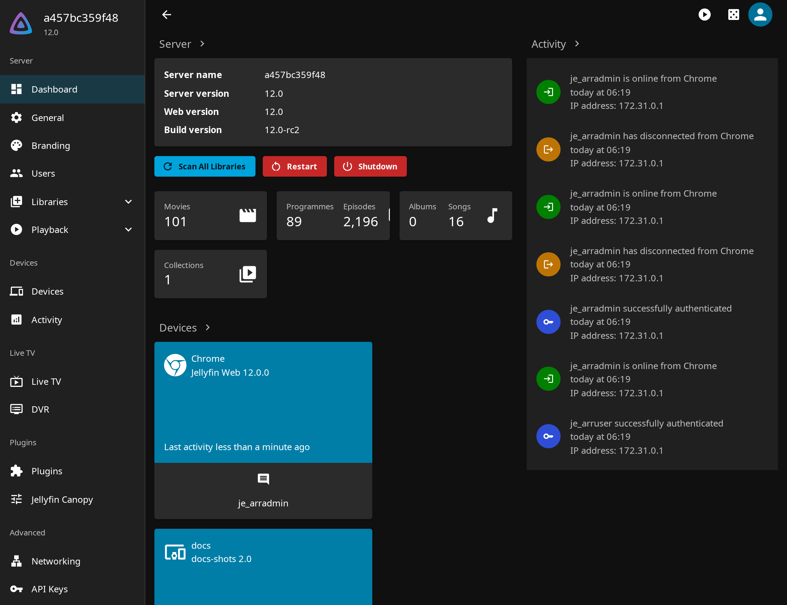
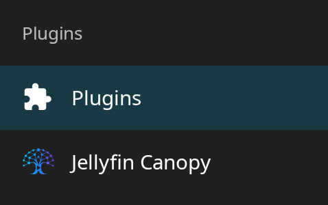
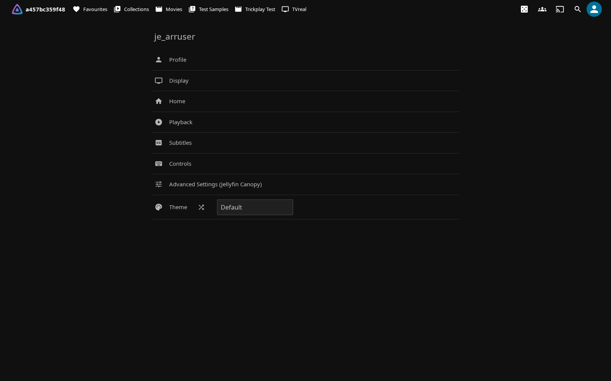
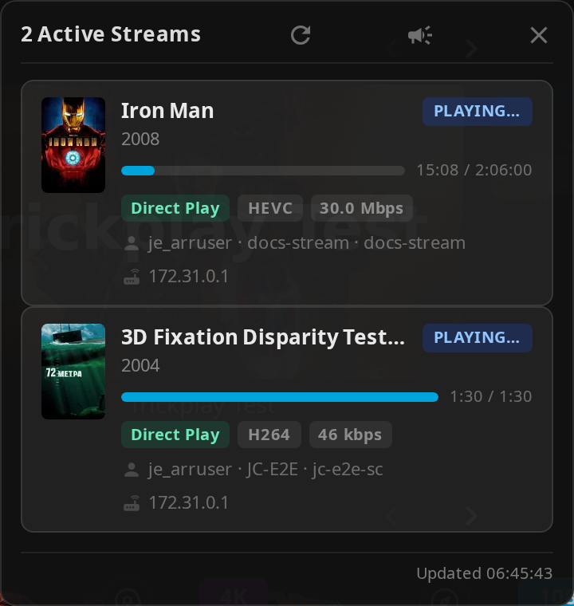

# Other Features

Additional features including custom branding, extras, icons, and more.

## Table of Contents

- [Custom Branding](#custom-branding)
- [Icon Settings](#icon-settings)
- [Extras](#extras)
- [Timeout Settings](#timeout-settings)
- [Letterboxd Integration](#letterboxd-integration)
- [Hidden Content](#hidden-content)
- [Splash Screen](#splash-screen)
- [Internationalization](#internationalization)
- [Cache Management](#cache-management)

---

## Custom Branding

Upload your own logos, banners, and favicon to personalize your Jellyfin instance.

### Features

- Custom Jellyfin logo (header)
- Custom splash banners (light/dark themes)
- Custom favicon (browser tab icon)
- Files stored in plugin config folder
- Survives Jellyfin updates

### Setup

**Prerequisites:**

- [file-transformation plugin](https://github.com/IAmParadox27/jellyfin-plugin-file-transformation) installed

**Configuration:**

1. Go to **Dashboard** → **Plugins** → **Jellyfin Elevate**
2. Navigate to the **Extras** tab
3. Find the **Custom Image Assets** section
4. Upload your custom images:
   - **Icon Transparent** - Header logo (PNG/SVG recommended)
   - **Banner Light** - Dark theme splash image
   - **Banner Dark** - Light theme splash image
   - **Favicon** - Browser tab icon
   - **Apple Touch Icon** - Icon shown when adding to the iOS Home Screen (180×180 PNG)
5. Click **Save**
6. Force refresh browser (Ctrl+F5)

### Image Requirements

- **Formats:** PNG, SVG recommended
- **Transparent backgrounds** for logos
- **Appropriate dimensions** for each type
- **File size:** Keep reasonable for performance

### Storage Location

Files stored in:
```text
/plugins/configurations/Jellyfin.Plugin.JellyfinElevate/custom_branding/
```

This location survives Jellyfin server and web updates.

---

## Icon Settings

Configure icon display throughout the plugin interface.

### Use Icons

Enable or disable icons in toasts, settings panel, and other UI elements.

**Enable:**

1. Go to **Dashboard** → **Plugins** → **Jellyfin Elevate**
2. Navigate to the **Display** tab
3. Check **"Use Icons in UI"**
4. Click **Save**

### Icon Style

Choose between different icon sets.

**Available Styles:**

- **Emoji** - Unicode emoji characters (default)
- **Lucide Icons** - Modern, clean icon set
- **Material UI Icons** - Google Material Design icons

**Configuration:**

1. Select icon style from dropdown
2. Click **Save**
3. Refresh browser to see changes

**Considerations:**

- Emoji - Universal, no loading required
- Lucide - Clean, modern aesthetic
- Material UI - Familiar Google design

---

## Extras

Personal scripts from the developer's collection.

### Colored Activity Icons

Replace default activity icons with Material Design icons with custom colors.



**Features:**

- Custom colors for each activity type
- Material Design icon set
- Better visual distinction

**Enable:**

1. Go to **Dashboard** → **Plugins** → **Jellyfin Elevate**
2. Navigate to the **Extras** tab
3. Check **"Colored Dashboard Icons"**
4. Click **Save**

### Colored Ratings

Color-coded backgrounds for ratings on detail pages.


**Features:**

- Different colors per rating type
- Value-based color gradients
- Supports TMDB, IMDb, Rotten Tomatoes

**Enable:**

1. Navigate to the **Extras** tab
2. Check **"Colored Ratings Backgrounds"**
3. Click **Save**

### Login Image Display

Show user profile images on manual login page.


**Features:**

- Display user avatars
- Cleaner login interface
- Automatic fallback to text

**Enable:**

1. Navigate to the **Extras** tab
2. Check **"Profile Picture on Login"**
3. Click **Save**

### Plugin Icons

Replace default plugin icons with Material Design icons.



**Features:**

- Custom icons for popular plugins
- Add custom config page links
- Improved dashboard aesthetics

**Enable:**

1. Navigate to the **Extras** tab
2. Check **"Custom Plugin Menu Icons"**
3. Click **Save**

**Sidebar Custom Links:**
Add sidebar links to plugin configuration pages. The field is labeled **Sidebar Custom Links** in the UI.

**Format:**
```text
Configuration Page Name | Material Icon Name
```

**Example:**
```text
Jellyfin Tweaks | tune
```

The second value is a [Material icon](https://fonts.google.com/icons) name, **not** a URL. The sidebar link is auto-generated as `#/configurationpage?name=<name>` from the first field, so arbitrary external URLs are not supported.

### Theme Selector

Choose from multiple Jellyfin theme color variants.



**Features:**

- Multiple color palettes (Aurora, Jellyblue, Ocean, etc.)
- Randomize theme daily option
- Quick theme switching

**Enable:**

1. Navigate to the **Extras** tab
2. Check **"Theme Selector (Jellyfish)"**
3. Click **Save**

**Usage:**

1. Open Enhanced panel
2. Go to Settings tab
3. Find Theme Selector section
4. Select theme from dropdown
5. Optional: Enable "Randomize Daily"

**Available Themes:**

- Aurora
- Jellyblue
- Ocean
- Peach
- Forest
- And more...


### Active Streams Widget



#### Admin Configuration

1. Go to **Dashboard** → **Plugins** → **Jellyfin Elevate**
2. Navigate to the **Extras** tab
3. Enable **"Active Streams Header Widget"**
4. Optional: Enable **"Show widget to non-admins"**
5. Click **Save**

#### Settings

| Setting | Default | Description |
|---|---|---|
| **Active Streams Header Widget** | Off | Adds the stream counter icon to the Jellyfin header |
| **Show widget to non-admins** | Off | When enabled, non-admin users also see the widget (read-only, no broadcast, no IP addresses) |

#### Broadcast Form Fields

Admins can send a message to all active sessions from the panel header (megaphone icon):

| Field | Required | Description |
|---|---|---|
| **Title** | No | Optional heading; may not display on web UI clients |
| **Message** | Yes | The message body; always visible on all clients |
| **Timeout (s)** | Yes | Seconds before the notification auto-dismisses (default: 10) |

!!! warning
    The Title field may not render on the Jellyfin web client. Always put the important information in the Message field.

### Metadata Icons (Druidblack)

Display item-detail metadata fields as icons instead of text.

**Features:**

- Swaps text metadata labels on item-detail pages for icons
- Also switches the plugin's own Letterboxd and *arr links to icons
- Uses the icon set from [Druidblack/jellyfin-icon-metadata](https://github.com/Druidblack/jellyfin-icon-metadata)

**Enable:**

1. Go to **Dashboard** → **Plugins** → **Jellyfin Elevate**
2. Navigate to the **Extras** tab
3. Check **"Enable Metadata Icons (Druidblack)"**
4. Click **Save**

**Default:** Off


---

## Timeout Settings

Configure durations for Enhanced panel UI elements.

### Shortcuts Panel Autoclose Delay

Control how long the shortcuts (help) panel stays open before automatically closing.

**Configure:**

1. Go to **Dashboard** → **Plugins** → **Jellyfin Elevate**
2. Navigate to the **Playback** tab
3. Find the timeout settings
4. Set **Shortcuts Panel Autoclose Delay (ms)**
5. Click **Save**

**Default:** 15000ms (15 seconds)
**Range:** advisory only — the input enforces no min/max; a value of 0 (or blank) reverts to the 15000 ms default.

**Use Cases:**

- Longer delay for first-time users
- Shorter delay for experienced users

### Toast Notification Duration

Control how long toast notifications are displayed.

**Configure:**

1. On the **Playback** tab
2. Set **Toast Notification Duration (ms)**
3. Click **Save**

**Default:** 1500ms (1.5 seconds)
**Range:** advisory — the input does not enforce a range (a value of 0 or blank reverts to the 1500 ms default)

**Affects:**

- Bookmark saved notifications
- Success/error messages
- State change confirmations

---

## Letterboxd Integration

Add Letterboxd external links to movie and person (cast/crew) detail pages.

### Setup

1. Go to **Dashboard** → **Plugins** → **Jellyfin Elevate**
2. Navigate to the **Extras** tab
3. Check **"Enable Letterboxd Links"**
4. Optional: Check **"Show link as text"** for text instead of icon
5. Click **Save**

### Usage

**On Movie Detail Pages:**

1. Open any movie
2. Look for Letterboxd link in external links section
3. Click to open movie on Letterboxd

**On Person Detail Pages:**

1. Open any cast or crew member
2. Look for the Letterboxd link in the external links section
3. Click to open that person's Letterboxd page

**Features:**

- Automatic IMDb ID to Letterboxd mapping for movies
- Person pages link to the actor's Letterboxd page (derived from the person's name slug)
- Icon or text display option

---

## Hidden Content

Hide specific items from your Jellyfin library without deleting them.

### Features

- Hide movies, shows, or episodes
- Hidden items don't appear in library
- Easily unhide items later
- Per-user hidden content
- Manage via Enhanced panel or dedicated page

!!! note "Continue Watching / Next Up on Home"

    **Filter Continue Watching** and **Filter Next Up** work on the Home screen
    independently of **Filter library views** — you can hide items from those
    Home rows without turning on library filtering. See [Enhanced Settings → Home
    Row Filtering](../enhanced/enhanced-settings.md#home-row-filtering).

### Setup

1. Go to **Dashboard** → **Plugins** → **Jellyfin Elevate**
2. Navigate to the **Pages** tab
3. Find **Hidden Content** section
4. Check **"Enable Hidden Content"**
5. Optional: Check **"Use Plugin Pages for Hidden Content"**

   - Adds a sidebar link to dedicated Hidden Content page
   - Requires [Plugin Pages](https://github.com/IAmParadox27/jellyfin-plugin-pages) plugin
   - Restart Jellyfin after enabling for first time
6. Click **Save**

### Usage

**Hide Item:**

1. Open item detail page
2. Click hide button (if available)
3. Item removed from library view

**Manage Hidden Items:**

**Via Enhanced Panel:**

1. Open Enhanced panel (press `?`)
2. Go to Hidden Content section
3. View all hidden items
4. Click to unhide

**Via Dedicated Page** (if enabled):
1. Click "Hidden Content" in sidebar
2. View all hidden items with thumbnails
3. Search and filter hidden items
4. Click to unhide

**Note:** Hidden items are per-user. Admins can optionally view and manage other users' hidden lists. See **Hidden Content → Admin Controls** in the plugin settings.

---

## Splash Screen

Custom splash screen that appears while Jellyfin is loading.

### Setup

1. Go to **Dashboard** → **Plugins** → **Jellyfin Elevate**
2. Navigate to the **Extras** tab
3. Check **"Enable Splash Screen Override"**
4. Enter **Splash Screen Image URL**

   - Use full URL or relative path
   - Default: `/web/assets/img/banner-light.png`
5. Click **Save**

### Image Requirements

- **Format:** PNG, JPG, SVG
- **Size:** Appropriate for full-screen display
- **Location:** Accessible from web root
- **Responsive:** Should work on various screen sizes

### Custom Image

**Upload Custom Image:**

1. Place image in Jellyfin web directory
2. Note the path (e.g., `/web/custom/splash.png`)
3. Enter path in plugin settings
4. Save and refresh

---

## Internationalization

Multi-language support with community translations.

### Supported Languages

<p align="left">
  <a href="https://hosted.weblate.org/engage/jellyfinelevate/">
    
  </a>
</p>

### How It Works

- Automatically detects Jellyfin user profile language
- Loads translations from the plugin's bundled locale files on first load and caches them for 24 hours
- Only when the third-party asset cache is disabled does it fall back to fetching from GitHub
- Clears outdated caches on plugin update

### Default Language Override

Set a default language for all users.

**Configuration:**

1. Go to **Dashboard** → **Plugins** → **Jellyfin Elevate**
2. Find **Default UI Language** setting
3. Select language from dropdown
4. Leave empty for system default
5. Click **Save**

### Contributing Translations

See the [Contributing Translations](../faq-support/contributing-translations.md) section for details.

**Translation Updates:**

- Bundled with the plugin as embedded resources
- Updated when the plugin itself is updated
- GitHub fetching only applies when the asset cache is disabled
- Cached per plugin version

---

## Cache Management

Force clients to refresh cached data.

### Clear All Client Caches

The config page has a single **Clear All Client Caches** button. Clicking it sets a
timestamp so that every client clears its localStorage and tag caches on next load.

**Use Case:**

- Reset all client-side settings
- Update quality/genre/language/rating tags
- Fix corrupted or stale cached data
- Force a fresh start across all clients

**How:**

1. Go to **Dashboard** → **Plugins** → **Jellyfin Elevate**
2. Navigate to the **Display** tab
3. Find the **Clear All Client Caches** button
4. Click to set the timestamp
5. All clients clear their storage and tag caches on next load

**Note:** May cause slowness on the first load after clearing while data is re-fetched.

### Translation Caches

There is no config-page button for clearing translation caches. Translation caches are
refreshed automatically for all clients by the **Refresh Translation Cache** scheduled
task (Dashboard → Scheduled Tasks). Individual users can also clear their own browser's
translation cache from the language section of the Enhanced settings panel — that button
only affects the local browser.

---

## Support

If you encounter issues:

1. Check [FAQ](../faq-support/faq.md) for common solutions
2. Verify settings are correct
3. Check browser console for errors
4. Report issues on [GitHub](https://github.com/n00bcodr/Jellyfin-Enhanced/issues)
