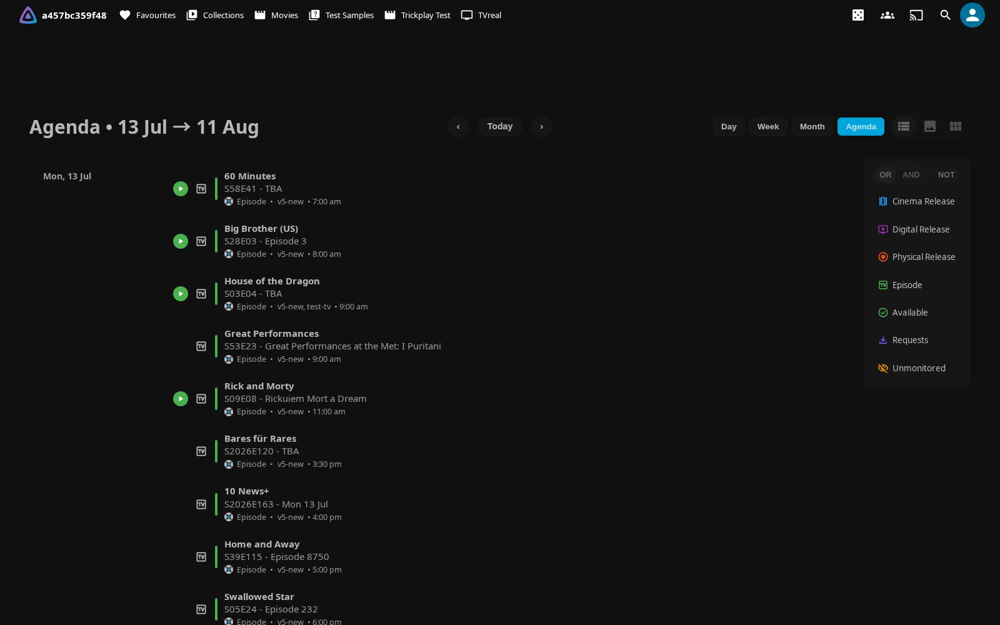
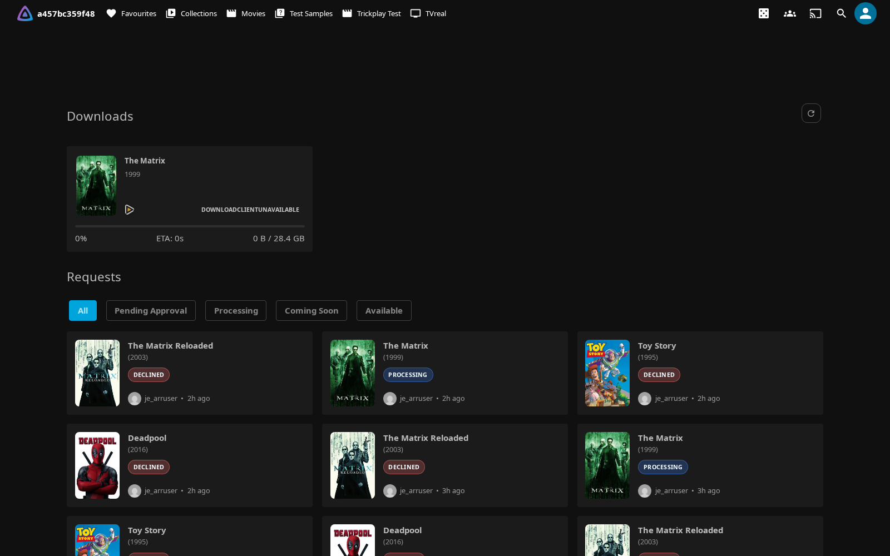

# Sonarr & Radarr

If you run Sonarr, Radarr, or Bazarr behind Jellyfin, this integration brings them to where you already are. As an administrator you get quick links, search, and library management on every movie, series, season, and episode page, without opening a separate arr tab. Authenticated users get a shared **Calendar** of what's coming and, subject to the administrator's server-enforced visibility policy, a **Requests** page that follows downloads through transfer, import processing, and bounded history. And synced \*arr tags become clickable filters right on the item you're looking at.

The integration is deliberately split by audience. The parts that reach into your arr apps — links, Search, Interactive Search, and Manage — are **admin-only** and policy-gated on the server, not merely hidden in the UI. The Calendar page, the Requests route, and synced tag links are available to authenticated users when enabled; the server still decides which download sections and records each non-admin may receive.

!!! warning "Before you connect anything"

    - **API keys** are stored on the server, never exposed to browsers.
    - **Network access** — treat your arr instances as sensitive; keep them off the open internet unless you mean to expose them.
    - **HTTPS** — use HTTPS for any remote access.

    Every request the plugin makes to a configured arr URL also passes through a built-in [SSRF host guard](#security-the-ssrf-host-guard) that fails closed.

New to the plugin? Start with [Getting Started](getting-started.md) to install it, then come back here. The Requests page is shared with Seerr, so if you also run Seerr, see [Discover & Request](discover.md).

## What you get

One connection puts links to your Sonarr, Radarr, and Bazarr instances directly on Jellyfin item pages, and can surface arr tags, upcoming releases, and the normalized download/import lifecycle alongside them.

- **Quick links** — jump to Sonarr, Radarr, or Bazarr for any item.
- **Search & Interactive Search** — trigger an automatic search, or pick a release by hand, straight from the item menu.
- **Manage (Monitor & Add)** — toggle monitoring, or add a movie or series to Sonarr/Radarr, from Jellyfin.
- **Tag links** — display synced arr tags as clickable, filterable links.
- **Calendar page** — upcoming releases from Sonarr and Radarr.
- **Requests page** — normalized **Downloading**, **Processing & attention**, and bounded **History** activity, with transfer progress kept separate from import and Jellyfin availability.

!!! note "Who sees what"

    \*arr links, Search, Interactive Search, and Manage are visible to **admin users only**. The Calendar page, the Requests route, and synced tag links are available to authenticated users when enabled. Administrators can independently hide active transfers, processing, warnings, history, provenance, and detailed lifecycle states from regular users; those controls are enforced by the server response.

## Connecting your instances

Everything starts on the **\*arr** tab: **Dashboard → Plugins → Jellyfin Canopy → \*arr**. You can connect several Sonarr and several Radarr instances at once — handy when you split libraries by type or quality (TV vs. Anime, HD vs. 4K). Neither service is mandatory; set up whichever you run.

To enable the on-page links:

1. Go to **Dashboard → Plugins → Jellyfin Canopy** and open the **\*arr** tab.
2. Check **"Enable \*arr Links on Detail Pages"**.
3. Add one or more Sonarr and/or Radarr instances (below). Two shortcuts sit
   next to each Add button:
    - **Import from Seerr** — adopts the Sonarr/Radarr servers Seerr already
      has configured, *including their API keys*, so an instance needs no
      typing at all. Requires a working Seerr connection.
    - **Detect Sonarr** / **Detect Radarr** / **Detect Bazarr** — finds
      services answering on well-known addresses (e.g. `http://sonarr:8989`)
      and offers each as an addable row; you supply the API key.

    Both list what they find with an **Add** button per row and never
    overwrite or duplicate what you already configured. See
    [Getting started](getting-started.md#detect-services-automatically).
4. Optionally add a **Bazarr URL** for subtitle-management links (see [Bazarr](#bazarr)).
5. Optional: check **"Show links as text"** for text links instead of icons.
6. Click **Save**.

### Adding a Sonarr or Radarr instance

1. On the **\*arr** tab, click **"+ Add Sonarr instance"** or **"+ Add Radarr instance"**.
2. Fill in **Name**, **URL (internal)**, and **API Key**.
3. Optionally add an **External URL** and/or **URL Mappings**.
4. Click **Save**.

### Instance fields

| Field | Required | What it does |
|---|---|---|
| **Name** | Yes | Display name shown in dropdowns (e.g. `TV Shows`, `Anime`, `4K Movies`). |
| **URL (internal)** | Yes | Internal base URL the Jellyfin *server* uses to reach the instance (e.g. `http://192.168.1.100:8989`). Can be a LAN or docker address browsers can't reach. |
| **External URL** | No | Public base URL a user's *browser* opens for links to this instance (e.g. `https://sonarr.example.com`). Leave empty to reuse the internal URL. |
| **API Key** | Yes | API key from the instance's **Settings → General** page. |
| **URL Mappings** | No | Per-instance URL remapping for reverse-proxy setups. Takes priority over External URL. |
| **Enabled** | — | Toggle to disable an instance without deleting it. Defaults to on. |

### Internal vs. external URLs

Each instance is reached from two different places, and they may need different addresses:

- The **Jellyfin server** fetches from Sonarr, Radarr, and Bazarr for link status, calendar data, the queue, and tag sync. It always uses the **URL (internal)**.
- A **user's browser** opens the service when someone clicks an "Open in Sonarr/Radarr/Bazarr" link. It uses the **External URL** when set, otherwise it falls back to the internal URL.

The browser link base is resolved with a clear precedence: **matching URL Mapping → External URL → internal URL**. Leaving External URL blank reproduces the previous single-address behaviour exactly.

!!! info "Malformed external URLs are rejected"

    An external URL that is missing `http://` or `https://`, embeds credentials, or carries a query string or fragment is rejected with a clear warning on save — and any unsafe value that slips through is additionally skipped at link-building time.

### URL Mappings

Use URL Mappings when the same Jellyfin server is reached at different addresses — local network versus remote — and each context should open a different arr address. Each line maps a Jellyfin access URL to the arr URL a browser should open from it:

```text
jellyfin_access_url|arr_url
```

The **left** side is matched against the Jellyfin server URL the browser is currently using; the **right** side is the arr link base returned for that context. Mappings can be set globally (the legacy fields) or per instance, and a per-instance mapping overrides the global one for that instance.

```text
https://jellyfin.example.com|https://sonarr.example.com
http://192.168.1.50:8096|http://192.168.1.100:8989
```

The net effect: users who reach Jellyfin over remote HTTPS get your public arr address, while users on the LAN get the local one.

### Disabling an instance

Toggle the **Enabled** switch off to skip an instance in every fan-out path — arr links, calendar, queue monitoring, and tag sync — without removing its configuration. Its URL and API key are preserved, so you can re-enable it at any time without re-entering credentials.

!!! tip

    Use the Enabled toggle during maintenance windows or when temporarily swapping out an instance.

### Legacy single-instance fields

The original `SonarrUrl`, `SonarrApiKey`, `RadarrUrl`, and `RadarrApiKey` fields are preserved for downgrade safety. If the multi-instance list is empty, the plugin automatically falls back to these fields, so existing setups keep working with no migration step.

!!! note

    Once you add instances via the new UI, the legacy fields are no longer used for arr links. They are not deleted, so downgrading to an older plugin version restores the previous single-instance behaviour.

### Bazarr

Bazarr is a single instance and needs no API key — add its address in the **Bazarr URL** field in the Setup section to get "Open in Bazarr" subtitle-management links. Like the arr instances, it has its own **Bazarr External URL** field so the browser can open a different address than the server fetches from.

## \*arr links on item pages

Once links are enabled, open any movie or TV show and look for the arr icons in the external-links section. The plugin detects the item type automatically and shows only the relevant service — **Radarr for movies, Sonarr for TV** — and the links are visible to administrators only.

Click an icon to open the item in the matching arr application, or click the dropdown to choose a specific instance.

**How links look depends on how many instances match the item:**

- **A single matching instance** renders as a plain icon link, with no badge clutter. To always show the status border and the episode/file count on single-instance links, enable **"Show status badge for single-instance"**.
- **Multiple matching instances** turn the link into a dropdown button. Each entry shows a colour-coded status dot, the instance name, the episode count (Sonarr) or download status (Radarr), and the file size on disk.

**Status colours:**

| Colour | Meaning |
|---|---|
| Green | Complete — all episodes present, or the file is present |
| Amber | Partial — some episodes missing |
| Grey | Missing — not in this instance |

The Calendar and Requests pages fan out across all enabled instances automatically.

## Search, Interactive Search, and Manage

These actions let you drive your configured Sonarr and Radarr instances straight from Jellyfin's own item menu — the three-dot menu on a card, the more button on a detail page, and long-press on touch — so you rarely need to open the arr web UI after setup. **Admin only**, and the endpoints are policy-gated on the server, not just hidden in the UI.

The menu items appear on **movies, series, seasons, and episodes** whenever the matching service (Radarr for movies, Sonarr for the TV kinds) has at least one enabled instance configured and the item carries a TVDB or TMDB id.

### Search (automatic)

Search fires the correct arr search command for the item and hands off to the arr's own grab logic:

| Item | Command |
|------|---------|
| Movie | Movie search |
| Series | Whole-series search |
| Season | Season search |
| Episode | Episode search |

If more than one configured instance tracks the item, the search runs on all of them. A toast reports how many instances started and, when the Requests page is enabled, points you there to watch progress.

### Interactive Search (manual release picker)

Interactive Search opens a themed release picker listing the candidate releases the arr found — title, quality, size, age, indexer, seeders/health, custom-format score, and any rejection reasons — with a **Grab** button per row. You can filter by text, sort (best match, size, age, seeders, or format score), hide rejected releases, and switch between instances that track the item. Grabbing sends the release to the arr's download client exactly as the arr UI would.

Interactive Search is offered for **movies, seasons, and episodes**. Sonarr has no whole-series manual search, so open a season or episode for TV.

### Manage (Monitor & Add)

The **Manage in Sonarr/Radarr…** item opens a compact panel that:

- toggles **Monitor / Unmonitor** per tracking instance;
- shows the same normalized transfer/import lifecycle used by the [Requests page](#the-requests-page), with a jump link there instead of inventing a second lifecycle model;
- and, for a movie or series **not yet tracked** by an instance, offers **Add to Sonarr/Radarr** with a quality-profile and root-folder picker, a monitor toggle, and an optional search-on-add.

Manage is gated by its own setting, so you can keep the menu search-only if you don't want changes made to the arr library from Jellyfin.

While the Manage panel is open and visible, its status view polls every 10 seconds for at most 60 refreshes (about 10 minutes). It pauses while the tab is hidden, cancels in-flight work when closed, and keeps the last successful rows with a visible degraded notice after a transport failure. Raw release/downloader names and paths are not sent to this panel.

### Enabling and using

1. Configure at least one Sonarr and/or Radarr instance under the **\*arr** tab (URL + API key) — the same instances the arr links use. No extra connection details are needed.
2. On the same tab, under **Search & Interactive Search**, confirm **"Enable Search in the item menu"** is on (the default), and optionally turn on **"Enable management actions (Monitor / Add)"**.
3. Open any movie, series, season, or episode menu as an administrator — the **Search**, **Interactive Search**, and **Manage** items appear.

| Setting | Default | What it does |
|---|---|---|
| **Enable Search in the item menu** | On | Adds **Search** (automatic) and **Interactive Search** (manual release picker) to the item menu for movies, series, seasons, and episodes, driving the instances configured above. |
| **Enable management actions (Monitor / Add)** | On | Also adds **Monitor / Unmonitor** and **Add to Sonarr/Radarr**. Turn off to keep the menu search-only and prevent changes to the arr library from Jellyfin. |

!!! note

    Search finds the item in the arr by its TVDB (Sonarr) or TMDB (Radarr) id, so the item must already be tracked there. Use **Manage → Add to Sonarr/Radarr** to start tracking a movie or series that isn't yet in the arr.

## Tag sync

Tag sync copies the tags you keep in Sonarr and Radarr onto the matching Jellyfin items, then shows them as clickable, filterable links on item pages — so a tag like `in-netflix` or `4k-upgrade` becomes something viewers can act on. It's available to all users once the tags are synced.

**Prerequisites:** at least one Sonarr **and/or** Radarr instance configured (URL + API key). Neither service is mandatory — the sync task processes each independently and simply skips the one you haven't set up. A movie-only Radarr server or a TV-only Sonarr server works fine.

### How matching works

Sonarr series tags are matched to your Jellyfin library by **TVDB id** — Sonarr's canonical, always-present id — falling back to **IMDb id**. That means TVDB-scraped libraries, whose series may have no IMDb id, sync their tags reliably. Radarr movies are matched by **TMDB id**.

### Enabling tag sync

1. On the **\*arr** tab, check **"Enable Tags Sync"**.
2. Make sure the Sonarr/Radarr instances you configured above have valid API keys — tag sync uses those instance keys. There is no separate key field in the Tags Sync section.
3. Configure the tag settings and filters (below).
4. Click **Save**.

!!! warning "Tags only populate when the sync task runs"

    Tag syncing is performed by the scheduled task **"Sync Tags from \*arr to Jellyfin"** (**Dashboard → Scheduled Tasks**, category Jellyfin Canopy). Tags appear on items only after this task runs. Trigger it manually the first time, then add a schedule trigger so it runs periodically and picks up new items automatically.

### Tag settings

| Setting | Default | What it does |
|---|---|---|
| **Tag Prefix** | `JC Arr Tag: ` | Prefix added to synced tags so plugin-managed tags are easy to identify. Leaving the field blank falls back to the same `JC Arr Tag: ` default on both the write and read sides, so a cleared prefix no longer leaves orphaned tags. |
| **Clear old tags before sync** | Recommended on | Removes old plugin-managed tags before syncing, keeping tags clean and up to date. |
| **Show synced tags as links** | Recommended on | Displays tags as clickable links on item pages; clicking one shows all items with that tag. |

### Filtering which tags appear

Each filter is a newline-separated list — one tag name per line.

| Filter | What it does |
|---|---|
| **Show as Links Filter** | Only matching tags are displayed as links. Leave empty to show all tags. |
| **Hide Specific Links Filter** | Matching tags are not displayed as links. Overrides the show filter. |
| **Sync to Jellyfin Filter** | Only matching tags are synced from the arr. Leave empty to sync all tags. |

```text
in-netflix
in-disney
4k-upgrade
```

### Styling tag links (CSS)

Synced tag links render with `arr-tag-link` CSS hooks, so you can rename, hide, or recolour individual tags. Each link carries a `data-id` (the tag id) and a `data-tag-name` attribute, and its label sits in `.arr-tag-link-text`.

```css
/* Rename a tag: hide the original label, add a custom one */
.itemExternalLinks a.arr-tag-link[data-tag-name="1 - n00bcodr"] .arr-tag-link-text {
  display: none !important;
}
.itemExternalLinks a.arr-tag-link[data-tag-name="1 - n00bcodr"]::after {
  content: " N00bCodr";
}

/* Hide a specific tag */
.itemExternalLinks a.arr-tag-link[data-id="in-netflix"] {
  display: none !important;
}

/* Give a tag service colours */
.itemExternalLinks a.arr-tag-link[data-id="in-netflix"] {
  background: #d81f26;
  color: #fff;
}
```

See [Reference](reference.md) for more CSS hooks and examples.

## The Calendar page



The Calendar page collects upcoming releases from all your enabled Sonarr and Radarr instances into a single view, so everyone on the server can see what's arriving and when. It offers day, week, month, and agenda views, colour-codes events by series or movie, and lets you filter by Sonarr/Radarr or search by text. Click an event to view its details.

### Enabling

1. Go to **Dashboard → Plugins → Jellyfin Canopy** and open the **Pages** tab.
2. Check **"Enable Calendar Page"**.
3. Configure the settings below and click **Save**.

**Where it appears.** Calendar is a real page with its own route, so there's no delivery method to choose. On the supported modern layout, Jellyfin Canopy adds an icon button to the header tray, a link to the mobile drawer, and a link to the user-preferences menu. Because it's a genuine router destination, you can open it directly at `/web/index.html#/calendar`, and browser back/forward, page refresh, and deep links all work.

The order of the page entries in every menu follows the admin **Pages order** setting on the **Pages** tab. Reorder the five pages there — the default order is **Calendar, Requests, Bookmarks, Hidden Content, Maintainerr** — using the up/down controls in its **Page order** area. Maintainerr remains admin-only regardless of its position.

!!! note "Upgrading from an earlier version"

    Older releases let you pick a delivery method for each page — Plugin Pages, Custom Tabs, or a native Home tab. Those options have been removed: the pages are now ordinary routed destinations with automatic entry points, so no delivery method is needed. Any delivery-mode selections you had are retired automatically on upgrade, and any entries Jellyfin Canopy created in the Custom Tabs plugin are cleaned up from its configuration on first startup.

### Calendar settings

Found on the **Pages** tab under "Calendar Page".

| Setting | Default | What it does |
|---|---|---|
| **First Day of Week** | Monday | The weekday the calendar starts on — any weekday, Sunday through Saturday. |
| **Time Format** | — | 12-hour (`5pm/5:30pm`) or 24-hour (`17:00/17:30`). |
| **Highlight Favorites/Watchlist** | — | Highlights favorite shows and movies, based on your Jellyfin favorites. |
| **Highlight Watched Series** | — | Highlights series you are currently watching, based on watch history. |
| **Filter by Library Access** | On | Restricts calendar items to libraries the user can access. Upcoming items not yet in Jellyfin are matched by their Sonarr/Radarr root folder. |
| **Show Requested Only (Default)** | — | The calendar loads showing only requested items; users can still toggle other items back on. |
| **Force Only Requested Items** | — | Locks the calendar to requested items only and removes the ability to show non-requested items, enforcing the filter. |

!!! note "Accuracy with multiple instances and date-only releases"

    - **Multiple instances** — when the same show or movie exists in more than one Sonarr/Radarr instance, its events are disambiguated **per instance**, so each keeps the correct instance icon and click-through even when two instances number their items identically.
    - **Date-only releases** — a release with no exact air time (Radarr cinema/digital/physical dates, and the Sonarr air-date fallback) is placed on its intended **local calendar day** with no spurious clock time, instead of drifting a day earlier for viewers west of UTC. Genuine air-time releases (Sonarr `airDateUtc`) are still shown in your local time.
    - **Duplicate collapsing** is deterministic — after access and file-presence precedence, the persisted instance identity and namespaced public event ID break ties. The same release therefore collapses to the same single event regardless of configured-instance or fetch order.

## The Requests page



The Requests page combines sanitized activity from every enabled Sonarr and Radarr instance. It separates transfer progress from import processing and terminal history, so a download reaching 100% is never presented as imported or available merely because its bytes finished transferring. It supports server-side search, fixed lifecycle tabs, and bounded history paging, and auto-refreshes on a configurable interval. Its route is `#/downloads`.

### Lifecycle sections

The page uses three stable sections instead of making tabs from raw upstream status strings:

| Section | What belongs there |
|---|---|
| **Downloading** | Queued, downloading, paused, and delayed transfers. Percentage and ETA describe **transfer only**. |
| **Processing & attention** | Import pending, importing, downloaded/waiting for import, blocked or failed-pending work, warnings, and unknown future states. |
| **History** | Terminal imported, failed, or canceled/ignored attempts proven by Sonarr/Radarr history or an authoritative terminal tracked state still present in its queue. |

Sonarr/Radarr's raw queue value `Completed` means the download client finished transferring; Canopy presents it as **Waiting for import**. A 100% progress bar carries the same meaning. Only an authoritative tracked import state or history event can move an attempt to **Imported**, and an unknown enum value degrades to **Unknown state** rather than being guessed as success.

!!! important "Imported is not the same as Available"

    **Imported** is Sonarr/Radarr's lifecycle result. **Available** is shown separately and only after the server positively resolves the media to a Jellyfin item the current user may access and verifies that the item has a media file. An imported item with no such user-authorized Jellyfin match says **Availability not confirmed** and has no Jellyfin open button.

### Identity, grouping, and ambiguous transitions

Canopy correlates queue rows and history using a persisted opaque instance identity, a non-empty download ID, and the relevant parent/entity identity. Display names, list positions, titles, percentages, and ETAs are never join keys. Renaming, reordering, disabling, or re-enabling an instance therefore does not reassign its activity.

For a Sonarr pack, the shared strong download identity forms one logical activity while episode identities preserve the expected set. Imported episodes are intersected with the positively grabbed set, so unrelated/manual imports sharing a download ID cannot inflate the numerator or mask a missing episode. Importing a non-zero strict subset stays in **Processing & attention** as a partial import; zero expected matches never claims partial or success. A failed or import-blocked peer outranks that synthetic partial summary while the counts remain visible. A row without a download ID remains an independent event instead of being attached by title. A new grab after a terminal event starts another attempt, so re-grabs remain visible rather than overwriting earlier history—even if an upstream download ID is reused.

When live queue data overlaps a grabbed-only or otherwise non-terminal history prefix, the queue state wins only when that strong identity proves they can be the same attempt. Positive terminal history completes the handoff. A similar title or percentage can do neither.

Queue disappearance alone is ambiguous: the download may be between queue and history, manually removed, or hidden by an upstream failure. Canopy retains a disappeared, previously known row for up to 90 seconds as a visibly stale **Waiting for import** handoff while history catches up. It becomes terminal only on positive history evidence; otherwise the handoff expires without inventing a successful result. At most 500 handoffs are retained per instance; overflow is reported as truncated instead of consuming unbounded memory.

### Provenance and privacy

The browser receives an allowlisted activity projection, not raw queue or history records. It can contain a sanitized media title/subtitle, instance label, normalized lifecycle/reason code, transfer percentage/ETA, event time, grouping counts, and a user-authorized Jellyfin item ID. It does **not** contain API keys, service URLs, download IDs, release/downloader titles, download-client or indexer names, quality/size, filesystem paths, raw status messages, or upstream error text.

**Associated with a Seerr request** appears only when the server has positive TMDB/TVDB evidence in the current user's request history and the configured topology is unambiguous: one Seerr identity domain and one enabled ARR instance for that media type. It describes an association, not proof that Seerr caused that particular grab. With multiple Seerr domains or multiple enabled instances of the same ARR service, Canopy has no explicit server-to-instance mapping, so the association fails closed to **Origin unknown** (and cannot authorize a request-filtered row). Missing, cross-instance, incomplete, or otherwise ambiguous evidence is also **Origin unknown**; Canopy never guesses “direct request” or request ownership from a title.

The activity endpoint requires Jellyfin authentication. Administrators receive the complete sanitized lifecycle view, but a row that cannot be mapped through the administrator's own Jellyfin library scope is reduced to an **Unknown** media label with no subtitle, provider identity, season/episode detail, navigation ID, or availability claim. This preserves useful instance/lifecycle health without turning administrator status into a library-discovery bypass. For regular users:

- With **Filter Downloads by User Requests** on, a row needs a positive match to that user's request history on the exact Seerr identity source.
- With it off, a row still needs either that positive request association or an unambiguous provider-ID match to a Jellyfin item the current user may access. When a row supplies multiple non-empty provider mappings, all positively resolved mappings must converge and only candidates in their intersection can authorize it; mixed resolved and unresolved identity evidence fails closed. Duplicate editions remain eligible when every resolved mapping agrees on them. If every mapping resolves to no Jellyfin candidate, a positive Seerr association can still represent media that is not yet in the library.
- An exact Sonarr episode always requires a positively resolved, caller-accessible Jellyfin **episode** candidate for regular-user detail. Access to its parent series and a series-level Seerr association cannot substitute; unresolved or restricted episodes fail closed.
- A missing user, unavailable/incomplete Seerr scope, failed library lookup, zero provider ID, or ambiguous match fails closed. Turning the filter off never exposes the raw server-wide queue.
- The section/detail controls below are applied by the server after record authorization; hiding a control in the browser is not the security boundary.

Seerr request cards and the sanitized download relations embedded in Seerr media responses share their own status and history policy. When that regular-user policy is off, the server returns empty embedded `downloadStatus` relations as well as refusing the request-list route; cached upstream bodies remain private and unmodified. The complete, caller/source/parental-scoped request collection is also filtered against the current caller's Jellyfin library before totals or paging. Normal and 4K requests are independent visibility domains: `is4k` selects the matching standard or 4K Jellyfin media ID, only that selected ID can authorize and be projected for navigation, and the inactive sibling never authorizes or acts as a fallback. Both recognized ID fields and the edition flag are shape-validated; a malformed value or failed batch lookup rejects the whole snapshot instead of exposing a partial prefix. A selected edition with no ID is genuinely not yet linked and remains eligible under its existing Seerr scope. These rules apply to administrators too. A Sonarr/Radarr **Imported** result is not rewritten as Seerr **Available**, and Seerr request provenance is not inferred from temporal proximity.

### History, paging, and source health

History comes from the official Sonarr/Radarr API-v3 history resources. The integration uses the same API-v3 queue/history contract supported by Sonarr v3/v4 and current compatible Radarr v3–v6 releases. If a future release adds an enum Canopy does not know, it remains a non-success unknown state until the normalizer is updated.

History can represent only events ARR actually emits. In particular, a direct manual library import that is not associated with a `NewDownload` may produce no `DownloadFolderImported` history event in current Sonarr/Radarr releases; Canopy cannot invent or display that missing activity. When ARR does emit an import event without a download ID, Canopy retains it as an independent event instead of joining it speculatively.

The administrator chooses a 1–30-day history window (7 days by default). Collection is paged on the server and bounded to the most recent 1,000 history records **per instance**. Terminal states still present in the live queue are routed to History. ARR's `added` value is the download-start time, not a completion time, so Canopy instead stamps each member when it first observes the complete logical queue group as terminal, displays the newest member observation, and applies the configured window to it. A newly observed or genuinely newer member keeps the complete group current without renewing an older member that the caller is not allowed to see. Repeated polls, missing/restored start fields, and history-window changes do not renew an existing member. This clock is in-memory and source-cache scoped: restarting Jellyfin or changing the source URL/API identity starts a new observation window, including for an undated row. A missing cache-owned observation fails closed. Mutable history pagination must keep a stable `totalRecords`, positive integral record IDs, valid timestamps, and descending order across every complete page; a violation invalidates the prefix rather than presenting it as complete. The browser requests 20 history activities per page by default and the endpoint permits at most 50. Active responses are capped at 500 logical activities. When a cap is reached, the page says that its data is truncated rather than presenting the prefix as complete.

Every source reports whether it is fresh, stale, unavailable, incomplete, truncated, or misconfigured. A partial instance failure leaves successful instances visible and keeps a persistent source-health notice. Queue and History freshness are tracked independently: a successful queue refresh stays fresh when only History is reused, and vice versa. After a refresh failure, Canopy may reuse that collection's last complete snapshot for up to 5 minutes, with only reused rows marked stale; even an empty reused collection owns that deadline. The server checks reused and 90-second handoff leases again after all instances and library authorization finish, so a slow peer cannot publish expired evidence. An incomplete queue prefix is never published as a complete empty or partial snapshot. Once no usable server-side last-good snapshot remains, that source is unavailable rather than silently empty.

An already-open browser also enforces independent absolute deadlines even if polling is disabled or visibility-paused. A successful server-stale envelope inherits each affected source's capture age; repeated stale polls never renew it. Expiry removes only that source's stale rows, preserves healthy-source and fresh-collection rows, marks the affected source unavailable, and marks a retained History slice truncated because its former global totals are no longer trustworthy. Queue-to-history handoffs over a fresh source use per-activity leases that survive temporary page, cap, or search projection changes, so hiding and showing a row or churning an unrelated handoff cannot renew it. Response-level stale metadata has its own non-renewing five-minute deadline for stale activity hidden beyond the active cap or on another History page; expiry removes visible stale evidence, preserves visible healthy rows, and reduces counts and paging to that known-safe slice. A filtered search with no stale results does not prove global recovery; a successful unfiltered non-stale response does. Missing, invalid, or inverted required capture timestamps expire immediately. A transport failure has a separate whole-snapshot deadline measured from the last successful receipt, so retained healthy rows cannot persist indefinitely after selective expiry. Recovery and navigation/account teardown clear the relevant timers.

### Enabling

1. Go to **Dashboard → Plugins → Jellyfin Canopy** and open the **Pages** tab.
2. Check **"Enable Requests Page"** (under the "Requests Page" section).
3. Click **Save**.

**Where it appears.** Like the Calendar page, Requests is a routed destination with automatic modern-layout entry points — the header tray, mobile drawer, and user-preferences menu — positioned by the admin **Pages order** setting. Open it directly at `/web/index.html#/downloads`; browser back/forward, refresh, and deep links all work.

!!! note "One page, two sources"

    This is the same unified Requests page that also surfaces Seerr media requests and issues when a Seerr server is connected (see [Discover & Request](discover.md)). Toggle the arr download queue with **"Show Downloads in Requests Page"** and the Seerr issues with **"Show Seerr Issues Section"**, both under the **Requests Page** section of the **Pages** tab.

### Requests page settings

Found on the **Pages** tab under "Requests Page".

| Setting | Default | What it does |
|---|---|---|
| **Enable Requests Page** | — | Enables the dedicated Requests page. The server also gates its Seerr request-list and approval routes, so a hidden/disabled page cannot be called directly and already-issued approval tokens stop working after disable. |
| **Show Downloads in Requests Page** | On | Includes the normalized Sonarr/Radarr lifecycle sections. |
| **Enable Auto-Refresh** | On | Automatically refreshes download and request status while the page is active. |
| **Poll Interval (seconds)** | 30 | How often to refresh, in seconds. Range 30–300. |
| **Filter Downloads by User Requests** | On | Requires a positive current-user, source-affine Seerr request match for regular-user activity. Off broadens eligibility only to an unambiguous Jellyfin item the caller may access; it never exposes the entire queue. |
| **Show active transfers to regular users** | On | Allows already-authorized **Downloading** activity. |
| **Show import processing to regular users** | On | Allows already-authorized **Processing & attention** activity. |
| **Show warnings and failures to regular users** | Off | Preserves warning/blocked/failure detail. Off projects a less revealing lifecycle instead. |
| **Show download history to regular users** | Off | Allows already-authorized, bounded Sonarr/Radarr **History**. Administrators retain the sanitized diagnostic view. |
| **Show request association to regular users** | Off | Allows the positive-evidence **Associated with a Seerr request** label; otherwise provenance is omitted for regular users. |
| **Show detailed lifecycle states to regular users** | Off | Allows the complete normalized vocabulary. Off projects simpler Downloading/Waiting/terminal states server-side. |
| **Download History Window (days)** | 7 | Requests 1–30 days of Sonarr/Radarr history; collection remains subject to the per-instance cap. |
| **Show Seerr request status and history to regular users** | On | Controls both the server-scoped Seerr request list and sanitized download relations embedded in Seerr media responses. When off, regular-user proxy responses contain empty download relations. Source affinity, ownership, parental limits, and library visibility still apply. |

### Why there is no direct SABnzbd history

Canopy deliberately reads the lifecycle Sonarr and Radarr own. Their queue models collapse the underlying download client's download, verification, unpacking, and handoff details into the signals ARR uses to decide whether import can proceed. A direct SABnzbd integration would not currently have an owner for credential/configuration storage, SSRF-safe connection policy, bounded polling, or deterministic SAB job-to-ARR/media correlation; adding an ad hoc client would jeopardize the lifecycle, privacy, and bounded-work guarantees above.

Future direct SABnzbd work would need server-only credentials, the same guarded outbound-URL policy, authenticated endpoints with a sanitized field allowlist, bounded/cancellable polling and backoff, explicit deterministic correlation rules, and tests for re-grabs, partial packs, failures, unknown states, and source outages. Until that complete contract exists, Canopy does not connect to SABnzbd directly.

## Security: the SSRF host guard

Because the plugin makes server-side requests to whatever arr URLs you configure, it guards every one of them against server-side request forgery (SSRF). The guard fails closed.

- **Cloud-metadata and link-local addresses are blocked** (for example `169.254.169.254` and the whole `169.254.0.0/16` range), so a malicious or misconfigured URL can't be used to reach a cloud provider's metadata service.
- **Loopback (`127.0.0.1`, `::1`) and private LAN ranges (`10.0.0.0/8`, `192.168.0.0/16`, `172.16.0.0/12`) stay allowed** by design, because Sonarr and Radarr commonly run on the same host or LAN as Jellyfin.
- A hostname that **cannot be resolved** fails closed — the request is blocked rather than allowed through — and the actually-resolved IP is re-checked at connect time to defeat DNS rebinding.

If a legitimate arr instance is being blocked, confirm its address is a normal loopback, LAN, or public address and that its hostname resolves from the Jellyfin server.

## Troubleshooting

### Links not appearing

1. Verify the arr URLs are correct.
2. Ensure **"Enable \*arr Links on Detail Pages"** is checked.
3. Confirm you're logged in as an administrator — the links are admin-only.
4. Check the item has arr metadata.

If they still don't show, open the arr URLs in a browser to confirm they're reachable from the Jellyfin server, and check for HTTP/HTTPS mismatches.

### Tags not syncing

First, **run the sync task** — tags are populated by the scheduled task **"Sync Tags from \*arr to Jellyfin"** and only appear after it runs:

1. Go to **Dashboard → Scheduled Tasks**.
2. Find **"Sync Tags from \*arr to Jellyfin"** (category: Jellyfin Canopy) and run it manually.
3. Add a schedule trigger so it runs periodically and picks up new items.

If tags still don't appear, check that the API keys are correct and test API access manually (and check the arr logs for errors). Then check your tag settings: the prefix should match, the sync filter shouldn't be too restrictive, and the tags must exist in the arr.

**Sonarr series tags specifically:** series are matched by **TVDB id** first, then by **IMDb id**. A series with neither id in Sonarr can't be matched — check the series' provider ids in Sonarr.

### Calendar icons or links wrong across instances

If a show or movie exists in **multiple** Sonarr/Radarr instances and its calendar event shows the wrong instance icon or opens the wrong instance, that shouldn't happen — events are disambiguated per instance. Make sure each instance has a distinct **Name** in the plugin settings.

### An \*arr URL is blocked

This is the [SSRF host guard](#security-the-ssrf-host-guard) doing its job. Confirm the instance's address is a normal loopback, LAN, or public address, and that its hostname resolves from the Jellyfin server. Cloud-metadata and link-local addresses are blocked deliberately.

### Calendar not loading

Check the prerequisites: Sonarr/Radarr URLs configured, API keys entered, the arr instances accessible, and the Calendar page enabled.

**Blank screen or "Cannot find module" error (Cloudflare Rocket Loader):** if the Calendar or Requests page shows a blank screen and the browser console shows `Cannot find module './'`, the cause is usually **Cloudflare Rocket Loader** interfering with Jellyfin's JavaScript module system — it rewrites and defers script loading in a way that can break dynamic module imports.

To fix it, disable Rocket Loader for your Jellyfin domain in Cloudflare:

1. Log in to the [Cloudflare dashboard](https://dash.cloudflare.com).
2. Select your domain.
3. Go to **Speed → Optimization → Content Optimization**.
4. Toggle **Rocket Loader** off.

Alternatively, disable it for specific pages with a Page Rule or Configuration Rule targeting your Jellyfin URL. For more context, see [Jellyfin Enhanced issue #570](https://github.com/n00bcodr/Jellyfin-Enhanced/issues/570), a historical reference from the upstream project this integration is based on.

If the page still won't load, check the browser console for client errors, the server logs for API errors, and the arr logs for connection issues.

### Requests page issues

**Downloads not showing:** ensure **Show Downloads in Requests Page** is enabled, verify the current user's request/library match and the regular-user section controls, confirm the item exists in the arr queue or retained history window, and check the page's source-health notice for API or configuration failures.

**Status not updating:** verify polling is enabled, check the poll interval, and inspect the persistent stale/degraded source notice. A 100% transfer that says **Waiting for import** is updating correctly; check Sonarr/Radarr's import state rather than expecting transfer completion to mean Jellyfin availability.

## Getting help

If you're stuck:

1. Check the [FAQ](help.md) for common solutions.
2. Verify your arr URLs and API keys.
3. Check the browser console and server logs.
4. Report issues on [GitHub](https://github.com/4eh5xitv6787h645ebv/Jellyfin-Canopy/issues).
