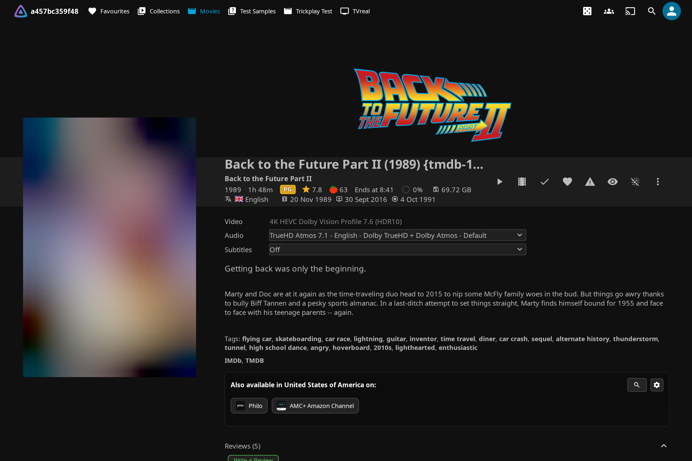
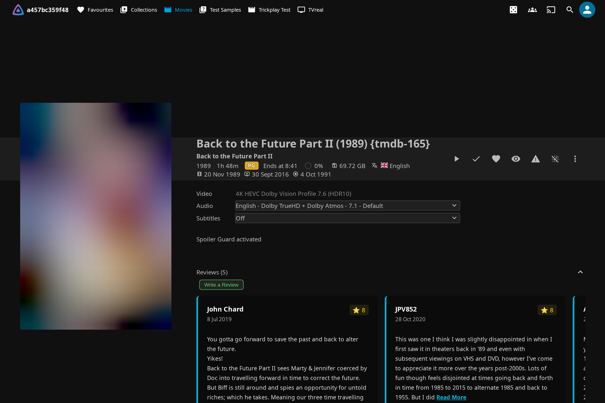
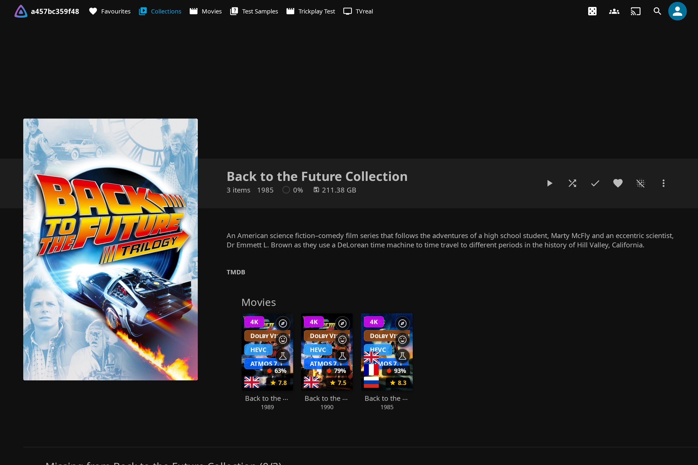
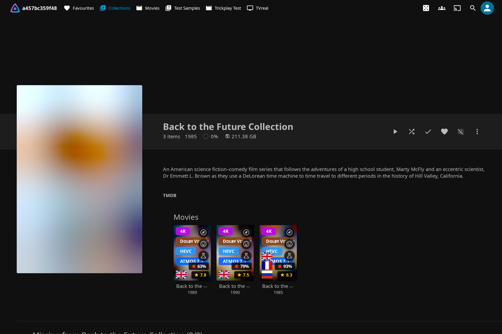
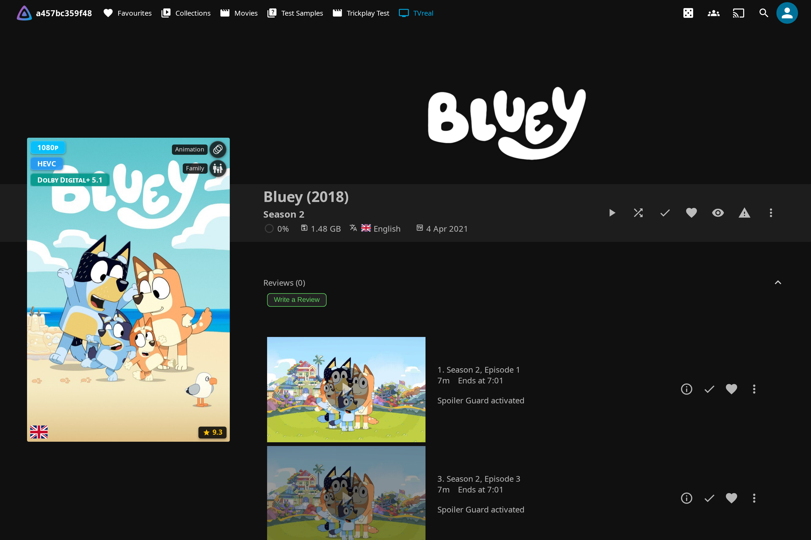
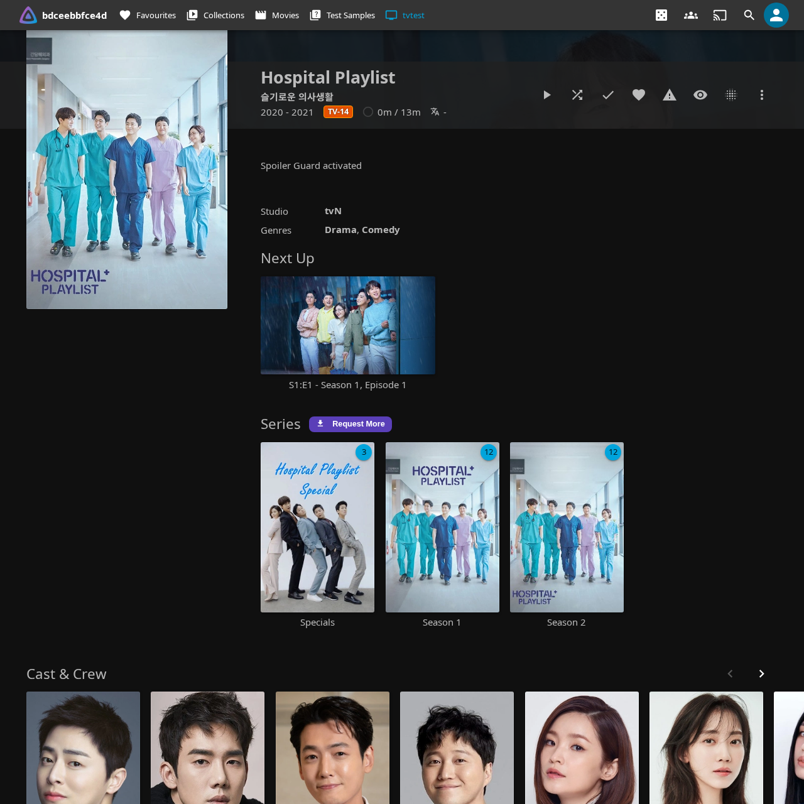

# Spoiler Guard

Browsing your own library shouldn't ruin the show. A thumbnail from three episodes ahead, an episode titled "The Death of Optimus", a 9.8/10 rating that screams "this is the big one" — the spoilers are baked into the artwork and metadata long before you press play. Spoiler Guard blurs those images and strips the revealing text for content you haven't watched yet, and puts it all back the moment you do. It's a per-user, per-show opt-in that covers episodes, seasons, movies, and collections.

The important part: the protection runs **server-side**, inside Jellyfin's image and metadata APIs. Every client you use — Jellyfin Web, Android TV, iOS Swiftfin, Roku, Wholphin, Moonfin, Findroid, Streamyfin, Jellyfin Media Player — sees the same protected bytes, with no per-client tweak to install and no client-side check a bad actor could bypass.

---

## What it hides

Once you turn Spoiler Guard on for a show or movie, the plugin hides every spoiler surface for the items you haven't watched yet. Watched episodes pass through completely untouched, and your library itself never changes — Spoiler Guard only changes what you *see*.

| Surface | What's hidden |
|---|---|
| **Episode thumbnails** | Replaced with a parent-level placeholder (Series Backdrop, Series Primary, or Collection art) or blurred, depending on the [protection mode](#hide-vs-blur-the-protection-mode). |
| **Season posters** | Same treatment as episode thumbnails. Season 1 always shows so you have an entry point; later seasons hide until any episode in them is watched. |
| **Episode titles** | Replaced with `Season X, Episode Y` so a title like "The Death of Y" can't spoil the reveal. |
| **Episode synopses** | Replaced with a configurable placeholder (default: `Spoiler Guard activated`). |
| **Tags** | Story tags like "Death of a main character" are dropped. |
| **Chapter names** | Replaced with `Chapter N`. The chapter **timestamps** stay, so the player's chapter list still lets you navigate. |
| **Chapter thumbnails** | Stripped on unwatched episodes. For movies, only chapter thumbs **after** your current watch position are stripped (progressive reveal). |
| **Trickplay timeline previews** | The sprite-sheet tiles your player uses for hover-scrubbing are blurred or hidden, with the same progressive reveal as chapters — a preview tile stays clear once its whole time range is behind your watch position, so scrubbing back over scenes you've seen shows them normally while scenes ahead stay blurred. |
| **Taglines** | TMDB taglines like "Everything changes tonight" are dropped. |
| **Ratings** | The community/TMDB rating and the critic rating are both hidden — a 9.8/10 on a specific episode is a hint that something big happens. The Jellyfin Canopy card rating overlay is suppressed too on the series, season, and unwatched-episode cards of a guarded show (it won't fall back to the parent series' rating); watched episodes keep theirs. |
| **Air date** | Hidden — a multi-month gap before an episode can imply "season finale" or "long-anticipated reveal". |
| **Cast** | Stripped on unwatched episode cards **and on the guarded series' own detail-page cast rail**. By default only guest stars are hidden; setting **Cast strip mode** to "All cast & crew" hides the entire cast. Character-role names are stripped from any surviving cast too. |
| **TMDB + user reviews** | The Reviews panel is suppressed on series **and movie** detail pages you have Spoiler Guard on for, until you've watched the item. |
| **Search results** | Episode hints in search are rewritten to `Season X, Episode Y` and the matched-term echo is suppressed. |

!!! note "The guarded series' own detail page is protected too"

    Spoiler Guard doesn't stop at episode cards. On a guarded series' own detail page, the series DTO itself is stripped the same way — its **description**, tags, taglines, air date, community/critic ratings, and cast (including guest stars and character-role names) are all hidden while protection is on. Only the series **title** and **poster** stay visible so you can still find and open the show. The description is exempt only if your admin turns **Hide descriptions** off — a series synopsis can itself spoil a later arc.

---

## How it works

Spoiler Guard combines three things before it answers any image or metadata request: your watched-state, your per-show opt-in list, and the admin's policy. Because that combination happens on the server, the protection is the same everywhere and can't be undone by pointing a different client at your library.

- **Image bytes** for unwatched episodes are intercepted and replaced before they leave the server — your client never receives the original frame.
- **Metadata** (titles, synopses, ratings, chapter names, cast, tags, taglines, air dates) is stripped or rewritten in the same response, both for unwatched episodes *and* for the guarded series' own detail-page DTO. Even a lightweight mobile client that ignores image transforms still gets safe text.

!!! warning "One piece is client-side: the Reviews panel"

    The JC **Reviews panel** (TMDB and user reviews, covered in [Discover & Request](discover.md)) is suppressed on guarded series and movies too — but it only exists in Jellyfin Web / JC, so that suppression runs in the **web client**, not in the server APIs. Everything else described here is enforced server-side. It's worth being precise about the distinction: an external metadata client can't see the JC Reviews panel to begin with, so there's nothing for it to bypass, but the panel's suppression is the one protection that isn't a server-side guarantee.

### Progressive reveal

Protection follows your watch position, not just your "watched / unwatched" flag. Marking an episode watched lifts its blur automatically — no manual refresh, because the plugin rides Jellyfin 12's live-update push channel (the `UserDataChanged` websocket message the server broadcasts when your watched-state changes) and rewrites the affected image URLs within a couple of frames of the server confirming the change. Marking an episode *unplayed* re-blurs it in the same window.

Inside a partly-watched movie, chapter names, chapter thumbnails, and trickplay tiles reveal up to your resume point and stay hidden after it — so a half-finished film shows you the scenes you've already seen and keeps the rest under wraps.

### Per-user isolation and identity

Spoiler Guard preferences are strictly per user. Your spoiler list never affects anyone else on the server, and theirs never affects yours — including two people on the same home network seeing different blur states of the same image.

Image fetches are anonymous in Jellyfin, so to know *which* user a request belongs to, the plugin embeds a small per-user **identity marker** in the image URLs each user receives (part of the image's `tag` value). Every client — web, Android TV, iOS, Roku — echoes that value back on fetch, letting Spoiler Guard apply exactly your blur state without depending on your device's IP address. This works out of the box behind reverse proxies, VPNs, and shared/NAT networks. The marker is not a credential: at worst a hand-crafted request could opt itself *into* another user's blur policy, never bypass authentication.

When a request arrives with no marker — for example a native client replaying an image URL it cached before this feature existed — the server falls back down a ladder:

1. the **identity marker** in the image tag (the normal path);
2. a validated per-browser **`jc-spoiler-uid` cookie** the web client sets, trusted only to disambiguate among users who actually have a session on the request's IP;
3. matching your **session by IP** — and if that's ambiguous (several users behind one IP), it fails closed and over-protects rather than risk a leak.

Native-client image caches (Glide, Coil, SDWebImage) normally key strictly by URL, so Spoiler Guard appends a per-user cache-bust token (the `sb-` token) that changes with your spoiler state, forcing those clients to refetch when your watched-state changes.

### Multi-client support

Because interception happens on the server, there's nothing to install per client. These clients have been tested:

- **Jellyfin Web** (Chrome, Firefox, Safari)
- **Wholphin** and **Moonfin** (Android TV)
- **Findroid** (Android)
- **Swiftfin** (iOS, tvOS)
- **Streamyfin** (mobile)
- **Jellyfin Media Player** (desktop)

Once an admin turns the master switch on and you opt a series in, every client picks it up on its next image fetch.

---

## Turning it on

The master switch has to be on first (an admin setting — see [Admin settings](#admin-settings)). Once it is, a toggle button appears in the action row on detail pages, and opting in takes one click. The server holds your opt-in list, so every other client you use picks up the same protection on its next image fetch — the browser isn't the source of truth.

### Per series

Open any series detail page. The Spoiler Guard toggle sits in the action row next to Play / Mark Watched. Click it, and the button flips to **Spoiler Guard: On** with a toast confirmation: *"Spoiler Guard on. Unwatched episodes will be blurred."*

### Per movie

The same toggle appears on movie detail pages. Turning it on swaps the description for the placeholder and applies the protection mode to chapters and cast on unwatched cards. By default the movie **poster** stays clear — the admin's **Keep movie posters unblurred** setting is on out of the box, so the Primary/Thumb art passes through while chapter thumbs and screenshots follow the protection mode. Backdrops and art images only get protected if the admin also enables **Also protect backdrops / art images** (off by default). If the admin turns **Keep movie posters unblurred** off, the poster blurs or hides too, following the protection mode.

| Before toggle | After toggle |
|---|---|
|  |  |

### Per collection

Enabling Spoiler Guard at the **collection level** (on a BoxSet) is a shortcut: every movie inside gets protected until you mark each one watched. The collection's own art and description stay clear — it's the entry point you just clicked, the same model as a series detail page.

| Before toggle | After toggle |
|---|---|
|  |  |

### Pre-arm before it's in your library

You can arm Spoiler Guard for a title that isn't in your library yet. Open the Seerr **More Info** modal for any title — whether you're about to request it or another user already has (see [Discover & Request](discover.md)) — and turn on the **Enable Spoiler Guard** toggle. That registers a *pending* intent against the TMDB id:

> Spoiler Guard will engage when this title arrives in your library.

When the content lands — via Seerr, manual import, or any other source — the plugin promotes the pending entry into a real per-series or per-movie protection, no extra clicks. Pre-arming a title someone else requested only activates for *you* when it arrives, not for them.

---

## Hide vs Blur — the protection mode

Your admin chooses how an unwatched card is visually hidden. Both modes run server-side, so every native client and browser sees the same protected bytes.

=== "Hide (default)"

    The episode-specific image is replaced with a **parent-level placeholder**, picked so the aspect ratio matches the card slot:

    | Item type | Replacement |
    |---|---|
    | Episode thumbnail (16:9) | Series Backdrop |
    | Season poster (2:3) | Series Primary |
    | Movie opted in via a Collection (2:3) | Collection Primary |
    | Movie opted in directly / no safe parent art | Blurred version of the original |

    When no safe parent art exists (a movie opted in directly, a series with no Backdrop), the original is blurred at the configured intensity instead, so the card still renders *something* rather than a blank tile. A pre-encoded flat dark JPEG is the fail-closed last resort, served only if the blur step itself fails — original bytes are never leaked through this path. Hide is useful when partial-blur feels like a tease: you get a consistent grid of "this show / this franchise" art instead of mystery boxes.

=== "Blur"

    The original image runs through SkiaSharp's `CreateBlur` (a separable Gaussian in native code, roughly 130 ms on a 1280×720 frame). Silhouettes and dominant colours stay visible — you can tell something is there, but not what.

    

The **Blur intensity** is admin-controlled: a range of **5–100, default 40**, which sets the Gaussian sigma. 5 is mild, 40 makes characters unrecognizable while keeping the show's colour palette visible, and 100 is a solid blob. The same value applies in Hide mode — it sets the intensity of the fallback blur used when no safe parent art is available.

---

## What you see after toggling

By default, toggling does a **soft refresh**: the plugin immediately rewrites every `` URL on the current page so blur/clear states flip instantly, with no full-page flash. Page-rendered text (Overview, episode titles, ratings) keeps showing whatever was already on screen until your next navigation, at which point everything syncs to the new state.

| Before toggle | After toggle (soft) |
|---|---|
|  |  |

If your admin enables **Full page reload on toggle (strict refresh)**, the page also auto-reloads after every toggle so the text updates immediately — at the cost of a brief flash. The soft, in-place refresh is *always* what runs when you mark an episode watched or unwatched (driven by the live-update push), regardless of the strict-refresh setting, because a reload mid-playback would be too jarring.

### The disable-confirm dialog

Turning Spoiler Guard **off** prompts a quick confirmation, since the toggle sits right next to Play / Mark Watched:

> **Disable Spoiler Guard?**
> Unblurred images and episode details will be visible again straight away.

A "Don't ask again for 15 minutes" checkbox lets you batch-disable a few shows without re-confirming each one. That snooze is per-browser and self-expires. To skip the prompt permanently, use the per-user override below.

---

## Auto-enable (hands-free)

Two optional, admin-controlled toggles save you from opting in manually for every new title. Both are off by default; ask your admin to turn them on if you want a hands-free experience.

- **Auto-enable on first play of a series' S1E1** — the first time you press play on S1E1 of a series you've never watched, the plugin adds it to your Spoiler Guard list. Rewatches and jumping in at a later episode don't trigger it (it's checked against your watched history, not just the current play).
- **Auto-enable on Seerr request** — every successful Seerr request you submit via JC registers a pending intent, so protection is already on for you when the content lands. See [Discover & Request](discover.md) for the request flow itself.

---

## Making it yours — per-user overrides

Your admin decides which spoiler surfaces get stripped, but you can relax any of them for yourself. Open the JC settings panel (gear icon → **Jellyfin Canopy**, part of the [Enhanced experience](enhanced.md)) and expand the **Spoiler Guard** section. Under **"Show me this even with Spoiler Guard on"** there's a checkbox per category:

> Episode descriptions · Episode titles · Chapter names · Cast list · Ratings · Air date · Taglines · Tags · Reviews

Every box starts checked (following your admin's policy). Uncheck one and that information becomes visible to you again on unwatched episodes of your guarded shows — for example, uncheck **Ratings** if you like seeing community and critic scores but still want synopses and images hidden.

A few rules keep this from becoming a way around admin policy:

- The override is **one-directional**. A category only appears in the list when your admin has that strip *enabled* — you can relax the policy for yourself, but you can't re-enable a category the admin turned off server-wide.
- Unchecking a box writes an opt-out (`false`) into the `Prefs` of your own `spoilerblur.json`. It applies only to your account; everyone else keeps the admin default.
- **Images always stay protected.** Image replacement is not user-overridable — how unwatched cards look is admin policy.

The same panel section holds a per-user **"Don't ask me to confirm when turning Spoiler Guard off"** checkbox. Unlike the dialog's own 15-minute snooze, this one never expires.

---

## What Spoiler Guard leaves alone

Spoiler Guard hides the surprise, not the show — a few things are deliberately left visible so you can still find and navigate what you've protected:

- **Series titles and posters** — your series identity. You opted this show in, so its name and poster stay visible so you can still find and open it. (The series *description* is **not** exempt: while protection is on it's replaced with the placeholder too, unless your admin turns **Hide descriptions** off.)
- **Collection posters** — same reasoning; the collection art is your entry point.
- **The "this episode is here" indicator** — episode rows and counts in the season grid stay so you can navigate. Only the thumbnail / title / synopsis / chapters are hidden.
- **Season 0 (Specials) and Season 1 posters** — the season poster and season overview always pass through so a brand-new show isn't a wall of placeholders. Unwatched **episodes** inside Season 0/1 are still protected — it's only the season-level art that's exempt.
- **External-player playback** — launch playback in an external player (mpv, VLC, Infuse, …) and it fetches metadata directly from Jellyfin's regular APIs, which may show un-stripped fields. Spoiler Guard runs inside the JC plugin's response filters, which external players bypass.

!!! note "Filename and stream-title scrubbing"

    When episode titles or descriptions are hidden, the fields that could leak the episode name indirectly — media-source paths, embedded/side-loaded subtitle filenames, and ffprobe stream titles/comments — are scrubbed from the API responses too. In-client playback still works; only the title-bearing text is removed.

---

## Admin settings

All Spoiler Guard policy is server-wide and lives in one place:

!!! info "Where to find it"

    Jellyfin Dashboard → Plugins → **Jellyfin Canopy** → **Pages** tab → **Spoiler Guard** section.

The master switch is the only setting that requires explicit admin opt-in. Everything below it is the default policy applied when a user enables Spoiler Guard for one of their shows — and because those metadata toggles all **default to on**, the out-of-the-box posture is strict: flip the master switch, a user opts a show in, and every spoiler surface is protected without further configuration. Admins who want a looser setup can untick anything they don't need.

| Setting | Default | What it does |
|---|---|---|
| **Enable Spoiler Guard** | Off | Master switch. While off, the per-user opt-in has no effect and no user-facing UI appears anywhere. Turn on to let users opt shows in. |
| **Protection mode for guarded artwork** | Hide | `Hide` substitutes a safe parent-level placeholder by aspect ratio; `Blur` Gaussian-blurs the original bytes. See [Hide vs Blur](#hide-vs-blur-the-protection-mode). |
| **Blur intensity** | 40 | Range **5–100**; sets the Gaussian sigma (5 mild, 40 hides content while keeping silhouettes/colour, 100 a solid blob). Also sets the fallback blur intensity used in Hide mode when no safe parent art exists. |
| **Also protect backdrops / art images** | Off | When off, only **Primary / Thumb / Screenshot** images are replaced; wider **Backdrop / Art** images pass through unblurred. Turn on for the strictest mode. |
| **Keep movie posters unblurred** | On | A guarded movie's **Primary** (poster) and **Thumb** pass through clear; its chapter thumbnails (progressive), screenshots, and — if the setting above is on — backdrops/art stay protected. Turn off to hide movie posters until each is watched. Series and Episodes are unaffected (they use their own per-aspect logic). |
| **Per-user image identity tags** | On | Appends the per-user identity marker to image tags so protection stays precise behind reverse proxies, VPNs, and shared/NAT networks with zero proxy config. Leave on — turning it off reverts non-web clients to session-by-IP matching, which over-blurs when several users share one IP. |
| **Auto-enable on first play of a series' S1E1** | Off | Auto-adds a series to the user's list the first time they play a fresh S1E1. Rewatches and later-episode plays don't trigger it. Applies to all users. |
| **Auto-enable on Seerr request** | Off | Every successful Seerr request via JC registers a pending entry that promotes to real protection when the content lands. The Seerr **More Info** toggle is available regardless of this setting. |
| **Full page reload on toggle (strict refresh)** | Off | Off = in-place image refresh only (no flash; text updates on next navigation). On = image refresh **plus** a full page reload so DOM text re-renders immediately. The mark-watched/unwatched path is always soft regardless. |
| **Hide episode/movie descriptions (Overview)** | On | Replaces the synopsis with the placeholder text below. The single biggest spoiler vector. |
| **Overview placeholder text** | `Spoiler Guard activated` | Shown in place of the description so the client doesn't render an empty section. Server-side sanitized on every serve (HTML tags and angle brackets stripped, capped at 200 chars), so even a hand-edited plugin XML gets the same defense-in-depth. |
| **Hide tags** | On | Drops the TMDB Tags array on unwatched-episode cards **and on the guarded series' own DTO**. (Genre/quality/language overlays are governed elsewhere and aren't affected by Spoiler Guard.) |
| **Hide chapter names** | On | Strips chapter names but keeps the timestamp markers, so the seek bar still shows dividers. Chapter thumbnails are stripped too. For movies this is a **progressive strip** — only chapters starting after the resume point are hidden. |
| **Hide taglines** | On | TMDB taglines are hidden via an empty array (not null), matching what Jellyfin returns for an item legitimately without tags. |
| **Hide ratings (community & critic)** | On | Hides **both** the community/TMDB and critic ratings (via null, so clients don't render "0/10"). Suppresses the JC card rating overlay on the series, season, and unwatched-episode cards (no fallback to the parent rating); watched episodes keep theirs. |
| **Hide air / premiere dates** | On | Hidden via null — a scheduling gap can itself imply "finale" or "long-anticipated reveal". |
| **Replace episode titles with "Season X, Episode Y"** | On | Synthesizes the title everywhere it appears — list views, Next Up, Continue Watching, search results, the player's now-playing overlay. Some clients use the title in tooltips/breadcrumbs where the synthesized form looks jarring; turn off if that's a deal-breaker. |
| **Hide cast** | On | Strips the cast on unwatched episodes **and on the guarded series' own cast rail**. See **Cast strip mode** below. |
| **Cast strip mode** | Guest stars only | `Guest stars only (keep regular cast)` removes only `Type=GuestStar` entries (regular cast appears every episode anyway). `All cast & crew` removes every People entry. When **Replace episode titles** *or* **Hide descriptions** is on, the character `Role` is also stripped from surviving People regardless of mode. |
| **Hide the Reviews panel on guarded series** | On | Suppresses the JC Reviews panel on guarded series **and movie** detail pages (a movie guarded directly or via an opted-in collection) until watched. This one is applied **in the web client**, since the panel only exists there. |

### Fail-closed behavior

Spoiler Guard **fails closed** whenever it can't read your spoiler policy — it over-protects rather than risk exposing a spoiler. A persistence fault can never silently *disable* your protection.

- If your `spoilerblur.json` becomes corrupt or is temporarily unreadable (a disk or permission fault), the server keeps protecting your **last known-good** list.
- If the fault happens before any good copy was ever loaded — for example right after a server restart — it protects **everything** until the file is readable.
- The server logs the fault, and protection returns to normal automatically on the next successful read, or on any change you make to your Spoiler Guard list.

Separately, when a corrupt file is *detected* (truncated by a power loss mid-write, mangled by a backup tool, and so on), the plugin backs it up to `spoilerblur.json.corrupt-{timestamp}`, resets the on-disk state to defaults, and records the event so the affected user knows to re-enable their items. This is automatic and needs no configuration.

### Health and diagnostics endpoints

Corruption events are exposed through a diagnostic JSON endpoint so you can check whether Spoiler Guard preferences were reset without shell access:

- `GET /JellyfinCanopy/spoiler-blur/health` — query corruption events. Scoping is per-user: non-admins see only their own events; admins see all, so they can advise affected users.
- `DELETE /JellyfinCanopy/spoiler-blur/health/{userId}` — acknowledges (clears) an event.

There's no in-UI banner yet — the surface is the endpoint, not a management-UI notification.

### What gets logged

For diagnostics, the plugin writes rate-limited entries to `/config/log/JellyfinCanopy_{date}.log`:

- Auto-enable events: `SpoilerAutoEnable: enabled Spoiler Guard for series '<name>' (...) on first-play of S1E1 by user <id>`
- Seerr pre-acquisition records: `Spoiler Guard pending recorded tv:<tmdbId> for <user>`
- Promotion events when a pending entry lands: `SpoilerSeerrPromoter: promoted tv:<tmdbId> -> series <id> for user <id>`
- Per-(user, scope) cache-eviction **failures** on watched-state changes (successful evictions aren't logged)
- Any unexpected response shape from a Jellyfin upgrade (rate-limited to one warn per key per hour)
- Any corruption event, with the backup path

Most entries are INFO; corruption and unexpected-shape events log at WARNING.

---

## Troubleshooting

Most issues come down to one of two things: a master switch that isn't on yet, or a client-side image cache serving stale bytes.

**The toggle button isn't showing on a series page.** The admin needs to flip the master **Enable Spoiler Guard** switch in the plugin config. Until that's on, no user-facing UI appears.

**I enabled Spoiler Guard but still see episode thumbnails.** Refresh the page — your browser may have cached the original images before you opted in. Confirm the series is in your list (the toggle should read **Spoiler Guard: On**). Protection is applied entirely on the server, so a plain refresh is enough; a hard reload (++ctrl+f5++) only helps if the browser cached the clear image before you opted in.

**Android TV (Wholphin / Moonfin / Findroid) shows the original images on first load after enabling.** Android TV clients cache image bytes locally with Glide / Coil. If you enabled Spoiler Guard while the client already had unblurred thumbnails on disk, it serves those from cache. **Clear the image cache once** in the client's settings (or force-stop and reopen the app). After that first clear, the per-user `sb-` cache-bust tokens invalidate the cache automatically whenever your spoiler state changes — you won't need to clear it again.

**A user sees another user's shows blurred (or their own non-guarded shows blurred) behind a reverse proxy.** This shouldn't happen in normal operation — Spoiler Guard identifies each request by the per-user identity marker, which every client echoes back regardless of the source IP. If you still see it, the client is fetching from **old cached URLs** minted before the marker existed (those fall back to IP matching and fail closed on a shared IP). Fix it either way:

- Clear the client's image cache once (or force-stop and reopen) so it refetches fresh, marker-carrying URLs; or
- configure the proxy to send `X-Forwarded-For` and add it under **Dashboard → Networking → Known proxies**, restoring real client IPs for the fallback path. The **Per-user image identity tags** setting must stay enabled (it is by default) for marker-based identification.

**Everything is suddenly blurred, even shows I never opted in.** That's Spoiler Guard [failing closed](#fail-closed-behavior) because it couldn't read your spoiler policy — for example a corrupt or temporarily unreadable `spoilerblur.json`. Protection returns to normal automatically once the file is readable again (the next successful read, or any change you make to your list). The server logs the fault so an operator can investigate.
