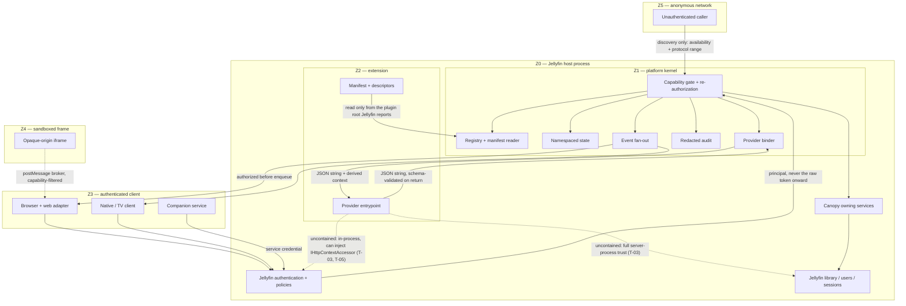

# Canopy Extension Platform — trust boundaries and threat model

Tracking issue: [#39 — EP-00](https://github.com/4eh5xitv6787h645ebv/Jellyfin-Canopy/issues/39)
Status: **proposed** (EP-00). EP-02 refines this to implementation detail; EP-11
revisits it in full before GA.

## 1. Trust zones

| Zone | Contents | Trust |
|---|---|---|
| **Z0 — host process** | Jellyfin server, Canopy, the platform kernel, every installed .NET plugin | Fully trusted. Everything here can read the database and the filesystem. |
| **Z1 — kernel boundary** | manifest reader, registry, provider binder, capability gate, audit | Trusted code enforcing policy **on** untrusted data |
| **Z2 — extension declarations** | `jellyfin-canopy-extension.json`, requested scopes, contribution descriptors, provider responses | **Untrusted input**, authored by a third party |
| **Z3 — authenticated client** | browser with a Canopy web adapter, native/TV client, companion service | Untrusted; authenticated; authority = its Jellyfin user |
| **Z4 — sandboxed frame** | opaque-origin iframe — **deferred, not in v1** ([ADR-0007](adr/0007-declarative-web-contributions.md)) | Untrusted, no host DOM, no token |
| **Z5 — anonymous network** | unauthenticated callers, other web origins | Fully untrusted |

**Z0 is one trust zone, not many.** An installed plugin is already inside it. The
platform's job at that boundary is to reduce *accidental* exposure and produce an
audit trail — not to contain a hostile plugin, which is not achievable.

## 2. Data flow

Three crossings carry the risk: **Z2 → Z1** (untrusted declarations and provider
responses entering trusted code), **Z1 → Z2** (what the kernel hands a provider),
and **Z3/Z5 → Z1** (what a client may ask for).

## 3. Threats

Severity is the *residual* rating after the stated mitigation.

### T-01 · Cross-user data access — **critical**

An extension or client reads or writes another user's data by supplying a user
id, a device id, a cookie, a marker or a manifest claim.

*Mitigation.* The acting user is derived from the access token only, and this is
verified: with a non-admin token, injected `Jellyfin-UserId`,
`X-Jellyfin-User-Id`, `X-Emby-Authorization` and `jellyfin-userid` cookie values
all resolved to the non-admin's own id
([S14](spike-evidence.md#s14--forged-identity-is-fully-resisted-but-the-token-is-in-the-claims)).
Storage keys are kernel-derived, never caller-supplied
([ADR-0008](adr/0008-storage-ownership.md)). Item, library and parental access
are re-checked at invocation, using the existing fail-closed pattern that refuses
to authorize against a truncated candidate list.
*Residual.* **Low**, contingent on no code path accepting a caller-supplied user
id. The two divergent caller-id resolvers in the current codebase must converge
before v1 — that divergence is exactly how this defect gets introduced.

### T-02 · Privilege escalation to administrator — **critical**

A non-admin registers an extension, approves a manifest, grants a scope, rotates
a credential or reads global audit data.

*Mitigation.* Every administrative operation uses `Policies.RequiresElevation`,
verified returning `403` for a non-admin on plugin routes
([S9](spike-evidence.md#s9--authorization-semantics-verified-on-plugin-routes)).
Deny-by-default base controller; anonymous endpoints enumerated and covered by an
architecture test ([ADR-0001](adr/0001-route-prefix-and-namespace.md)).
*Residual.* **Low.**

### T-03 · Malicious or compromised installed plugin — **critical, accepted**

An installed extension reads the Jellyfin database, exfiltrates media or
credentials, or hangs the server.

*Mitigation.* None that is real. Scopes reduce accidental exposure and audit
records make behaviour visible.
[S6](spike-evidence.md#s6--provider-failure-modes-all-map-to-bounded-host-errors)
demonstrates the limit precisely: a provider that ignores cancellation kept
running after the kernel's deadline fired and could not be killed.
*Residual.* **Accepted and documented.** Installing a plugin is a trust decision
made by the administrator, before the platform is involved. No document in this
program may claim containment here.

### T-04 · Malformed or dishonest manifest — **high (defence in depth)**

A manifest declares another extension's id, escapes its plugin root, declares
scopes it was never granted, or is a parser bomb.

*Adversary, stated honestly.* Anyone who can write this file into a plugin root
is already inside Z0 — so this is **not** a containment boundary against a
malicious plugin (that is T-03, accepted). It is robustness against a careless
extension, a compromised supply chain, a fork that copied a manifest, and a
partially completed install. It is worth doing for exactly those cases.

*Mitigation.* Manifests are read only from the root `IPluginManager` reports and
fingerprint-bound to the GUID Jellyfin reports
([S4](spike-evidence.md#s4--manifest-discovery-binds-to-the-real-plugin-identity-and-rejects-a-claim-to-another)).
Traversal, absolute paths, embedded NUL and escaping symlinks are rejected before
any file is opened
([S5](spike-evidence.md#s5--path-containment-holds-against-traversal-symlinks-and-link-cycles)).
Size, malformed-JSON and non-object manifests are rejected before registration, and a fingerprint mismatch is a rejection rather than a flag — all verified. A manifest requests; an admin grants.
*Residual.* **Low.** Four defects found during the spike were fixed rather than
documented away: separators are normalised before any test; every path component
is resolved, not just the leaf; resolution runs to a **fixed point**, because one
pass still let a two-hop chain escape; and a link cycle is rejected rather than
throwing out of the reader, which would otherwise have taken manifest discovery
down for every plugin. A symlink that stays inside the root is still accepted
([S5](spike-evidence.md#s5--path-containment-holds-against-traversal-symlinks-and-link-cycles)).
Remaining gap: nothing re-validates on the open handle, so a TOCTOU window
remains — [#494](https://github.com/4eh5xitv6787h645ebv/Jellyfin-Canopy/issues/494).

### T-05 · Token theft through the provider boundary — **high, accepted**

An extension obtains the calling user's bearer token and acts as them, outside
any scope or audit.

*Mitigation.* The `ClaimsPrincipal` contains `Jellyfin-Token` — the raw bearer
token — so the kernel never passes it across the boundary. The provider context
is an explicit allow-list of derived values; `HttpContext`, `IServiceProvider`
and host services are never exposed
([ADR-0004](adr/0004-provider-invocation.md),
[ADR-0011](adr/0011-identity-and-authority.md)).

*Residual.* **Accepted — subsumed by T-03.** The allow-list stops *accidental*
exposure, not a provider that wants the token. A provider entrypoint is
constructed by Jellyfin's own container and can inject `IHttpContextAccessor`;
because the kernel invokes it synchronously on the request's execution context,
that accessor returns the live principal for the very request being brokered.
Withholding the principal from the call signature is hygiene and keeps the
published contract honest; it is not a boundary. The reduction that *is* real:
a careless provider no longer acquires a credential it never asked for, and the
platform never offers one.

### T-06 · Stored XSS via extension-supplied UI — **high**

An extension supplies HTML, CSS, a selector or a script that runs same-origin
with the viewer's token.

*Mitigation.* Extensions supply neither markup nor selectors nor script; they
target semantic slots rendered by Canopy's own adapter, which already has
build-failing HTML-escape and CSS-injection guards
([ADR-0007](adr/0007-declarative-web-contributions.md)). Extensions have no content channel into
the page at all in v1, which is the whole reason
[milestone 82 is superseded](milestone-82-disposition.md).
*Residual.* **Medium — unverified.** No browser spike ran, so slot rendering,
mounting/teardown and CSP behaviour are unproven
([#491](https://github.com/4eh5xitv6787h645ebv/Jellyfin-Canopy/issues/491)). The
sandboxed frame is not part of v1, so it neither helps nor hurts this residual.

### T-07 · Cross-origin abuse of a held token — **medium**

Any web origin calls the platform with a token it has obtained.

*Mitigation.* None is possible at the origin level: the host answers
`Access-Control-Allow-Origin: *` with `Access-Control-Allow-Headers: authorization`
([S10](spike-evidence.md#s10--host-cors-is-permissive)). Therefore every request is
authorized on its own merits, no CSRF-by-origin assumption is made, and mutations
require an opaque, short-lived, replay-protected action capability.
*Residual.* **Medium.** Bounded by how the token was obtained in the first place,
which is outside the platform.

### T-08 · Credential leakage in URLs and logs — **medium**

A token reaches a proxy access log, browser history or a `Referer` header.

*Mitigation.* Query-string credentials are forbidden on platform routes, and the
event transport uses `fetch()` streaming rather than `EventSource` for exactly
this reason — Jellyfin 12 *does* accept `?apikey=`, so the safe choice must be
made deliberately
([S8](spike-evidence.md#s8--browser-eventsource-cannot-authenticate-safely),
[ADR-0006](adr/0006-client-event-transport.md)). Audit and diagnostics are
redacted by construction.
*Residual.* **Low.**

### T-09 · SSRF via extension-supplied URLs — **medium**

An extension induces the server to fetch an internal address — cloud metadata,
a loopback admin service.

*Mitigation.* Reuse `ArrUrlGuard`, which denies metadata hosts and IMDS
addresses, unwraps IPv4-mapped IPv6, fails closed on resolver failure, and
re-validates the resolved IP **at connect time** to defeat DNS rebinding. Note
its deliberate choice to allow RFC1918 ranges, because the existing consumers are
private-network services — for untrusted extensions that default must be
revisited.
*Residual.* **Medium**, pending the private-range decision in EP-02.

### T-10 · Resource exhaustion — **medium**

Oversized payloads, event storms, unbounded queues, quota abuse or a slow
consumer degrade the server.

*Mitigation.* Kernel-owned bounds well below the host's — necessary because the
host's only free limit is Kestrel's 30,000,000 bytes and exceeding it produces an
opaque `500`, not a `413`
([S11](spike-evidence.md#s11--request-size-and-json-depth-boundaries)). Per-extension
concurrency caps, bulkheads, circuit breakers, coalescing, bounded retention and
disconnect-and-resync for slow consumers.
*Residual.* **Medium.** No load or concurrency testing has been done; every spike
probe was sequential.

### T-11 · Startup denial of service — **high**

A malformed, throwing or slow extension prevents Jellyfin or Canopy from starting.

*Mitigation.* Nothing extension-related runs on the startup path; binding is
lazy and per-invocation
([ADR-0004](adr/0004-provider-invocation.md),
[ADR-0005](adr/0005-manifest-discovery.md)). Verified: removing the host plugin
entirely left Jellyfin healthy with **zero errors on that boot**, and every
lifecycle permutation — reversed load order, disabled, uninstalled, upgraded —
left the server healthy ([S13](spike-evidence.md#s13--lifecycle-matrix)).
*Residual.* **Low.**

### T-12 · Event leakage across users or extensions — **high**

A subscriber receives events about another user's activity, or another
extension's state.

*Mitigation.* Authorize and filter **before enqueueing**, and re-check at
delivery — enqueue-time filtering alone would let an event authorized before a
permission change still be delivered out of a reconnect buffer afterwards. A
grant change or a Jellyfin permission change drops the subscriber's buffer and
forces `resync-required`. Per-subscriber cursors; reconnect buffers scoped to the
subscriber ([ADR-0006](adr/0006-client-event-transport.md)).
*Residual.* **Low by design, untested.** EP-05 must prove it under multi-user
load, including a permission change mid-stream.

### T-13 · Confused deputy via contribution-supplied context — **high**

A contribution or provider claims a context ("this action is for item X, user Y")
and the kernel acts on it.

*Mitigation.* Actions are opaque capabilities binding extension, operation, user,
device, catalog revision, scopes and expiry, re-authorized at invocation.
A client never names a provider method
([ADR-0011](adr/0011-identity-and-authority.md)).
*Residual.* **Low.**

### T-14 · Silent binding failure — **medium**

A version drift between two independently shipped components makes the platform
quietly do nothing.

*Mitigation.* This is not hypothetical, and it is probed in this repository:
resolving a host-owned interface across the plugin boundary returns
`resolveByHostOwnedInterface: null` with `threw: False` — no exception, no log
entry, no `Malfunctioned` status
([S2](spike-evidence.md#s2--no-shared-type-identity-and-the-failure-is-silent)).
The JSON ABI removes the shared-type dependency entirely
([ADR-0003](adr/0003-json-abi.md)); protocol negotiation, health probes and an
explicit `incompatible` registry state make a mismatch visible.
*Residual.* **Low.**

### T-15 · Data loss through state corruption or migration — **high**

A crash, an interrupted write or a failed migration loses or corrupts extension
or user state.

*Mitigation.* Reuse `AtomicFile` (temp sibling → fsync contents → rename → fsync
parent directory), guarded by the existing architecture test that forbids any
second write path. Quarantine-on-corruption with a versioned unhealthy marker and
bounded backup retention. Transactional migrations that roll back
([ADR-0008](adr/0008-storage-ownership.md)).
*Residual.* **Low.**

### T-16 · Plugin-directory deletion by manifest-name collision — **high, accepted**

A third-party plugin ships `"name": "Jellyfin Canopy"` in its `meta.json`.
Jellyfin's own old-version cleanup deletes the real Canopy installation.

*Evidence.* `PluginManager.DiscoverPlugins()` sorts with `LocalPlugin.Compare`
(`Name` ordinal-ignore-case → `Id` → `Version`), walks the sorted list backwards
keeping the first enabled entry **per `Name`**, and for every subsequent entry
with the same `Name` runs `Directory.Delete(path, recursive: true)`. The
deduplication keys on `Name` alone — never on GUID — so two plugins that share a
display name and differ only in GUID are treated as two versions of one plugin,
and the loser's directory is removed.

*Mitigation.* None available to a plugin: the behaviour is in the host, before
any plugin code runs. What the platform can do is (a) document the exact `name`
string as reserved, (b) add a startup self-check that the expected plugin root
still exists and log loudly if it does not, and (c) prefer **not** to introduce a
second reserved name — which is an additional argument for keeping the kernel
in-process ([charter §6](charter.md#6-kernel-placement-decision)).

*Residual.* **Accepted.** Reachable by the same adversary as T-03, and also by an
honest fork or a namesake by accident, which makes it worth documenting even
though the malicious case adds nothing to T-03.

## 4. Out of scope

- Containing a malicious installed .NET plugin (**T-03**).
- Protecting against a compromised Jellyfin server or host operating system.
- Protecting against a malicious administrator.
- Protecting a user who has already given their token to a third party.
- Network-level attacks the reverse proxy owns (TLS termination, DDoS).

## 5. Open questions for EP-02

1. Should RFC1918 ranges be denied by default for **untrusted extensions**, given
   `ArrUrlGuard` deliberately allows them for first-party integrations (**T-09**)?
2. Can a write-only secret reference be protected meaningfully in a
   single-process plugin, or should v1 simply not offer one
   ([ADR-0008](adr/0008-storage-ownership.md) §9)?
3. What is the exact scope vocabulary, and how does an admin see an *effective*
   permission preview rather than a raw scope list?
4. Does revocation need to interrupt an in-flight provider call, given
   **T-03** shows the call cannot actually be stopped?
5. Do the two divergent caller-id resolvers converge before v1, or does the
   platform pin one and leave the legacy surface alone (**T-01**)?
